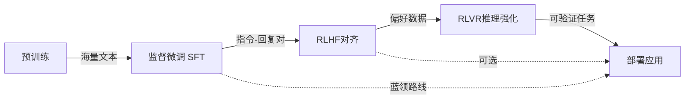

# 数据集格式与训练阶段

大模型的训练是一个多阶段的过程，每个阶段有不同的目标、数据格式和训练方法。理解这些阶段的差异是有效训练模型的基础。

不妨把训练大模型类比为培养一名医生。预训练就像读完整的大学和医学院课程——海量阅读、广泛涉猎，建立起对世界的基本理解；监督微调就像住院医师规培，跟着带教老师学习"问诊→分析→开处方"的标准流程；而强化学习则像由患者满意度和同行评价来进一步磨练医术和沟通技巧。每个阶段用的"教材"格式和"考核方式"都截然不同。

## 训练阶段概览

下图展示了大模型训练的完整阶段流程：



| 阶段 | 目标 | 数据规模 | 数据类型 |
|-----|------|---------|---------|
| 预训练 | 语言建模、世界知识 | TB级 | 原始文本 |
| 监督微调（SFT） | 指令跟随 | GB级 | 指令-回复对 |
| RLHF | 人类偏好对齐 | MB级 | 偏好数据 |
| RLVR | 推理能力强化 | MB级 | 带验证的推理数据 |

## 预训练

### 目标与原理

预训练阶段的目标是让模型学习语言的统计规律和世界知识。主流方法是**自回归语言建模**（Causal Language Modeling）：

$$\mathcal{L}_{\text{pretrain}} = -\sum_{t=1}^{T} \log P(x_t | x_{<t}; \theta)$$

其中：$T$ 为序列总长度，$x_t$ 为第 $t$ 个 token，$x_{<t}$ 为位置 $t$ 之前的所有 token，$\theta$ 为模型参数，$P(x_t | x_{<t}; \theta)$ 为模型在参数 $\theta$ 下对下一个 token 的条件概率。

上式的含义很直觉：给定前面所有的字（$x_{<t}$），模型要尽可能准确地预测下一个字（$x_t$）。整体损失是所有位置上负对数似然的累加，值越小说明模型对训练文本的预测越准确。这就像你读到"今天天气真"时，大脑会自动预测下一个字可能是"好"或"热"。这个看似简单的"填空"任务，却迫使模型在海量文本中学到语法、语义乃至世界知识。

### 数据格式

预训练数据通常是简单的文本序列，经过分词后直接用于训练：

```json
{"text": "这是一段预训练文本。模型将学习预测下一个token..."}
{"text": "Another document for pretraining. The model learns language patterns..."}
```

**数据处理流程**：

```python
def prepare_pretrain_data(documents, tokenizer, max_length=2048):
    # 将文档连接并切分为固定长度
    all_tokens = []
    for doc in documents:
        tokens = tokenizer.encode(doc + tokenizer.eos_token)
        all_tokens.extend(tokens)
    
    # 切分为训练样本
    samples = []
    for i in range(0, len(all_tokens) - max_length, max_length):
        samples.append(all_tokens[i:i + max_length])
    
    return samples
```

### 数据质量要求

预训练数据的质量直接影响模型能力：

- **多样性**：覆盖多种领域、语言、风格
- **质量**：过滤低质量、重复、有害内容
- **规模**：通常需要TB级别的文本数据

## 监督微调（SFT）

### 目标与原理

SFT使预训练模型学会遵循指令。回到培养医生的比喻：如果说预训练是"读万卷书"，那么SFT就是让模型学会"患者问什么、医生答什么"的标准问答流程。训练目标是最大化给定指令下回复的概率：

$$\mathcal{L}_{\text{SFT}} = -\sum_{t=1}^{T} \mathbf{1}_{t \in \text{response}} \cdot \log P(x_t | x_{<t}; \theta)$$

其中：$\mathbf{1}_{t \in \text{response}}$ 为指示函数，当且仅当第 $t$ 个 token 属于回复（response）部分时取 1，否则取 0；其余符号含义同预训练损失。

这里有个巧妙的设计：只有回复部分的loss被计算，指令部分作为条件但不参与损失计算。也就是说，我们不会因为模型没能"背出"用户的问题而惩罚它，只关心它的回答质量。

### 数据格式

**Alpaca格式**：

```json
{
    "instruction": "将以下句子翻译成英文",
    "input": "今天天气很好",
    "output": "The weather is nice today."
}
```

**ShareGPT格式**（多轮对话）：

```json
{
    "conversations": [
        {"from": "human", "value": "你好，请介绍一下Python"},
        {"from": "gpt", "value": "Python是一种高级编程语言..."},
        {"from": "human", "value": "它有什么特点？"},
        {"from": "gpt", "value": "Python有以下几个主要特点..."}
    ]
}
```

**ChatML格式**：

```
<|im_start|>system
你是一个有帮助的助手。
<|im_end|>
<|im_start|>user
你好
<|im_end|>
<|im_start|>assistant
你好！有什么可以帮助你的吗？
<|im_end|>
```

### 数据处理

```python
def prepare_sft_data(sample, tokenizer):
    # 构建完整prompt
    prompt = f"<|im_start|>user\n{sample['instruction']}\n"
    if sample.get('input'):
        prompt += f"{sample['input']}\n"
    prompt += "<|im_end|>\n<|im_start|>assistant\n"
    response = sample['output'] + "<|im_end|>"
    
    # 分词
    prompt_ids = tokenizer.encode(prompt, add_special_tokens=False)
    response_ids = tokenizer.encode(response, add_special_tokens=False)
    
    # 构建labels（只计算response部分的loss）
    input_ids = prompt_ids + response_ids
    labels = [-100] * len(prompt_ids) + response_ids  # -100表示忽略
    
    return {"input_ids": input_ids, "labels": labels}
```

## RLHF（人类反馈强化学习）

### 目标与原理

RLHF通过人类偏好信号优化模型输出。想象一下你去餐厅吃饭，同一道菜两个厨师做出了不同的版本，你尝过之后告诉老板"我觉得A版更好吃"——RLHF做的就是类似的事：收集大量这样的"人类品尝意见"，用它们来训练模型。典型流程：

1. **收集偏好数据**：对同一问题的多个回答进行人工排序
2. **训练奖励模型**：学习预测人类偏好
3. **PPO优化**：用奖励模型指导策略优化

奖励模型训练目标（Bradley-Terry模型）：

$$\mathcal{L}_{\text{RM}} = -\log \sigma(r_\theta(x, y_w) - r_\theta(x, y_l))$$

其中：$\sigma(\cdot)$ 为 sigmoid 函数；$r_\theta(x, y)$ 为参数为 $\theta$ 的奖励模型对提示 $x$ 与回答 $y$ 的打分；$y_w$ 是被偏好的回答（chosen），$y_l$ 是被拒绝的回答（rejected）。

直觉地说，这个损失函数会让奖励模型给"好回答"打出比"差回答"更高的分，而且两者的分差越大越好——就像美食评审员能明确区分精致料理和平庸快餐一样。

### 数据格式

**偏好数据**：

```json
{
    "prompt": "请解释什么是机器学习",
    "chosen": "机器学习是人工智能的一个分支，它使计算机能够从数据中学习...",
    "rejected": "机器学习就是让机器学习。"
}
```

**排序数据**：

```json
{
    "prompt": "...",
    "responses": [
        {"text": "回答A", "rank": 1},
        {"text": "回答B", "rank": 2},
        {"text": "回答C", "rank": 3}
    ]
}
```

### DPO：简化的偏好学习

DPO（Direct Preference Optimization）绕过显式的奖励模型，直接从偏好数据优化策略。如果说RLHF是"先训练一个美食评审员，再用评审员的评分指导厨师进步"，那DPO就是直接让厨师对比"好吃的菜"和"难吃的菜"自己悟出门道——省去了评审员这个中间环节：

$$\mathcal{L}_{\text{DPO}} = -\log \sigma\left(\beta \log \frac{\pi_\theta(y_w|x)}{\pi_{\text{ref}}(y_w|x)} - \beta \log \frac{\pi_\theta(y_l|x)}{\pi_{\text{ref}}(y_l|x)}\right)$$

其中：$\pi_\theta$ 为当前训练策略（即正在优化的模型），$\pi_{\text{ref}}$ 为参考策略（通常是 SFT 阶段得到的模型），$\beta$ 为温度超参数，控制偏离参考策略的惩罚力度；$x$ 为提示，$y_w$ 和 $y_l$ 分别为被偏好和被拒绝的回答。该公式的核心思想是：相比参考模型，当前模型应当更倾向于生成好回答、更回避差回答，而 $\beta$ 确保这种偏移不会过于激进。

DPO数据格式与RLHF相同，但训练更简单、更稳定。

## RLVR（推理验证强化学习）

### 目标与原理

RLVR针对可验证正确性的任务（如数学、编程），使用自动验证器提供奖励信号。在实际项目中，这类任务有个巨大优势：答案对不对可以自动判定，不需要人工标注。数学题算出来是多少就是多少，代码能不能跑过测试用例一目了然——这就像开卷考试和闭卷考试的区别，RLVR专治"闭卷"场景。

**关键思想**：
- 对于数学题，可以验证答案是否正确
- 对于代码，可以运行测试用例
- 无需人工标注，可以大规模生成训练数据

### 数据格式

```json
{
    "problem": "计算 2^10 的值",
    "solution": "2^10 = 1024",
    "verification": {
        "type": "exact_match",
        "answer": "1024"
    }
}
```

**代码任务**：

```json
{
    "problem": "编写一个函数，判断一个数是否为质数",
    "solution": "def is_prime(n): ...",
    "verification": {
        "type": "unit_test",
        "test_cases": [
            {"input": [2], "expected": true},
            {"input": [4], "expected": false},
            {"input": [17], "expected": true}
        ]
    }
}
```

### 过程奖励模型（PRM）

除了结果正确性，还可以评估推理过程的质量：

```json
{
    "problem": "...",
    "steps": [
        {"step": "首先，我们设...", "correct": true},
        {"step": "然后，根据公式...", "correct": true},
        {"step": "所以答案是...", "correct": false}
    ]
}
```

## 蒸馏与拒绝采样

### 知识蒸馏

假设你是一位经验丰富的大厨，现在要把你的独门绝活教给徒弟。你不可能把自己几十年的经验全部灌输给他，但可以让徒弟观察你做菜的每一个步骤，然后照着学。知识蒸馏（Knowledge Distillation）的原理与此相同——从大模型（教师）向小模型（学生）转移知识：

```python
# 教师模型生成数据
teacher_outputs = teacher_model.generate(prompts, do_sample=True, temperature=0.7)

# 学生模型学习
student_loss = student_model(input_ids, labels=teacher_outputs)
```

**数据格式**（教师生成）：

```json
{
    "instruction": "解释量子计算",
    "output": "[教师模型的高质量回答]"
}
```

### 拒绝采样

拒绝采样的思路很好理解：让模型对同一个问题生成很多个回答，然后只挑最好的那个作为训练数据——就像作家先写十版草稿，再从中选出最满意的一版发表：

```python
def rejection_sampling(model, prompt, reward_model, n_samples=16):
    # 生成多个候选
    candidates = [model.generate(prompt) for _ in range(n_samples)]
    
    # 用奖励模型评分
    scores = [reward_model(prompt, c) for c in candidates]
    
    # 选择最好的
    best_idx = np.argmax(scores)
    return candidates[best_idx]
```

## 高质量数据工程

### 数据清洗

```python
def clean_data(sample):
    text = sample['text']
    
    # 去除HTML标签
    text = re.sub(r'<[^>]+>', '', text)
    
    # 去除多余空白
    text = re.sub(r'\s+', ' ', text).strip()
    
    # 去除重复内容
    if is_duplicate(text):
        return None
    
    # 质量过滤
    if not quality_check(text):
        return None
    
    return {'text': text}
```

### 数据配比

数据配比就像营养配餐——光吃粗粮不行，光吃肉也不行，各种类型的数据需要按合理的比例混合：

```python
data_mixture = {
    'general_text': 0.4,      # 通用文本
    'code': 0.15,             # 代码
    'math': 0.1,              # 数学
    'conversation': 0.2,      # 对话
    'instruction': 0.15,      # 指令
}
```

### 数据增强

```python
# 回译增强
def back_translation(text, src_lang, tgt_lang):
    translated = translate(text, src_lang, tgt_lang)
    back_translated = translate(translated, tgt_lang, src_lang)
    return back_translated

# 改写增强
def paraphrase(text, model):
    prompt = f"请用不同的方式表达以下内容：\n{text}"
    return model.generate(prompt)
```

### 数据去污染

这是很容易被忽视但极其重要的一步。如果测试题提前混入了训练材料，模型的测试成绩就像开卷考试一样——看起来很好，但完全不反映真实能力：

```python
def decontaminate(train_data, test_data, n_gram=10):
    # 构建测试集n-gram集合
    test_ngrams = set()
    for sample in test_data:
        ngrams = get_ngrams(sample['text'], n_gram)
        test_ngrams.update(ngrams)
    
    # 过滤训练集
    clean_train = []
    for sample in train_data:
        ngrams = get_ngrams(sample['text'], n_gram)
        if not ngrams & test_ngrams:  # 无交集
            clean_train.append(sample)
    
    return clean_train
```

数据是大模型的"燃料"，其质量和配比直接决定模型的上限。每个训练阶段都需要精心设计的数据处理流程。建议初学者先从小规模SFT数据集制作入手，跑通格式和流程后，再逐步探索RLHF和RLVR方法。
