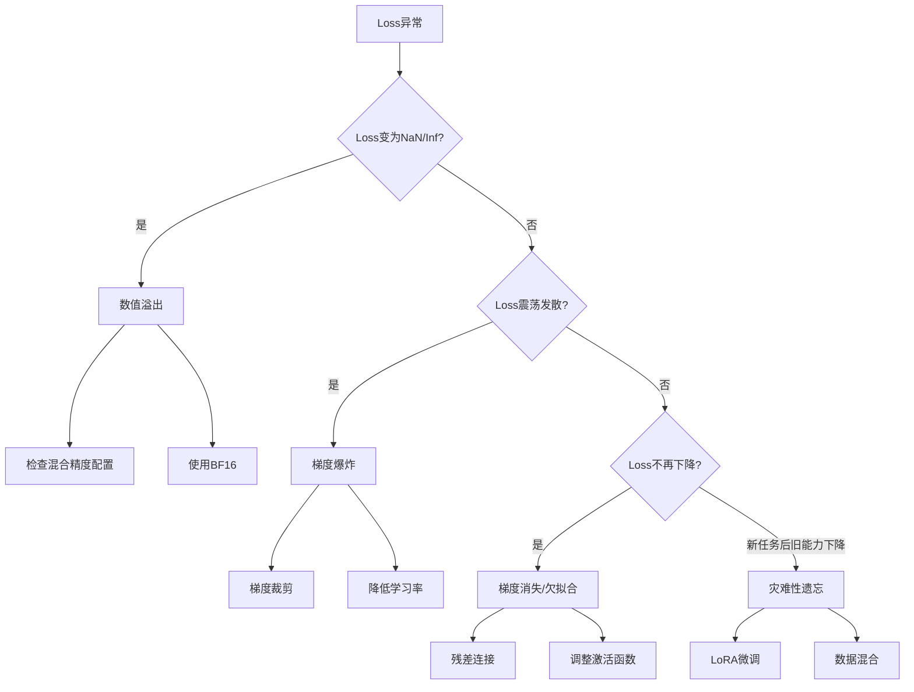

# 训练中的问题

大模型训练中会遇到各种技术挑战，从数值稳定性到优化困难再到泛化问题。准确诊断和解决这些问题是成功训练的关键。

训练大模型很像烹饪一道复杂的菜肴：火候、调料、时间每一个环节都可能出错。Loss爆炸就像火开太大把菜烧糊了，梯度消失就像火太小菜始终没熟，而灾难性遗忘则像学了新菜谱却忘了以前的拿手菜。接下来我们逐一剖析这些“翻车现场”及其应对策略。

下图展示了训练中常见问题的诊断流程：



## 数值溢出

### 问题表现

数值溢出是大模型训练中最常见的问题之一。想象一下你用一个只能显示两位小数的计算器来计算天文数字——显示屏不够用，就会出现乱码。计算机的浮点数类似这个计算器，有其表示范围的上限和下限。一旦超出范围，训练就会出现各种奇怪的问题：
- Loss变为`NaN`或`Inf`
- 模型参数出现`NaN`
- 梯度爆炸到极大值

### 溢出类型

**上溢（Overflow）**：数值超过表示范围上限

```python
import torch

# FP16范围：约 ±65504
x = torch.tensor(65505.0, dtype=torch.float16)
print(x)  # tensor(inf, dtype=torch.float16)
```

**下溢（Underflow）**：数值过小被截断为0

```python
# FP16最小正数：约 6×10^-8
x = torch.tensor(1e-10, dtype=torch.float16)
print(x)  # tensor(0., dtype=torch.float16)
```

### 常见溢出场景

**Softmax溢出**：

$$\text{softmax}(x_i) = \frac{e^{x_i}}{\sum_j e^{x_j}}$$

其中：$x_i$ 为输入向量的第 $i$ 个分量，求和 $\sum_j$ 遍历向量的所有分量。该函数将任意实数向量映射为一个概率分布，输出均为正值且总和为 1。

当 $x_i$ 很大时，$e^{x_i}$ 会溢出。举个具体的例子：如果 $x_i = 1000$，那么 $e^{1000}$ 是一个有434位数字的天文数字，远远超出float16的表示范围。解决方法却很巧妙——先减去最大值，就像在比较两个人身高时，不需要知道他们海拔多少，只要让他们背靠背站在一起比就行：

```python
def safe_softmax(x):
    x_max = x.max(dim=-1, keepdim=True).values
    exp_x = torch.exp(x - x_max)
    return exp_x / exp_x.sum(dim=-1, keepdim=True)
```

**LayerNorm中的方差计算**：

当输入值差异很大时，方差计算可能不稳定。

```python
# 数值稳定的LayerNorm
def stable_layer_norm(x, eps=1e-6):
    mean = x.mean(dim=-1, keepdim=True)
    # 使用mean和var的数值稳定版本
    var = ((x - mean) ** 2).mean(dim=-1, keepdim=True)
    return (x - mean) / torch.sqrt(var + eps)
```

### 混合精度训练

混合精度训练在FP16计算与FP32精度之间平衡：

```python
from torch.cuda.amp import autocast, GradScaler

scaler = GradScaler()

for batch in dataloader:
    optimizer.zero_grad()
    
    # FP16前向
    with autocast():
        loss = model(batch)
    
    # 缩放loss防止梯度下溢
    scaler.scale(loss).backward()
    
    # 检查梯度是否有inf/nan
    scaler.unscale_(optimizer)
    torch.nn.utils.clip_grad_norm_(model.parameters(), max_norm=1.0)
    
    # 只有梯度正常时才更新
    scaler.step(optimizer)
    scaler.update()
```

**GradScaler的工作原理**：
1. 将loss放大（如×65536）
2. 反向传播得到放大的梯度
3. 更新前将梯度缩小回原尺度
4. 如果出现inf/nan，跳过更新并减小缩放因子

### BF16的优势

BF16（Brain Floating Point 16）具有与FP32相同的指数位，减少了溢出风险：

| 格式 | 符号 | 指数 | 尾数 | 动态范围 |
|-----|------|------|------|---------|
| FP32 | 1 | 8 | 23 | ±3.4×10³⁸ |
| FP16 | 1 | 5 | 10 | ±6.5×10⁴ |
| BF16 | 1 | 8 | 7 | ±3.4×10³⁸ |

```python
# 使用BF16训练（需要Ampere及以上GPU）
model = model.to(dtype=torch.bfloat16)
```

## 梯度爆炸与梯度消失

### 梯度爆炸

梯度爆炸就像炒菜时火开得太大——油温瞬间飙升，菜还没下锅油就已经冒烟了。在训练中，它表现为参数更新量突然变得巨大，导致模型"失控"。典型症状包括：
- 梯度范数急剧增大
- Loss震荡或发散
- 参数更新不稳定

**诊断**：

```python
def monitor_gradients(model):
    total_norm = 0
    for p in model.parameters():
        if p.grad is not None:
            param_norm = p.grad.data.norm(2)
            total_norm += param_norm.item() ** 2
    total_norm = total_norm ** 0.5
    return total_norm

# 训练中监控
grad_norm = monitor_gradients(model)
if grad_norm > 100:
    print(f"Warning: Large gradient norm: {grad_norm}")
```

**解决方案**：应对梯度爆炸的思路很直接——既然火太大，那就控制火候：

1. **梯度裁剪**：

```python
# 按范数裁剪
torch.nn.utils.clip_grad_norm_(model.parameters(), max_norm=1.0)

# 按值裁剪
torch.nn.utils.clip_grad_value_(model.parameters(), clip_value=1.0)
```

2. **学习率调整**：

```python
# 学习率预热
scheduler = get_linear_schedule_with_warmup(
    optimizer,
    num_warmup_steps=1000,
    num_training_steps=total_steps
)
```

3. **权重初始化**：

```python
def init_weights(module):
    if isinstance(module, nn.Linear):
        # Xavier/Glorot初始化
        nn.init.xavier_uniform_(module.weight)
        if module.bias is not None:
            nn.init.zeros_(module.bias)
```

### 梯度消失

与梯度爆炸相反，梯度消失就像火开得太小，菜始终没熟。模型的早期层几乎收不到任何训练信号，就像你在一个很长的传话链中，第一个人说的话传到最后一个人已经面目全非了。

**表现**：
- 早期层梯度接近0
- 参数几乎不更新
- 训练停滞

**深度网络中的梯度消失**：

链式法则导致梯度连乘：

$$\frac{\partial \mathcal{L}}{\partial W_1} = \frac{\partial \mathcal{L}}{\partial h_L} \cdot \frac{\partial h_L}{\partial h_{L-1}} \cdots \frac{\partial h_2}{\partial h_1} \cdot \frac{\partial h_1}{\partial W_1}$$

其中：$\mathcal{L}$ 为损失函数，$W_1$ 为第 1 层的权重，$h_l$（$l=1,\ldots,L$）为第 $l$ 层的隐藏表示。上式展示了链式法则的连乘结构：损失对浅层参数的梯度是所有中间层局部梯度的连乘，层数越多梯度传播链越长。

如果每层梯度 $< 1$，连乘后趋近于0。这就好比你把一张纸对折多次——每次折叠只减半，但折了二十次之后，厚度已经只有原来的百万分之一。深度网络中的梯度消失也是同理：每经过一层梯度缩小一点，经过几十层后就基本消失了。

**解决方案**：应对梯度消失的核心思想是给梯度提供"捷径"，让它不必经过每一层的衰减就能直接传到早期层：

1. **残差连接**：

```python
class ResidualBlock(nn.Module):
    def forward(self, x):
        return x + self.sublayer(x)  # 梯度可以直接流过
```

2. **LayerNorm**：

```python
class TransformerBlock(nn.Module):
    def forward(self, x):
        # Pre-LN结构更稳定
        x = x + self.attn(self.norm1(x))
        x = x + self.ffn(self.norm2(x))
        return x
```

3. **适当的激活函数**：

```python
# ReLU在正区间梯度为1，但负区间梯度为0
# GELU/SiLU更平滑，梯度不会突然截断
nn.GELU()
nn.SiLU()
```

## 灾难性遗忘

### 问题描述

你是否有过这样的经历：学了一门新的编程语言后，突然发现以前很熟练的语言句法变得生疏了？模型在微调时也会遇到类似的问题——学习新任务时，预训练阶段获得的通用能力可能被"覆盖"，在新任务上表现很好但通用能力下降。这个现象被称为"灾难性遗忘"（Catastrophic Forgetting）。

### 诊断方法

```python
# 在微调前后评估多个任务
tasks = ['general_qa', 'math', 'code', 'target_task']

pretrained_scores = evaluate_all(pretrained_model, tasks)
finetuned_scores = evaluate_all(finetuned_model, tasks)

# 检查是否有任务性能显著下降
for task in tasks:
    delta = finetuned_scores[task] - pretrained_scores[task]
    if delta < -0.1:
        print(f"Warning: {task} performance dropped by {-delta:.2%}")
```

### 缓解策略

缓解灾难性遗忘的思路可以类比为"既要学新菜，也要练旧菜"——通过各种手段确保模型在学习新任务的同时不丢失已有能力：

**1. 参数高效微调（PEFT）**：

只更新少量参数，保持大部分预训练权重不变：

```python
from peft import LoraConfig, get_peft_model

lora_config = LoraConfig(
    r=16,
    lora_alpha=32,
    target_modules=["q_proj", "v_proj"],
    lora_dropout=0.05,
)
model = get_peft_model(model, lora_config)
# 只有0.1%的参数被更新
```

**2. 数据混合**：

```python
# 在微调数据中混入预训练格式的数据
mixed_dataset = ConcatDataset([
    target_dataset,           # 目标任务数据
    general_dataset,          # 通用数据（保持通用能力）
])
```

**3. 弹性权重巩固（EWC）**：

对重要参数施加更强的正则化。换个角度看，这就像给模型的"核心记忆"加上一把锁，不让新知识轻易覆盖这些关键参数：

$$\mathcal{L} = \mathcal{L}_{\text{task}} + \lambda \sum_i F_i (\theta_i - \theta_i^*)^2$$

其中：$\mathcal{L}_{\text{task}}$ 为新任务的损失；$\lambda$ 为正则化强度系数，控制新旧任务之间的权衡；$F_i$ 为 Fisher 信息矩阵的第 $i$ 个对角元素，衡量参数 $\theta_i$ 对旧任务的重要程度；$\theta_i^*$ 为旧任务训练完成后的最优参数值，$\theta_i$ 为当前参数值。该公式的思想是：对旧任务越重要的参数，新任务训练时允许其偏离原值的幅度越小，从而在学习新知识的同时保护旧知识。

**4. 学习率分层**：

```python
# 早期层使用更小的学习率
param_groups = [
    {'params': model.embed.parameters(), 'lr': 1e-6},
    {'params': model.layers[:12].parameters(), 'lr': 1e-5},
    {'params': model.layers[12:].parameters(), 'lr': 1e-4},
]
optimizer = torch.optim.AdamW(param_groups)
```

## 显存利用率与MFU

### 显存分析

在实际项目中，显存往往是训练大模型的第一个瓶颈。把显存想象成你的工作台面——上面要同时摆放食材（模型参数）、菜谱笔记（优化器状态）、正在处理的半成品（激活值）和各种工具（梯度）。台面就这么大，怎么合理分配空间是个学问。

大模型训练的显存占用包括：

| 组成部分 | 估算公式（FP16） |
|---------|-----------------|
| 模型参数 | $2 \times P$ 字节 |
| 优化器状态 | $8-12 \times P$ 字节（AdamW） |
| 梯度 | $2 \times P$ 字节 |
| 激活值 | $\sim 2 \times B \times S \times H \times L$ 字节 |

其中 $P$ 是参数量，$B$ 是batch size，$S$ 是序列长度，$H$ 是隐藏维度，$L$ 是层数。

```python
def estimate_memory(model_params_b, batch_size, seq_len, hidden_dim, layers):
    # 单位：GB
    params_memory = model_params_b * 2  # FP16权重
    optimizer_memory = model_params_b * 12  # AdamW状态
    gradient_memory = model_params_b * 2
    
    # 激活值估算（简化）
    activation_memory = 2 * batch_size * seq_len * hidden_dim * layers / 1e9
    
    return {
        'params': params_memory,
        'optimizer': optimizer_memory,
        'gradients': gradient_memory,
        'activations': activation_memory,
        'total': params_memory + optimizer_memory + gradient_memory + activation_memory
    }
```

### 显存优化技术

当显存不够用时，有几种常用的"省空间"策略。每种策略都是在"时间换空间"或"分布式分担"的思路下运作的：

**1. 梯度检查点**：

```python
from torch.utils.checkpoint import checkpoint

class CheckpointedTransformerBlock(nn.Module):
    def forward(self, x):
        # 不保存中间激活，反向时重新计算
        return checkpoint(self._forward, x, use_reentrant=False)
    
    def _forward(self, x):
        x = x + self.attn(self.norm1(x))
        x = x + self.ffn(self.norm2(x))
        return x
```

**2. 梯度累积**：

```python
accumulation_steps = 8

for i, batch in enumerate(dataloader):
    loss = model(batch) / accumulation_steps
    loss.backward()
    
    if (i + 1) % accumulation_steps == 0:
        optimizer.step()
        optimizer.zero_grad()
```

**3. ZeRO优化器**：

```python
# DeepSpeed ZeRO Stage 3
ds_config = {
    "zero_optimization": {
        "stage": 3,
        "offload_optimizer": {"device": "cpu"},
        "offload_param": {"device": "cpu"}
    }
}
```

### MFU（Model FLOPs Utilization）

MFU衡量实际计算效率与硬件峰值的比值。假设你买了一台号称最高时速300公里的跑车，但在实际驾驶中只能跑到平均120公里——那么你的"性能利用率"就是40%。MFU衡量的就是类似的事情，只不过把"时速"换成了"计算量"。

$$\text{MFU} = \frac{\text{实际FLOPs/秒}}{\text{硬件峰值FLOPs/秒}}$$

其中“实际 FLOPs/秒”为训练过程中每秒完成的浮点操作数，“硬件峰值 FLOPs/秒”为 GPU 的理论最大计算吞吐量。MFU 取值范围为 $[0, 1]$，值越接近 1 表明硬件利用率越高；实践中典型值为 30%–50%。

**计算方法**：

```python
def compute_mfu(model_params, batch_size, seq_len, time_per_step, gpu_flops):
    # Transformer前向+反向约6倍参数量的FLOPs
    flops_per_step = 6 * model_params * batch_size * seq_len
    achieved_flops = flops_per_step / time_per_step
    mfu = achieved_flops / gpu_flops
    return mfu

# 示例：7B模型，A100 GPU
mfu = compute_mfu(
    model_params=7e9,
    batch_size=4,
    seq_len=2048,
    time_per_step=0.5,  # 秒
    gpu_flops=312e12    # A100 FP16峰值
)
print(f"MFU: {mfu:.1%}")
```

**优化MFU**：
- 增大batch size（更好的GPU利用）
- 使用Flash Attention（减少内存带宽瓶颈）
- 优化数据加载（避免GPU空闲）
- 使用高效的通信原语（分布式训练）

### 监控与调试工具

```python
# PyTorch Profiler
with torch.profiler.profile(
    activities=[
        torch.profiler.ProfilerActivity.CPU,
        torch.profiler.ProfilerActivity.CUDA,
    ],
    record_shapes=True,
    profile_memory=True,
) as prof:
    model(batch)

print(prof.key_averages().table(sort_by="cuda_time_total"))
```

训练问题的诊断需要系统性方法：监控关键指标、理解问题根因、选择合适的解决方案。随着经验积累，你会逐渐培养出"看一眼训练曲线就知道哪里出了问题"的直觉。
