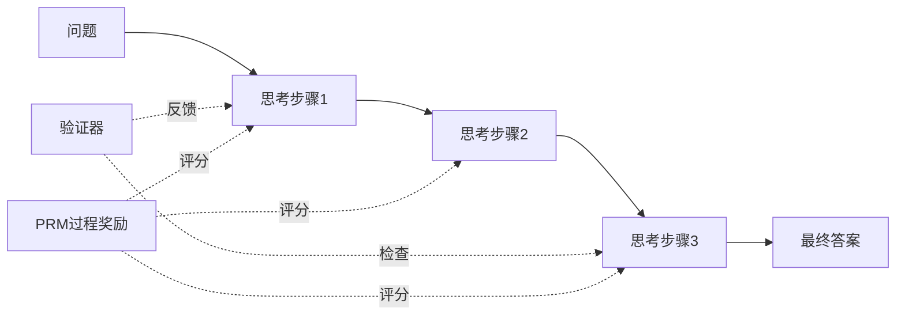

# 思维链训练与思维回溯

提升大模型的推理能力是当前研究的重要方向。思维链（Chain-of-Thought）训练和思维回溯技术使模型能够进行更深入、更可靠的推理。

回想一下你上学时考数学的经历。老师总是说"要写出解题过程"，不能只写一个答案。这背后有深刻的道理：写出每一步推导，不仅方便老师给分，更重要的是帮助你自己理清思路、发现错误。思维链训练的核心思想完全一样——让模型学会"展示解题过程"，而不是直接报答案。

## 思维链的本质

下图展示了思维链推理的核心流程：



### 从直觉到推理

传统的语言模型直接从问题映射到答案，就像考生直接在答题卡上写答案，不写任何运算过程：

$$P(\text{answer} | \text{question})$$

即模型直接对问题产生答案的条件概率，中间不包含任何显式的推理过程。

思维链则是让模型先在“草稿纸”上写出推导过程，再得出最终答案：

$$P(\text{answer} | \text{question}) = \sum_{\text{reasoning}} P(\text{answer} | \text{reasoning}, \text{question}) \cdot P(\text{reasoning} | \text{question})$$

其中：$\text{question}$ 为输入问题，$\text{reasoning}$ 为中间推理过程，$\text{answer}$ 为最终答案。第一项 $P(\text{reasoning} | \text{question})$ 表示模型生成某条推理路径的概率，第二项 $P(\text{answer} | \text{reasoning}, \text{question})$ 表示给定推理过程后得到正确答案的概率。对所有可能的推理路径求和，即得到边缘化的答案概率。该分解说明：通过引入显式推理链，模型可以综合多条推理路径的信息，从而提升最终答案的可靠性。
- **分解复杂问题**：将困难问题拆解为可管理的子问题
- **可解释性**：用户可以理解和验证推理过程
- **错误定位**：更容易发现推理中的错误
- **能力迁移**：推理模式可以迁移到新问题

### 推理类型

| 类型 | 描述 | 示例 |
|-----|------|------|
| 数学推理 | 逻辑推导与计算 | 解方程、证明 |
| 常识推理 | 基于世界知识的推断 | 因果关系、物理规律 |
| 符号推理 | 符号操作与转换 | 代码执行、逻辑运算 |
| 多跳推理 | 整合多个信息片段 | 阅读理解、知识问答 |

## 思维链训练方法

### 监督微调方法

使用带有推理步骤的数据进行SFT：

```json
{
    "question": "小明有5个苹果，小红给了他3个，然后他吃掉了2个。现在小明有几个苹果？",
    "reasoning": "1. 小明最初有5个苹果\n2. 小红给了他3个，所以他有 5 + 3 = 8 个苹果\n3. 他吃掉了2个，所以他有 8 - 2 = 6 个苹果",
    "answer": "6"
}
```

**数据构造方法**：

1. **人工标注**：质量高但成本大
2. **模型生成+验证**：用强模型生成，通过答案正确性筛选
3. **程序合成**：对于数学问题，可以程序化生成推理步骤

```python
def generate_cot_data(problem, model, verifier, n_samples=10):
    candidates = []
    for _ in range(n_samples):
        # 生成带推理的回答
        response = model.generate(
            f"问题：{problem}\n让我们一步步思考：",
            temperature=0.7
        )
        
        # 提取答案并验证
        answer = extract_answer(response)
        if verifier(problem, answer):
            candidates.append({
                'question': problem,
                'reasoning': response,
                'answer': answer
            })
    
    return candidates
```

### 强化学习方法

使用RL优化推理过程，奖励信号可以来自：
- **结果正确性**：最终答案是否正确
- **过程正确性**：每一步推理是否正确（需要过程标注或PRM）

**RLVR训练框架**：

```python
def rlvr_training_step(model, problem, verifier):
    # 生成推理和答案
    reasoning, answer = model.generate_with_reasoning(problem)
    
    # 计算奖励
    if verifier(problem, answer):
        reward = 1.0
    else:
        reward = 0.0
    
    # 可选：过程奖励
    step_rewards = process_reward_model(reasoning)
    reward = reward + sum(step_rewards)
    
    # PPO/GRPO更新
    update_policy(model, reasoning, reward)
```

### 过程奖励模型（PRM）

PRM评估推理过程中每一步的正确性：

```python
class ProcessRewardModel:
    def __init__(self, base_model):
        self.model = base_model
        self.classifier = nn.Linear(hidden_size, 2)  # 正确/错误
    
    def forward(self, question, reasoning_steps):
        rewards = []
        context = question
        
        for step in reasoning_steps:
            context = context + "\n" + step
            hidden = self.model(context).last_hidden_state[:, -1]
            prob = self.classifier(hidden).softmax(-1)[:, 1]  # 正确的概率
            rewards.append(prob)
        
        return rewards
```

**PRM训练数据**：

```json
{
    "question": "...",
    "steps": [
        {"content": "首先，设x为...", "label": "correct"},
        {"content": "根据公式，x = ...", "label": "correct"},
        {"content": "所以答案是...", "label": "incorrect"}
    ]
}
```

## 思维回溯

### 问题动机

在考试中，你可能做着做着突然发现前面某一步算错了，这时你会划掉错误的部分，回到出错的地方重新推导。思维回溯（Thought Backtracking）就是让模型也具备这种"发现错误并纠正"的能力，而不是一条路走到黑。

### 实现方法

**1. 自我验证与修正**：

```
问题：...

初次推理：
步骤1：...
步骤2：...
答案：X

验证：
让我检查一下这个推理是否正确。
步骤2中，... 这里有个错误。

修正后的推理：
步骤1：...
步骤2（修正）：...
答案：Y
```

**2. 树搜索方法**：

```python
def beam_search_with_backtrack(model, problem, beam_width=5, max_depth=10):
    # 初始状态
    beams = [{'path': [], 'score': 0.0}]
    
    for depth in range(max_depth):
        candidates = []
        for beam in beams:
            # 从当前状态扩展
            continuations = model.generate_steps(
                problem, beam['path'], n=beam_width
            )
            
            for cont in continuations:
                # 评估每个扩展
                score = evaluate_step(problem, beam['path'] + [cont])
                candidates.append({
                    'path': beam['path'] + [cont],
                    'score': beam['score'] + score
                })
        
        # 保留最好的beam_width个
        beams = sorted(candidates, key=lambda x: -x['score'])[:beam_width]
        
        # 检查是否完成
        if any(is_complete(b['path']) for b in beams):
            break
    
    return beams[0]['path']
```

**3. Monte Carlo Tree Search (MCTS)**：

```python
class MCTSNode:
    def __init__(self, state, parent=None):
        self.state = state
        self.parent = parent
        self.children = []
        self.visits = 0
        self.value = 0.0

def mcts_search(problem, model, verifier, iterations=100):
    root = MCTSNode(state=problem)
    
    for _ in range(iterations):
        # Selection: 选择最有潜力的节点
        node = select(root)
        
        # Expansion: 扩展新的推理步骤
        child_state = model.generate_step(node.state)
        child = MCTSNode(child_state, parent=node)
        node.children.append(child)
        
        # Simulation: 完成推理并验证
        final_answer = model.complete_reasoning(child_state)
        reward = 1.0 if verifier(problem, final_answer) else 0.0
        
        # Backpropagation: 更新节点统计
        backpropagate(child, reward)
    
    return best_child(root).state
```

## Test-Time Compute

### 思想

在推理时投入更多计算以提升性能。这个思路很好理解：就像你做一道难题时，花十分钟思考往往比花30秒就下笔得到更好的结果。Test-Time Compute的核心就是"用更多的思考时间换取更好的答案"。

### 实现策略

**1. 多次采样**（Self-Consistency）：

```python
def self_consistency(model, problem, n_samples=10):
    answers = []
    for _ in range(n_samples):
        response = model.generate(problem, temperature=0.7)
        answer = extract_answer(response)
        answers.append(answer)
    
    # 投票选择最常见的答案
    return max(set(answers), key=answers.count)
```

**2. 迭代改进**：

```python
def iterative_refinement(model, problem, max_iterations=3):
    solution = model.generate(problem)
    
    for _ in range(max_iterations):
        # 让模型评估和改进
        critique = model.generate(f"评估以下解答并指出问题：\n{solution}")
        
        if "正确" in critique and "没有问题" in critique:
            break
        
        solution = model.generate(
            f"问题：{problem}\n原解答：{solution}\n评估：{critique}\n请给出改进后的解答："
        )
    
    return solution
```

**3. Best-of-N**：

```python
def best_of_n(model, problem, reward_model, n=10):
    candidates = [model.generate(problem) for _ in range(n)]
    scores = [reward_model(problem, c) for c in candidates]
    return candidates[np.argmax(scores)]
```

## 训练增强推理

### 数据增强

```python
def augment_cot_data(sample):
    augmented = []
    
    # 原始样本
    augmented.append(sample)
    
    # 不同风格的推理
    styles = ['详细', '简洁', '数学符号']
    for style in styles:
        new_reasoning = rewrite_reasoning(sample['reasoning'], style)
        augmented.append({**sample, 'reasoning': new_reasoning})
    
    # 添加常见错误和修正
    error_sample = inject_error(sample)
    augmented.append(error_sample)
    
    return augmented
```

### 课程学习

课程学习借鉴了人类学习的规律：小学生先学加减法，再学乘除法，最后才学方程。同样，训练模型时也可以先用简单的推理任务热身，然后逐渐增加难度：

```python
def curriculum_training(model, datasets):
    # 按难度排序
    easy, medium, hard = split_by_difficulty(datasets)
    
    # 从易到难训练
    for epoch in range(num_epochs):
        if epoch < num_epochs // 3:
            train_data = easy
        elif epoch < 2 * num_epochs // 3:
            train_data = easy + medium
        else:
            train_data = easy + medium + hard
        
        train_epoch(model, train_data)
```

### 推理长度控制

```python
# 奖励设计：在正确的前提下鼓励简洁
def compute_reward(answer_correct, reasoning_length):
    if not answer_correct:
        return 0.0
    
    # 正确答案基础奖励 + 简洁性奖励
    base_reward = 1.0
    brevity_bonus = max(0, 0.2 - 0.001 * reasoning_length)
    
    return base_reward + brevity_bonus
```

思维链训练和思维回溯技术代表了大模型能力提升的重要方向。通过让模型学会"思考"，而不仅仅是"回答"，可以显著提升其在复杂推理任务上的表现。就像教育家们常说的那样："重要的不是答案，而是解题过程。"这一领域仍在快速发展，新的方法和技术不断涌现。
