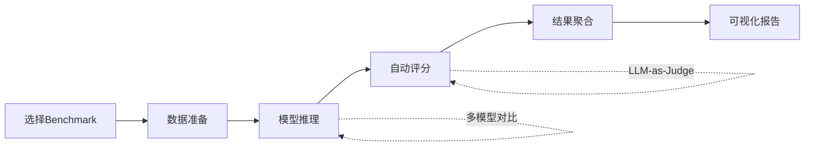

# 评测框架

大模型评测涉及数据加载、推理执行、指标计算、结果聚合等多个环节。专业的评测框架将这些环节标准化、模块化，大幅提升评测效率和可复现性。本节将介绍三个主流评测框架：OpenCompass、EvalScope和VLMEvalKit。

在实际项目中，手工搞评测就像用算盘做会计——理论上能完成，但效率低且容易出错。评测框架就是你的“财务软件”：它把数据加载、模型推理、分数计算、报表生成这些繁琐工作全部自动化，你只需要配置好“要考什么”和“考谁”，剩下的交给框架来处理。

下图展示了评测框架的通用流水线：



## OpenCompass

OpenCompass是由上海人工智能实验室开发的开源大模型评测平台，支持100+评测数据集和多种主流模型。如果把评测框架比作考试系统，OpenCompass就是那个"题库最全、考场最正规"的考试院——它背后有学术界的深度支持，几乎每个主流Benchmark都能在这里找到。

### 核心架构

OpenCompass采用模块化设计，主要包含以下组件。整个架构就像一个考试管理系统：configs是"考试计划"，datasets是"题库"，models是"考生接口"，metrics是"评分标准"，summarizers是"成绩单生成器"：

```
OpenCompass
├── configs/           # 配置文件
│   ├── datasets/     # 数据集配置
│   ├── models/       # 模型配置
│   └── eval_*.py     # 评测任务配置
├── opencompass/
│   ├── datasets/     # 数据集加载器
│   ├── models/       # 模型适配器
│   ├── tasks/        # 任务执行器
│   ├── metrics/      # 评测指标
│   └── summarizers/  # 结果汇总器
└── data/             # 数据存储
```

### 安装与配置

```bash
# 克隆仓库
git clone https://github.com/open-compass/opencompass.git
cd opencompass

# 安装依赖
pip install -e .

# 下载数据集
python tools/download_data.py
```

### 基础使用

运行单个评测任务：

```bash
# 评测Qwen模型在MMLU上的表现
python run.py \
    --models qwen/Qwen2.5-7B-Instruct \
    --datasets mmlu \
    --work-dir outputs/qwen-mmlu
```

### 配置文件编写

OpenCompass使用Python配置文件定义评测任务：

```python
# configs/eval_qwen_comprehensive.py

from mmengine.config import read_base

with read_base():
    # 引入数据集配置
    from .datasets.mmlu.mmlu_gen import mmlu_datasets
    from .datasets.gsm8k.gsm8k_gen import gsm8k_datasets
    from .datasets.humaneval.humaneval_gen import humaneval_datasets
    
    # 引入模型配置
    from .models.qwen.qwen2_5_7b_instruct import models

# 组合数据集
datasets = mmlu_datasets + gsm8k_datasets + humaneval_datasets

# 评测配置
work_dir = './outputs/qwen_comprehensive'

# 推理配置
infer_cfg = dict(
    inferencer=dict(
        type='GenInferencer',
        max_out_len=512,
    ),
    runner=dict(
        type='LocalRunner',
        max_num_workers=4,
        task=dict(type='OpenICLInferTask'),
    ),
)
```

### 自定义模型适配

```python
# opencompass/models/my_custom_model.py

from opencompass.models.base import BaseModel

class MyCustomModel(BaseModel):
    def __init__(self, model_path, **kwargs):
        super().__init__(**kwargs)
        self.model = self._load_model(model_path)
        
    def _load_model(self, path):
        from transformers import AutoModelForCausalLM, AutoTokenizer
        self.tokenizer = AutoTokenizer.from_pretrained(path)
        return AutoModelForCausalLM.from_pretrained(path)
        
    def generate(self, inputs, max_out_len=512, **kwargs):
        """生成接口"""
        encoded = self.tokenizer(inputs, return_tensors='pt', padding=True)
        outputs = self.model.generate(
            **encoded,
            max_new_tokens=max_out_len,
            **kwargs
        )
        return self.tokenizer.batch_decode(outputs, skip_special_tokens=True)
        
    def get_ppl(self, inputs, mask_length=None):
        """计算困惑度"""
        # 实现困惑度计算逻辑
        pass
```

### 自定义数据集

```python
# opencompass/datasets/my_dataset.py

from datasets import load_dataset
from opencompass.datasets.base import BaseDataset
from opencompass.registry import LOAD_DATASET

@LOAD_DATASET.register_module()
class MyCustomDataset(BaseDataset):
    @staticmethod
    def load(path):
        dataset = load_dataset('json', data_files=path)
        
        def format_item(item):
            return {
                'input': f"Question: {item['question']}\nAnswer:",
                'output': item['answer'],
                'category': item.get('category', 'default')
            }
            
        return dataset.map(format_item)
```

### 分布式评测

OpenCompass支持多机多卡分布式评测。当你需要评测一个72B参数的大模型时，单张GPU可能连模型都加载不下，更别说跑完整个评测集。这时候分布式评测就像把一场大考试分成多个考场同时进行，大大缩短总时间：

```bash
# 使用Slurm调度
python run.py \
    --models qwen/Qwen2.5-72B-Instruct \
    --datasets mmlu ceval gsm8k \
    --slurm \
    --partition gpu \
    --quotatype auto \
    -a $ACCOUNT
```

### 结果分析

```python
# 读取评测结果
import json
from pathlib import Path

results_dir = Path('outputs/qwen_comprehensive')
summary_path = results_dir / 'summary' / 'summary.json'

with open(summary_path) as f:
    summary = json.load(f)
    
# 分析各数据集表现
for dataset, scores in summary['results'].items():
    print(f"{dataset}: {scores['accuracy']:.2%}")
```

## EvalScope

EvalScope是阿里巴巴ModelScope团队开发的评测框架，与ModelScope生态深度集成，支持大模型和多模态模型评测。如果说OpenCompass是"学术派考试院"，EvalScope就像是"企业内部的能力评估中心"——它的优势在于与ModelScope Hub无缝对接，加上独特的Arena竞技场评测功能，让你可以直接让两个模型"当场对决"。

### 核心特性

- 与ModelScope Hub无缝集成
- 支持Arena竞技场评测
- 内置多种评测报告生成
- 支持自定义评测流程

### 安装

```bash
pip install evalscope

# 安装可选依赖（多模态评测）
pip install evalscope[vlm]
```

### 基础用法

```python
from evalscope import Evaluator

# 创建评估器
evaluator = Evaluator(
    model_id='Qwen/Qwen2.5-7B-Instruct',
    datasets=['mmlu', 'gsm8k', 'humaneval'],
    output_dir='./eval_results'
)

# 运行评测
results = evaluator.run()

# 查看结果
print(results.summary())
```

### 命令行使用

```bash
# 基础评测
evalscope run \
    --model Qwen/Qwen2.5-7B-Instruct \
    --datasets mmlu gsm8k \
    --output-dir ./results

# 指定评测参数
evalscope run \
    --model Qwen/Qwen2.5-7B-Instruct \
    --datasets mmlu \
    --num-fewshot 5 \
    --batch-size 8 \
    --max-length 2048
```

### 自定义评测任务

```python
from evalscope import EvalTask, Dataset, Metric

# 定义自定义数据集
class CustomerServiceDataset(Dataset):
    def __init__(self, data_path):
        self.data = self._load_data(data_path)
        
    def _load_data(self, path):
        import json
        with open(path) as f:
            return [json.loads(line) for line in f]
            
    def __len__(self):
        return len(self.data)
        
    def __getitem__(self, idx):
        item = self.data[idx]
        return {
            'input': item['query'],
            'reference': item['response'],
            'metadata': item.get('metadata', {})
        }

# 定义自定义指标
class ServiceQualityMetric(Metric):
    def compute(self, predictions, references):
        scores = []
        for pred, ref in zip(predictions, references):
            # 多维度评分
            accuracy = self._score_accuracy(pred, ref)
            completeness = self._score_completeness(pred, ref)
            politeness = self._score_politeness(pred)
            
            scores.append({
                'accuracy': accuracy,
                'completeness': completeness,
                'politeness': politeness,
                'overall': (accuracy + completeness + politeness) / 3
            })
        return scores

# 创建评测任务
task = EvalTask(
    name='customer_service_eval',
    dataset=CustomerServiceDataset('data/cs_eval.jsonl'),
    metrics=[ServiceQualityMetric()],
    prompt_template="请回答用户问题：{input}\n回答："
)

# 运行评测
from evalscope import Evaluator
evaluator = Evaluator(model_id='Qwen/Qwen2.5-7B-Instruct')
results = evaluator.evaluate(task)
```

### Arena评测

EvalScope支持模型对战评测。这是EvalScope最有特色的功能之一——想象一下拳击比赛的赛制，两个模型对同一个问题各自作答，然后由一个更强的"裁判模型"评判谁答得更好。经过多轮对战，用ELO评分系统（和国际象棋等级分一样）给每个模型排名：

```python
from evalscope.arena import Arena

# 创建竞技场
arena = Arena(
    models=[
        'Qwen/Qwen2.5-7B-Instruct',
        'meta-llama/Llama-3.1-8B-Instruct',
        'mistralai/Mistral-7B-Instruct-v0.3'
    ],
    judge_model='Qwen/Qwen2.5-72B-Instruct'  # 裁判模型
)

# 单轮对战
result = arena.battle(
    prompt="请解释量子纠缠现象",
    criteria=['准确性', '易懂性', '完整性']
)

print(f"Winner: {result.winner}")
print(f"Scores: {result.scores}")

# 批量对战统计
battle_results = arena.run_battles(
    prompts=test_prompts,
    num_rounds=100
)

# 计算ELO评分
elo_ratings = arena.compute_elo(battle_results)
```

### 评测报告生成

```python
from evalscope.report import ReportGenerator

# 生成HTML报告
generator = ReportGenerator(results)
generator.generate_html('eval_report.html')

# 生成对比报告
generator.generate_comparison_report(
    baseline_results=baseline,
    current_results=current,
    output_path='comparison_report.html'
)
```

## VLMEvalKit

VLMEvalKit专注于视觉语言模型（VLM）的评测，支持主流多模态模型和30+评测基准。前面两个框架主要考的是模型的"读写能力"，而VLMEvalKit考的是模型的"视力"——能不能看懂图片、理解图表、识别文字，这些都是多模态模型特有的能力维度。

### 安装

```bash
git clone https://github.com/open-compass/VLMEvalKit.git
cd VLMEvalKit
pip install -e .
```

### 支持的评测基准

| 基准 | 类型 | 描述 |
|------|------|------|
| MMBench | 综合 | 多维度多模态能力评测 |
| SEED-Bench | 综合 | 图像和视频理解 |
| MME | 综合 | 感知和认知能力 |
| POPE | 幻觉 | 对象存在性幻觉检测 |
| HallusionBench | 幻觉 | 多维度幻觉评测 |
| OCRBench | OCR | 文字识别能力 |
| TextVQA | VQA | 图像中文字问答 |
| ChartQA | 图表 | 图表理解能力 |

### 基础使用

```bash
# 评测单个模型
python run.py \
    --model qwen-vl-chat \
    --data MMBench_DEV_EN SEED_IMG

# 指定GPU
CUDA_VISIBLE_DEVICES=0,1 python run.py \
    --model internvl2-8b \
    --data MMBench_DEV_CN
```

### Python API

```python
from vlmeval.config import supported_VLM
from vlmeval.run import run_evaluation

# 查看支持的模型
print(supported_VLM.keys())

# 运行评测
results = run_evaluation(
    model='qwen-vl-chat',
    datasets=['MMBench_DEV_EN', 'SEED_IMG'],
    work_dir='./vlm_results',
    nproc=4
)
```

### 自定义多模态模型

```python
from vlmeval.vlm.base import BaseModel
from vlmeval.smp import load_image

class MyVLM(BaseModel):
    INSTALL_REQ = True
    INTERLEAVE = False  # 是否支持图文交织
    
    def __init__(self, model_path, **kwargs):
        self.model = self._load_model(model_path)
        self.processor = self._load_processor(model_path)
        
    def generate_inner(self, message, dataset=None):
        """核心生成方法"""
        # 解析消息中的图像和文本
        images = [load_image(m['value']) for m in message if m['type'] == 'image']
        texts = [m['value'] for m in message if m['type'] == 'text']
        
        # 处理输入
        inputs = self.processor(
            images=images,
            text=texts,
            return_tensors='pt'
        )
        
        # 生成输出
        outputs = self.model.generate(**inputs, max_new_tokens=512)
        response = self.processor.decode(outputs[0])
        
        return response
```

### 评测配置

```python
# vlmeval_config.py

model_configs = {
    'my_vlm': {
        'class': 'MyVLM',
        'model_path': '/path/to/model',
        'max_new_tokens': 512,
        'temperature': 0.0
    }
}

dataset_configs = {
    'custom_vqa': {
        'type': 'VQA',
        'data_path': '/path/to/data.json',
        'image_root': '/path/to/images'
    }
}
```

## 框架对比与选型

### 功能对比

| 特性 | OpenCompass | EvalScope | VLMEvalKit |
|------|-------------|-----------|------------|
| 语言模型评测 | ✓ | ✓ | ✗ |
| 多模态评测 | 部分 | ✓ | ✓ |
| 分布式支持 | ✓ | ✓ | ✓ |
| 自定义数据集 | ✓ | ✓ | ✓ |
| Arena对战 | ✗ | ✓ | ✗ |
| 报告生成 | ✓ | ✓ | ✓ |
| ModelScope集成 | ✗ | ✓ | ✗ |
| 评测基准数量 | 100+ | 50+ | 30+ |

### 选型建议

**选择OpenCompass**：
- 需要全面的语言模型评测
- 对评测基准覆盖度要求高
- 需要与学术界评测标准对齐

**选择EvalScope**：
- 使用ModelScope生态
- 需要Arena对战评测
- 需要灵活的自定义评测流程

**选择VLMEvalKit**：
- 专注于多模态模型评测
- 需要丰富的VLM评测基准
- 需要与OpenCompass互补

### 框架集成使用

在实际项目中，可以组合使用多个框架。这就像一家招聘公司可能同时用笔试系统、技能考核系统和综合面试系统——每个系统考察不同维度，综合起来才是全面的评估。以下示例展示了如何将三个框架整合为一个统一的评测流水线：

```python
class UnifiedEvaluator:
    def __init__(self, model_path):
        self.model_path = model_path
        
    def evaluate_llm(self, datasets):
        """使用OpenCompass评测语言能力"""
        import subprocess
        cmd = f"python -m opencompass.run --models {self.model_path} --datasets {' '.join(datasets)}"
        subprocess.run(cmd, shell=True)
        
    def evaluate_vlm(self, datasets):
        """使用VLMEvalKit评测多模态能力"""
        from vlmeval.run import run_evaluation
        return run_evaluation(
            model=self.model_path,
            datasets=datasets
        )
        
    def run_arena(self, competitors, prompts):
        """使用EvalScope进行Arena评测"""
        from evalscope.arena import Arena
        arena = Arena(models=[self.model_path] + competitors)
        return arena.run_battles(prompts)
        
    def comprehensive_eval(self):
        """综合评测"""
        results = {}
        
        # 语言能力
        results['language'] = self.evaluate_llm(['mmlu', 'gsm8k', 'humaneval'])
        
        # 多模态能力（如果模型支持）
        if self.supports_vision:
            results['multimodal'] = self.evaluate_vlm(['MMBench', 'SEED_IMG'])
            
        # Arena排名
        results['arena'] = self.run_arena(
            competitors=['baseline_model_1', 'baseline_model_2'],
            prompts=arena_prompts
        )
        
        return results
```

总结一下：选择评测框架就像选择工具——没有最好的，只有最合适的。学术研究主用OpenCompass，ModelScope生态内工作选EvalScope，专攻多模态用VLMEvalKit。而在生产环境中，往往需要将多个框架组合使用，才能获得对模型能力的全面认识。通过合理选择和组合评测框架，可以构建完整、高效的模型评测体系，为模型开发和选型提供全面的数据支撑。
