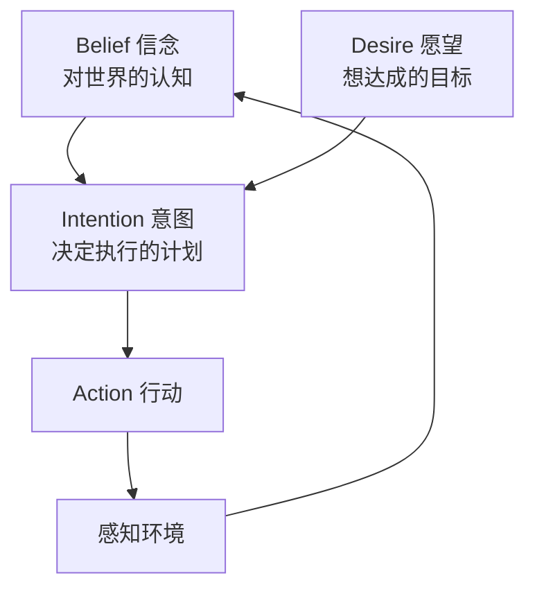

# 智能体发展历史

智能体（Agent）的概念并非随着大语言模型的兴起才出现。从人工智能诞生之初，研究者就在探索如何构建能够自主感知、决策和行动的系统。


想象一下，你要雇一个"万能助手"来帮你处理日常事务——订餐、查天气、安排日程、回复邮件。这个助手需要能**理解你的意图**、**自主规划步骤**、**操作各种工具**，甚至在遇到意外时**灵活调整方案**。这正是智能体要解决的问题，而围绕这个目标的探索已经持续了七十多年。理解这段演进历史，有助于我们把握当前Agent技术的本质和未来发展方向。

## 符号主义时代：规则驱动的智能体

### 早期专家系统

1950年代至1980年代，人工智能以符号主义为主流范式。这一时期的智能体本质上是基于规则的推理系统。

假设你是一位刚入职的住院医师，面前有一本厚厚的《临床诊断手册》，里面写满了"如果患者出现症状A和B，则考虑疾病C"这样的规则。你看病的方式就是翻手册、对症状、做判断——这基本上就是早期专家系统的工作方式。

**MYCIN系统（1976）**是医疗诊断领域的经典专家系统，它使用约600条"IF-THEN"规则来诊断血液感染疾病：

```
IF: 感染部位是血液
AND: 革兰氏染色为阴性
AND: 形态为杆状
AND: 患者处于免疫抑制状态
THEN: 感染菌可能是假单胞菌（置信度0.6）
```

这类系统展现了智能体的雏形——能够根据输入信息进行推理并给出决策建议。但其局限性也很明显：规则需要人工编写，难以处理规则库之外的情况，知识的表示和获取成本极高。

回到那位住院医师的场景：如果来了一个手册上没有的罕见病例，他就束手无策了。而且，要编写一本覆盖所有疾病的完备手册，几乎是不可能完成的任务。这正是符号主义智能体面临的根本困境。

### BDI架构

1980年代末，Michael Bratman提出的BDI（Belief-Desire-Intention）模型为智能体提供了更优雅的理论框架：

| 组件 | 含义 | 作用 |
|------|------|------|
| Belief（信念） | 对世界状态的认知 | 感知和理解环境 |
| Desire（愿望） | 想要达成的目标 | 提供行动动机 |
| Intention（意图） | 决定执行的计划 | 承诺和坚持行动 |

举个日常的例子：你早上醒来，**信念**是"今天是工作日，外面在下雨"，**愿望**是"准时到公司"，于是你形成了**意图**——"带伞、提前出门、坐地铁而不是骑车"。如果半路发现地铁停运，你的信念更新了，意图也随之调整为"打车"。这个"感知—目标—规划—执行—调整"的循环，正是BDI模型描述的核心过程。



BDI模型影响深远，至今仍是多智能体系统设计的重要参考。它强调智能体不仅要有目标，还要形成计划并承诺执行，这与后来ReACT等框架的设计理念一脉相承。

## 行为主义时代：反应式智能体

### Brooks的包容架构

1986年，Rodney Brooks提出了与符号主义截然不同的方法论。他认为智能不需要复杂的内部表示，而是源于与环境的直接交互。

这就像一个人走路时的本能反应：你不需要"思考"如何保持平衡、如何避开障碍物，这些行为是分层自动完成的——最底层负责站稳，上一层负责避开障碍，再上一层才决定去哪里。Brooks把这种分层本能式的设计称为包容架构（Subsumption Architecture），将智能体分解为多个层次的行为模块，每层处理特定任务，高层可以"包容"（抑制）低层行为：

```
层级3: 探索（发现新区域）
    ↓ 抑制
层级2: 漫游（随机移动）
    ↓ 抑制
层级1: 避障（避免碰撞）
    ↓ 抑制
层级0: 站立（保持平衡）
```

这种"行为叠加"的思想影响了后来的机器人控制和游戏AI设计。其核心洞见是：复杂的智能行为可以从简单行为的组合中涌现，而不必依赖中央规划器。

### 强化学习的兴起

1989年，Chris Watkins提出的Q-Learning算法为智能体提供了从环境交互中自主学习的能力。在实际开发中，这意味着智能体不再需要程序员事先写好每条规则，而是像一个学走迷宫的小白鼠一样——走对了给奶酪（奖励），走错了碰壁（惩罚），多试几次自然就找到了最短路径：

$$
Q(s, a) \leftarrow Q(s, a) + \alpha \left[ r + \gamma \max_{a'} Q(s', a') - Q(s, a) \right]
$$

其中：$Q(s, a)$ 为状态-动作价值函数，表示在状态 $s$ 下执行动作 $a$ 的预期累积奖励；$\alpha \in (0,1]$ 为学习率，控制新信息覆盖旧估计的程度；$r$ 为执行动作 $a$ 后获得的即时奖励；$\gamma \in [0,1]$ 为折扣因子，控制未来奖励的重要程度；$s'$ 为执行动作后进入的新状态；$\max_{a'} Q(s', a')$ 为新状态下所有可能动作的最大 Q 值。方括号内的表达式 $r + \gamma \max_{a'} Q(s', a') - Q(s, a)$ 称为时序差分（TD error），反映实际奖励与预期价值的偏差，智能体通过不断缩小这个偏差来逐步学习最优策略。

这开启了智能体从"被动执行规则"到"主动学习优化"的转变。从"照着菜谱做菜"变成了"不断尝试、自己摸索出好吃的配方"，这是智能体发展史上的一次重大跃迁。

## 深度学习时代：神经网络智能体

### DQN与深度强化学习

2013年，DeepMind的DQN（Deep Q-Network）将深度学习与强化学习结合，在Atari游戏上达到超人类水平。

假设你正在教一个从未见过电子游戏的朋友玩《打砖块》。你不告诉他任何规则，只给他看屏幕画面和分数变化。神奇的是，经过反复尝试，他不仅学会了基本操作，还发现了"把球打到砖块后面让它自动弹跳消除"这样的高级策略。DQN做的就是这件事——智能体直接从像素输入学习游戏策略，无需人工设计特征。

```python
# DQN核心思想：用神经网络近似Q函数
class DQN(nn.Module):
    def __init__(self, state_dim, action_dim):
        super().__init__()
        self.fc1 = nn.Linear(state_dim, 128)
        self.fc2 = nn.Linear(128, 128)
        self.fc3 = nn.Linear(128, action_dim)
        
    def forward(self, state):
        x = F.relu(self.fc1(state))
        x = F.relu(self.fc2(x))
        return self.fc3(x)  # Q values for each action
```

### AlphaGo与蒙特卡洛树搜索

2016年，AlphaGo击败世界围棋冠军，展示了将深度学习与传统搜索算法结合的威力。其架构整合了：

- **策略网络**：学习人类棋谱，预测落子概率
- **价值网络**：评估棋盘局势
- **蒙特卡洛树搜索**：在策略网络指导下进行前瞻搜索

这种"学习+搜索"的混合架构成为后来许多智能体系统的设计模板。如果说之前的智能体只会"凭经验做决定"或者"蒙头穷举所有可能"，AlphaGo则展示了一种更像人类棋手的思考方式：先凭直觉缩小选择范围，再对最有希望的几步棋进行深入推演。

## LLM时代：语言驱动的智能体

### 从GPT到Agent

2020年后，大语言模型的突破性进展重新定义了智能体的能力边界。GPT-3展示了In-Context Learning能力，模型可以通过少量示例学习新任务，无需微调权重。

这在实际开发中意味着什么？假设你需要构建一个能处理"查航班、定酒店、推荐餐厅"的旅行助手。在以前，你需要为每个功能分别训练模型或编写规则；而现在，同一个大语言模型只需在提示中写清楚"你是一个旅行助手，可以使用以下工具……"，它就能在多种任务间自如切换。这种通用性使得构建真正的通用智能体成为可能。

### ReACT框架

2022年，Yao等人提出的ReACT（Reasoning and Acting）框架将推理和行动统一在一个框架内：

```
问题：小明的身高是多少厘米？已知他比170cm的小红高5cm。

Thought 1: 我需要计算小明的身高。已知小红170cm，小明比她高5cm。
Action 1: Calculate[170 + 5]
Observation 1: 175

Thought 2: 计算完成，小明的身高是175cm。
Action 2: Finish[175cm]
```

ReACT的核心洞见是：让模型显式地"思考"可以提高决策质量，而"行动"则让模型能够与外部世界交互获取信息。这就像一个侦探破案：先推理线索之间的关联（Thought），再去实地调查取证（Action），最后根据新发现的证据修正推理（Observation）——如此往复，直到案件水落石出。

### 工具使用与函数调用

2023年，OpenAI推出Function Calling功能，将工具调用标准化。模型可以识别何时需要调用外部工具，并生成结构化的调用参数：

```json
{
  "name": "get_weather",
  "arguments": {
    "location": "北京",
    "date": "2024-01-15"
  }
}
```

这一机制极大地扩展了智能体的能力边界——从单纯的文本生成，扩展到了与任意API和服务的交互。打个比方，以前的大模型像一个博学但"手脚被绑住"的顾问，只能动嘴说；有了Function Calling，它终于可以亲手操作了——查数据库、发邮件、订机票，说到做到。

### 多智能体协作

2023-2024年，多智能体系统成为研究热点。代表性工作包括：

- **AutoGen**（微软）：定义了多智能体对话的编程范式
- **ChatDev**：用智能体模拟软件公司的开发流程
- **MetaGPT**：将软件工程方法论融入多智能体协作

多智能体系统的核心假设是：专业化分工和协作可以解决单个智能体难以处理的复杂任务。这与现实中的团队协作如出一辙：一个软件项目中，产品经理负责需求分析，架构师负责技术方案，程序员负责编码实现，测试工程师负责质量保障——每个人都是某个领域的"专家智能体"，通过沟通协作完成单个人难以胜任的复杂工程。

## 当前趋势与未来展望

### Agentic Workflow

当前智能体技术的主流范式是"Agentic Workflow"——将复杂任务分解为多个步骤，每个步骤可能涉及推理、工具调用、信息检索等操作。

```
用户请求 → 任务分解 → 步骤1 → 步骤2 → ... → 结果整合 → 返回
                ↑                              ↓
                └──────── 反馈与修正 ←─────────┘
```

### 智能体基础设施

随着智能体应用的普及，标准化基础设施变得越来越重要：

| 方向 | 代表项目 | 解决的问题 |
|------|----------|------------|
| 工具标准化 | MCP协议 | 统一的工具描述和调用接口 |
| 记忆管理 | Mem0、Zep | 长期记忆的存储和检索 |
| 评测框架 | AgentBench | 智能体能力的标准化评估 |
| 部署运维 | LangServe | 智能体应用的生产化部署 |

### 从Agent到AGI

智能体技术被视为通向通用人工智能（AGI）的重要路径之一。核心假设是：
- 通用智能不仅是"知道"，更是"能做"
- 通过与环境的持续交互，智能体可以不断积累知识和能力
- 多智能体协作可能产生超越单个智能体的涌现智能

回顾这段历史，智能体技术的发展线索清晰可辨：从早期"照章办事"的专家系统，到"自主试错"的强化学习智能体，再到"能看会想"的深度学习智能体，最终演进为当前"能说会做、灵活通用"的LLM智能体。每一次跃迁都在解决上一代的核心瓶颈——规则太死板，就让它自己学；只会做一件事，就给它通用语言理解能力；光会说不会做，就给它接上工具和API。

从符号推理到神经网络，从被动回答到主动行动，智能体技术的演进反映了人工智能研究的核心追求：构建能够真正理解世界、自主决策、持续学习的智能系统。理解这段历史，我们才能更好地把握当前技术的定位和未来的发展方向。
