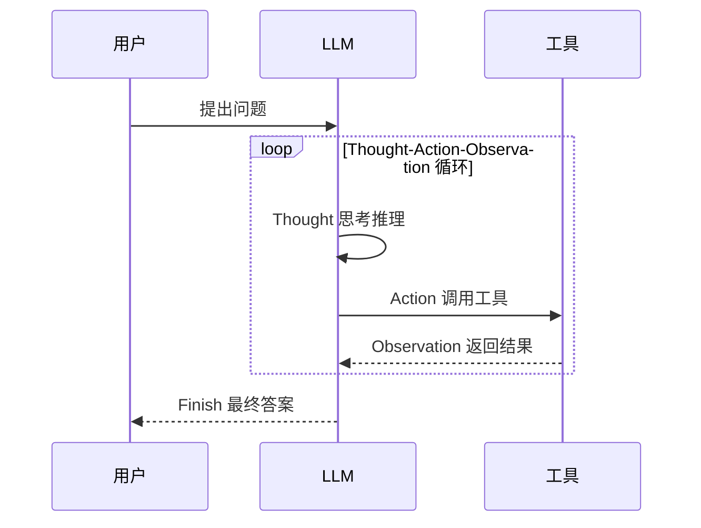

# ReACT协议

ReACT（Reasoning and Acting）是2022年由Yao等人提出的智能体框架，它将推理（Reasoning）和行动（Acting）统一在一个交替执行的循环中。这一框架的提出标志着LLM-based Agent从简单的问答系统向具备规划和执行能力的智能体演进。

假设你是一位侦探，接到了一起盗窃案。你不会一上来就漫无目的地到处翻找证据，也不会光坐在办公室里空想。而是：先分析已知线索（思考），然后去现场勘查或调取监控（行动），根据新发现修正方向（观察），再进一步推理……如此循环，直到破案。ReACT框架的精髓正是这种"想清楚再动手"的侦探思维。

## 核心思想

ReACT的核心洞见是：单纯的推理（如Chain-of-Thought）缺乏与外部世界交互的能力，而单纯的行动（如直接调用工具）又缺乏对任务的深度理解和规划。将两者结合，可以让智能体：

1. 通过**思考**理解问题、制定计划、分析中间结果
2. 通过**行动**获取信息、执行操作、验证假设
3. 通过**观察**获得反馈，指导下一步思考

回到侦探的比方：如果只在脑子里推理（纯思考），你可能会基于错误假设越走越偏；如果不加思考就到处翻找（纯行动），你会浪费大量时间在无关线索上。好的侦探一定是"想一步，查一步"交替进行的。

## 执行流程

ReACT的执行遵循“Thought-Action-Observation”的循环模式。下面用一个具体的例子来感受这个过程：



```
问题：2023年诺贝尔物理学奖得主是谁？他们的主要贡献是什么？

Thought 1: 我需要查找2023年诺贝尔物理学奖的获奖者信息。
Action 1: Search[2023 Nobel Prize Physics]
Observation 1: 2023年诺贝尔物理学奖授予Pierre Agostini、Ferenc Krausz
              和Anne L'Huillier，以表彰他们在阿秒光脉冲领域的贡献。

Thought 2: 我已经知道获奖者是三位科学家。现在需要了解阿秒光脉冲的具体内容。
Action 2: Search[阿秒光脉冲 贡献]
Observation 2: 阿秒光脉冲是持续时间在10^-18秒量级的超短激光脉冲，
              可以用于观察电子在原子和分子中的运动。

Thought 3: 我现在有足够的信息来回答问题了。
Action 3: Finish[2023年诺贝尔物理学奖授予Pierre Agostini、Ferenc Krausz
         和Anne L'Huillier三位科学家，表彰他们开发阿秒光脉冲技术，
         使人类能够观察电子在原子中的运动。]
```

注意观察这个过程：每一步的Thought都是基于前一步的Observation得出的，而不是一开始就拟定好所有步骤。这就像侦探破案一样，下一步去哪里调查，往往取决于这一步发现了什么。

## 与 Chain-of-Thought的对比

| 特性 | Chain-of-Thought | ReACT |
|------|------------------|-------|
| 推理能力 | 有，分步思考 | 有，显式Thought |
| 外部交互 | 无 | 有，通过Action |
| 知识来源 | 模型内部知识 | 可访问外部工具 |
| 实时性 | 受限于训练数据 | 可获取最新信息 |
| 可验证性 | 难以验证中间步骤 | 可追踪每个Action |

表格中最关键的区别在于"外部交互"一行。假设你要回答"今天北京气温多少"这个问题：Chain-of-Thought只能根据训练数据里的旧信息猜测，而ReACT会直接调用天气API获取实时数据——一个是"闭卷考试”，一个是"开卷考试"。

## 实现架构

### 基础实现

```python
from typing import List, Tuple
import re

class ReACTAgent:
    def __init__(self, llm, tools: dict):
        self.llm = llm
        self.tools = tools
        self.max_iterations = 10
        
    def run(self, question: str) -> str:
        prompt = self._build_initial_prompt(question)
        trajectory = []
        
        for i in range(self.max_iterations):
            # Generate thought and action
            response = self.llm.generate(prompt)
            thought, action, action_input = self._parse_response(response)
            
            trajectory.append(f"Thought {i+1}: {thought}")
            trajectory.append(f"Action {i+1}: {action}[{action_input}]")
            
            # Check if finished
            if action.lower() == "finish":
                return action_input
                
            # Execute action
            observation = self._execute_action(action, action_input)
            trajectory.append(f"Observation {i+1}: {observation}")
            
            # Update prompt with trajectory
            prompt = self._build_prompt_with_trajectory(question, trajectory)
            
        return "达到最大迭代次数，未能完成任务"
        
    def _parse_response(self, response: str) -> Tuple[str, str, str]:
        """解析LLM响应，提取Thought、Action和Action Input"""
        thought_match = re.search(r"Thought:?\s*(.+?)(?=Action:|$)", response, re.DOTALL)
        action_match = re.search(r"Action:?\s*(\w+)\[(.+?)\]", response)
        
        thought = thought_match.group(1).strip() if thought_match else ""
        action = action_match.group(1) if action_match else "Finish"
        action_input = action_match.group(2) if action_match else response
        
        return thought, action, action_input
        
    def _execute_action(self, action: str, action_input: str) -> str:
        """执行指定的Action"""
        if action.lower() in self.tools:
            return self.tools[action.lower()](action_input)
        return f"未知工具: {action}"
        
    def _build_initial_prompt(self, question: str) -> str:
        tools_desc = "\n".join([f"- {name}: {func.__doc__}" 
                               for name, func in self.tools.items()])
        return f"""Answer the following question using the available tools.

Available tools:
{tools_desc}

Use the following format:
Thought: your reasoning about what to do
Action: tool_name[input]
Observation: result of the action
... (repeat Thought/Action/Observation as needed)
Thought: I now have enough information
Action: Finish[final answer]

Question: {question}

Let's solve this step by step."""
```

### 工具定义

```python
def search(query: str) -> str:
    """Search the web for information about the query."""
    # 实际实现会调用搜索API
    return f"Search results for: {query}"

def calculate(expression: str) -> str:
    """Calculate a mathematical expression."""
    try:
        result = eval(expression)
        return str(result)
    except Exception as e:
        return f"Calculation error: {e}"

def lookup(term: str) -> str:
    """Look up a specific term in knowledge base."""
    # 实际实现会查询知识库
    return f"Definition of {term}: ..."

# 创建Agent
agent = ReACTAgent(
    llm=my_llm,
    tools={
        "search": search,
        "calculate": calculate,
        "lookup": lookup
    }
)
```

## Prompt工程

ReACT的效果很大程度上取决于Prompt的设计。这就像给新员工写工作指南——指南写得越清晰，新员工上手越快。关键要素包括：

### 工具描述

清晰描述每个工具的用途和使用方式：

```
Available tools:
- Search[query]: Search the web for current information. Use for facts, 
  news, or anything that might have changed recently.
- Calculate[expression]: Evaluate mathematical expressions. Input should 
  be a valid Python expression.
- Lookup[term]: Look up detailed information about a specific term from 
  the knowledge base.
```

### Few-shot示例

提供高质量的示例可以显著提升Agent表现。这就像带新员工时，与其只讲规则，不如先带他做几个实际案例，效果远比单纯讲理论好得多：

```
Example:
Question: What is the population of the capital of France?

Thought 1: I need to find the capital of France first.
Action 1: Search[capital of France]
Observation 1: Paris is the capital of France.

Thought 2: Now I need to find the population of Paris.
Action 2: Search[population of Paris 2023]
Observation 2: The population of Paris is approximately 2.1 million.

Thought 3: I have the answer now.
Action 3: Finish[The population of Paris, the capital of France, is 
approximately 2.1 million.]
```

### 格式约束

明确输出格式要求，减少解析错误：

```
IMPORTANT: Always follow this exact format:
Thought: <your reasoning>
Action: <tool_name>[<input>]

Do NOT include any other text between Thought and Action.
The Action MUST be one of: Search, Calculate, Lookup, Finish
```

## 变体与改进

ReACT作为基础框架，后续产生了多种改进变体。就像基础的侦探方法不断进化一样，有人提出了"多人独立调查再汇总"、"从失败中学习"、"多线并行追踪"等多种改良方案。

### ReACT-SC（Self-Consistency）

结合Self-Consistency，生成多条推理路径并投票选择最佳答案：

```python
def react_sc(question, n_paths=5):
    answers = []
    for _ in range(n_paths):
        answer = agent.run(question)
        answers.append(answer)
    
    # 投票选择最常见的答案
    return most_common(answers)
```

### Reflexion

在ReACT基础上增加反思机制，从失败中学习。这就像一个经验丰富的侦探，不会在同一个死胡同里转圈，而会反思为什么上次的调查方向错了，然后调整策略：

```
Thought: 之前的搜索没有找到有用信息，我需要换一个更具体的查询词。
Reflection: 上一次使用"AI发展"太宽泛，应该使用"2023年AI突破性进展"。
Action: Search[2023年AI突破性进展]
```

### Tree-of-Thoughts

将ReACT的线性推理扩展为树状结构，探索多个推理分支：

```
                    Question
                       │
           ┌──────────┼──────────┐
           ▼          ▼          ▼
        Path A     Path B     Path C
           │          │          │
        Thought    Thought    Thought
           │          │          │
        Action     Action     Action
           │          │          │
          ...        ...        ...
           │          │          │
           └──────────┼──────────┘
                      ▼
                 Best Answer
```

## 局限性与应对

任何框架都有其局限性，ReACT也不例外。在实际应用中，你可能会遇到以下几类典型问题：

### 工具调用错误

LLM可能生成无效的工具调用格式或参数：

```python
def safe_execute(action, action_input, tools):
    """安全执行工具调用，处理各种错误情况"""
    action = action.lower().strip()
    
    if action not in tools:
        return f"Error: Unknown tool '{action}'. Available: {list(tools.keys())}"
    
    try:
        return tools[action](action_input)
    except Exception as e:
        return f"Error executing {action}: {str(e)}"
```

### 无限循环

Agent可能陷入重复相同动作的循环——就像一个人在陌生城市迷路，反复走同一条街道却不自知：

```python
def detect_loop(trajectory, window=3):
    """检测最近的动作是否形成循环"""
    if len(trajectory) < window * 2:
        return False
    
    recent = trajectory[-window:]
    previous = trajectory[-2*window:-window]
    
    return recent == previous
```

### 推理深度不足

对于复杂问题，可能需要更深层的推理链：

```python
# 动态调整最大迭代次数
def adaptive_react(question, base_iterations=5):
    complexity = estimate_complexity(question)
    max_iter = base_iterations * complexity
    return agent.run(question, max_iterations=max_iter)
```

ReACT框架的提出为LLM智能体提供了清晰的设计模式。尽管后续出现了更多复杂的框架，但"思考-行动-观察"的核心循环仍然是大多数智能体系统的基础架构。就像所有复杂的侦探技术最终都离不开"观察—推理—行动"这个基本循环，理解ReACT，是深入学习智能体技术的重要基础。
