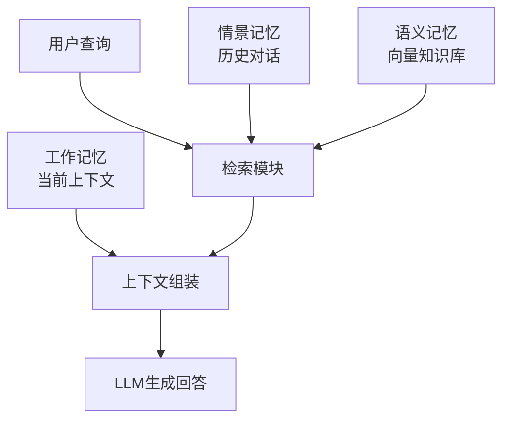

# 记忆、检索与上下文

智能体的“记忆”能力决定了它能否积累经验、保持对话连贯性以及处理需要长期追踪的复杂任务。

假设你是一名学生，正在备考期末考试。你的“记忆系统”其实分好几层：**工作记忆**是你此刻大脑里正在操作的那点信息（比如正在计算的这道题）；**短期记忆**是今天上课记的笔记，还留在草稿纸上；**长期记忆**是你整理归档的笔记本，内容经过梳理，随时可以翻阅；而**检索**就是在一堆笔记本里迅速翻到正确的那一页。智能体的记忆系统设计，与此异曲同工。

本节将探讨智能体记忆系统的设计原理、实现方案以及与上下文管理的关系。



## 记忆的分类

借鉴认知科学的分类，智能体的记忆可以分为以下几种类型。继续用学生备考的比方来理解：

| 记忆类型 | 特点 | 学生备考中的对应 | 智能体中的对应 |
|----------|------|----------------------|----------------|
| 工作记忆 | 短期、容量有限 | 正在计算的这道题 | 当前对话上下文 |
| 情景记忆 | 具体事件的记录 | 记得上周商议了什么 | 历史对话日志 |
| 语义记忆 | 一般性知识 | 整理好的笔记本 | 知识库、向量存储 |
| 程序记忆 | 技能和习惯 | 将梳理出的解题套路 | Prompt模板、工具定义 |

### 工作记忆

工作记忆对应LLM的上下文窗口，是智能体在单次交互中能够“看到”的所有信息。就像你做数学题时，草稿纸上能同时容纳的信息是有限的——写满了就得擦掉一部分才能继续。LLM的上下文窗口也是一样，容量有上限，需要策略地管理。

```python
class WorkingMemory:
    def __init__(self, max_tokens=4096):
        self.max_tokens = max_tokens
        self.messages = []
        
    def add(self, role: str, content: str):
        self.messages.append({"role": role, "content": content})
        self._trim_if_needed()
        
    def _trim_if_needed(self):
        """当超出容量时，移除最早的消息"""
        while self._count_tokens() > self.max_tokens:
            # 保留系统消息，移除最早的用户/助手消息
            for i, msg in enumerate(self.messages):
                if msg["role"] != "system":
                    self.messages.pop(i)
                    break
                    
    def get_context(self) -> list:
        return self.messages.copy()
```

### 情景记忆

情景记忆存储历史交互，用于跨会话的信息保持。回到学生的场景：你记得上周的学习小组讨论了什么、老师在哪节课上提到过哪个重点，这些都是情景记忆。对于智能体来说，就是能够记住“用户上周说过喜欢颗粒感强的咖啡”这类信息：

```python
from datetime import datetime
import json

class EpisodicMemory:
    def __init__(self, storage_path="episodic_memory.jsonl"):
        self.storage_path = storage_path
        
    def store(self, session_id: str, messages: list, metadata: dict = None):
        """存储一次完整的对话会话"""
        episode = {
            "session_id": session_id,
            "timestamp": datetime.now().isoformat(),
            "messages": messages,
            "metadata": metadata or {}
        }
        with open(self.storage_path, "a") as f:
            f.write(json.dumps(episode, ensure_ascii=False) + "\n")
            
    def retrieve_by_session(self, session_id: str) -> list:
        """检索特定会话的历史"""
        episodes = []
        with open(self.storage_path, "r") as f:
            for line in f:
                episode = json.loads(line)
                if episode["session_id"] == session_id:
                    episodes.append(episode)
        return episodes
        
    def search_similar(self, query: str, top_k: int = 5) -> list:
        """语义搜索相似的历史对话"""
        # 实现向量化搜索
        pass
```

### 语义记忆

语义记忆存储可检索的知识，通常使用向量数据库实现。这就是你精心整理的笔记本——不是按时间顺序抢到的草稿，而是按主题分类、标注好关键词的知识库。当你需要某个知识点时，可以通过关键词快速定位到相关页面：

```python
from typing import List
import numpy as np

class SemanticMemory:
    def __init__(self, embedding_model, vector_store):
        self.embedding_model = embedding_model
        self.vector_store = vector_store
        
    def add(self, text: str, metadata: dict = None):
        """添加知识到记忆"""
        embedding = self.embedding_model.encode(text)
        self.vector_store.add(
            embedding=embedding,
            text=text,
            metadata=metadata
        )
        
    def retrieve(self, query: str, top_k: int = 5) -> List[str]:
        """检索相关知识"""
        query_embedding = self.embedding_model.encode(query)
        results = self.vector_store.search(query_embedding, top_k=top_k)
        return [r["text"] for r in results]
        
    def update(self, text: str, new_text: str):
        """更新已有知识"""
        self.vector_store.delete(text=text)
        self.add(new_text)
```

## 上下文管理策略

LLM的上下文窗口有限（通常4K-128K tokens），需要精心管理。这就像你的书桌空间有限，不可能同时摆开十本书和所有草稿纸——你必须决定留下哪些资料、收起哪些、把哪些内容压缩成摘要写在便签上。以下是几种常见策略：

### 滑动窗口

保留最近的N轮对话，这是最简单直接的策略——就像只留住最近几分钟的对话，更早的内容自动“忘记”：

```python
def sliding_window(messages, window_size=10):
    """保留最近的window_size轮对话"""
    system_messages = [m for m in messages if m["role"] == "system"]
    other_messages = [m for m in messages if m["role"] != "system"]
    
    # 每轮对话包含user和assistant各一条
    kept_messages = other_messages[-(window_size * 2):]
    
    return system_messages + kept_messages
```

### 摘要压缩

将早期对话压缩为摘要。想象一下你的课堂笔记：前十页已经不重要了，但里面可能有几个关键结论。你不会全部丢掉，而是用一张便签写下核心要点，然后把原始笔记收起来：

```python
def summarize_and_compress(messages, llm, threshold=2000):
    """当上下文过长时，将早期对话压缩为摘要"""
    if count_tokens(messages) < threshold:
        return messages
        
    # 分离系统消息和对话消息
    system_msgs = [m for m in messages if m["role"] == "system"]
    conversation = [m for m in messages if m["role"] != "system"]
    
    # 找到压缩点：保留最近1/3的对话
    split_point = len(conversation) * 2 // 3
    to_summarize = conversation[:split_point]
    to_keep = conversation[split_point:]
    
    # 生成摘要
    summary_prompt = f"""请总结以下对话的关键信息：

{format_messages(to_summarize)}

用1-2句话概括重要内容。"""
    
    summary = llm.generate(summary_prompt)
    
    # 构建新的消息列表
    summary_message = {"role": "system", "content": f"[历史摘要] {summary}"}
    
    return system_msgs + [summary_message] + to_keep
```

### 重要性排序

根据相关性选择性保留消息。这是最“聪明”的策略：就像你复习时，不是把所有笔记都摆在桌上，而是根据当前正在做的这道题，只拿出最相关的几页笔记：

```python
def relevance_based_selection(messages, current_query, embedding_model, max_tokens):
    """基于与当前查询的相关性选择消息"""
    query_embedding = embedding_model.encode(current_query)
    
    scored_messages = []
    for msg in messages:
        if msg["role"] == "system":
            scored_messages.append((msg, float("inf")))  # 系统消息始终保留
        else:
            msg_embedding = embedding_model.encode(msg["content"])
            similarity = cosine_similarity(query_embedding, msg_embedding)
            scored_messages.append((msg, similarity))
    
    # 按相关性排序
    scored_messages.sort(key=lambda x: x[1], reverse=True)
    
    # 选择直到达到token限制
    selected = []
    current_tokens = 0
    for msg, score in scored_messages:
        msg_tokens = count_tokens(msg["content"])
        if current_tokens + msg_tokens <= max_tokens:
            selected.append(msg)
            current_tokens += msg_tokens
            
    # 恢复原始顺序
    original_order = {id(m): i for i, m in enumerate(messages)}
    selected.sort(key=lambda m: original_order.get(id(m), 0))
    
    return selected
```

## 记忆检索架构

有了不同层级的记忆，接下来的关键问题是：如何在正确的时机从正确的层级取出正确的信息？这就像你在图书馆复习时，需要同时参考课本、笔记、过往试卷和老师的PPT——关键是要快速定位到正确的参考资料。

### 基础RAG架构

```
用户查询
    │
    ▼
┌─────────────┐
│  查询编码   │
└──────┬──────┘
       │
       ▼
┌─────────────┐     ┌─────────────┐
│  向量检索   │ ──▶ │  文档排序   │
└─────────────┘     └──────┬──────┘
                          │
                          ▼
                   ┌─────────────┐
                   │  上下文构建  │
                   └──────┬──────┘
                          │
                          ▼
                   ┌─────────────┐
                   │   LLM生成   │
                   └─────────────┘
```

### 多级记忆检索

```python
class MultiLevelMemory:
    def __init__(self, working_memory, episodic_memory, semantic_memory):
        self.working = working_memory
        self.episodic = episodic_memory
        self.semantic = semantic_memory
        
    def retrieve(self, query: str, session_id: str) -> dict:
        """从多个记忆层级检索相关信息"""
        results = {
            "working": self.working.get_context(),
            "episodic": [],
            "semantic": []
        }
        
        # 检索情景记忆（最近的相关对话）
        recent_episodes = self.episodic.search_similar(query, top_k=3)
        results["episodic"] = recent_episodes
        
        # 检索语义记忆（相关知识）
        relevant_knowledge = self.semantic.retrieve(query, top_k=5)
        results["semantic"] = relevant_knowledge
        
        return results
        
    def build_context(self, query: str, session_id: str) -> str:
        """构建完整的上下文"""
        memories = self.retrieve(query, session_id)
        
        context_parts = []
        
        # 添加相关知识
        if memories["semantic"]:
            context_parts.append("相关知识：")
            for k in memories["semantic"]:
                context_parts.append(f"- {k}")
                
        # 添加历史对话摘要
        if memories["episodic"]:
            context_parts.append("\n相关历史对话：")
            for e in memories["episodic"]:
                context_parts.append(f"- {e['summary']}")
                
        return "\n".join(context_parts)
```

## 记忆更新与遗忘

人的记忆会自然地巩固和遗忘——重要的事情反复回忆就记住了，无关紧要的细节慢慢就淡忘了。智能体的记忆系统也需要类似的机制，否则记忆库会无限膨胀、旧信息反而干扰新决策。

### 记忆巩固

将重要的短期记忆转化为长期记忆。这个过程很像你备考时的“归纳整理”：不是所有课堂内容都值得写入笔记本，只有重要的公式、关键结论、常考题型才值得记录：

```python
class MemoryConsolidator:
    def __init__(self, llm, importance_threshold=0.7):
        self.llm = llm
        self.threshold = importance_threshold
        
    def evaluate_importance(self, message: str, context: str) -> float:
        """评估消息的重要性"""
        prompt = f"""评估以下消息在给定上下文中的重要性（0-1分）：

上下文：{context}
消息：{message}

重要性评估标准：
- 是否包含关键事实或决策
- 是否会影响后续对话
- 是否需要长期记住

请只输出一个0-1之间的数字。"""
        
        score = float(self.llm.generate(prompt).strip())
        return score
        
    def consolidate(self, working_memory, semantic_memory):
        """将重要的工作记忆巩固到语义记忆"""
        messages = working_memory.get_context()
        context = "\n".join([m["content"] for m in messages[:5]])
        
        for msg in messages:
            if msg["role"] == "assistant":
                importance = self.evaluate_importance(msg["content"], context)
                if importance >= self.threshold:
                    semantic_memory.add(
                        text=msg["content"],
                        metadata={"importance": importance, "source": "conversation"}
                    )
```

### 遗忘机制

避免记忆系统无限膨胀。假设你的笔记本签满了，你得决定哪些内容可以清理掉。自然的做法是：太旧的、从来没翻过的、本身就不重要的内容优先清理：

```python
class MemoryManager:
    def __init__(self, semantic_memory, max_size=10000):
        self.memory = semantic_memory
        self.max_size = max_size
        
    def forget(self):
        """清理不重要或过时的记忆"""
        all_memories = self.memory.get_all()
        
        if len(all_memories) <= self.max_size:
            return
            
        # 计算每条记忆的"遗忘分数"
        forget_scores = []
        for mem in all_memories:
            age = (datetime.now() - mem["created_at"]).days
            access_count = mem.get("access_count", 0)
            importance = mem.get("importance", 0.5)
            
            # 遗忘分数：越高越可能被遗忘
            # 考虑年龄、访问频率和重要性
            score = age * 0.3 - access_count * 0.2 - importance * 0.5
            forget_scores.append((mem["id"], score))
            
        # 删除遗忘分数最高的记忆
        forget_scores.sort(key=lambda x: x[1], reverse=True)
        to_delete = forget_scores[:len(all_memories) - self.max_size]
        
        for mem_id, _ in to_delete:
            self.memory.delete(mem_id)
```

## 实践：构建有记忆的对话Agent

有了以上基础组件，我们可以把它们组装起来，构建一个真正“有记忆”的对话Agent。这就像把草稿纸、笔记本、整理术结合起来，形成一套完整的学习体系：

```python
class MemoryAwareAgent:
    def __init__(self, llm, embedding_model):
        self.llm = llm
        self.working_memory = WorkingMemory(max_tokens=4096)
        self.semantic_memory = SemanticMemory(embedding_model, VectorStore())
        self.consolidator = MemoryConsolidator(llm)
        
    def chat(self, user_message: str) -> str:
        # 添加用户消息到工作记忆
        self.working_memory.add("user", user_message)
        
        # 检索相关的长期记忆
        relevant_memories = self.semantic_memory.retrieve(user_message, top_k=3)
        
        # 构建带有记忆的Prompt
        system_prompt = self._build_system_prompt(relevant_memories)
        messages = [{"role": "system", "content": system_prompt}]
        messages.extend(self.working_memory.get_context())
        
        # 生成回复
        response = self.llm.chat(messages)
        
        # 添加回复到工作记忆
        self.working_memory.add("assistant", response)
        
        # 周期性巩固记忆
        if len(self.working_memory.messages) % 10 == 0:
            self.consolidator.consolidate(self.working_memory, self.semantic_memory)
            
        return response
        
    def _build_system_prompt(self, memories: list) -> str:
        base_prompt = "你是一个有记忆能力的助手。"
        
        if memories:
            memory_context = "\n".join([f"- {m}" for m in memories])
            base_prompt += f"\n\n你记得以下相关信息：\n{memory_context}"
            
        return base_prompt
```

记忆系统是智能体从“无状态对话机器人”进化为“有经验积累的助手”的关键。就像一个好学生不仅要会做题，还要会记笔记、会归纳整理、会考前复习——合理的记忆架构设计，能够让智能体在长期交互中展现出更强的个性化和一致性。
