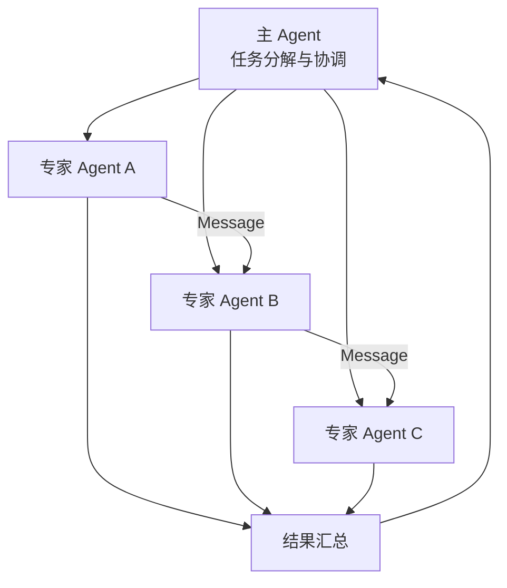

# 多智能体体系

单个智能体的能力终究有限，当面对复杂任务时，多个智能体的协作往往能产生超越个体能力之和的效果。

想象一下你的毕业设计项目：如果只有你一个人，写需求、画架构、写代码、做测试、写报告都得自己来，而且你不可能每个领域都擅长。但如果组成一个团队——小明负责产品设计，小红负责后端开发，小刚负责前端，小美负责测试——每个人发挥专长，通过沟通协作，效率和质量都能大幅提升。多智能体系统的核心理念正是如此。

本节将介绍多智能体系统的设计模式、通信协议以及典型的协作架构。



## 为什么需要多智能体

### 单智能体的局限

即使是最强大的LLM，在处理复杂任务时也面临诸多挑战。回到毕业设计的场景：一个人写代码的时候，又当开发者又当测试员，很容易"当局者迷"——自己写的代码自己很难发现bug：

| 挑战 | 表现 | 多智能体解决方案 |
|------|------|------------------|
| 角色混淆 | 同时扮演多个角色时容易混乱 | 每个Agent专注单一角色 |
| 上下文溢出 | 复杂任务需要大量上下文 | 分布式存储和处理 |
| 能力瓶颈 | 单一模型难以精通所有领域 | 专家Agent分工协作 |
| 验证困难 | 自己难以发现自己的错误 | Agent间相互审查 |

### 多智能体的优势

而团队协作能有效解决这些问题：

**专业化分工**：每个Agent专注特定任务，深度优于广度。就像团队里每个人只负责自己最擅长的部分。

**并行处理**：多个Agent可以同时处理不同子任务。前端和后端可以并行开发，不用等对方做完才开始。

**相互验证**：Agent间可以检查彼此的输出，提高质量。就像代码审查机制，别人更容易发现你的问题。

**涌现行为**：简单规则的组合可能产生复杂的智能行为。

## 多智能体架构模式

### 主从架构

一个主Agent负责任务分解和结果整合，多个从Agent执行具体任务。这就像项目经理和团队成员的关系——项目经理拆解任务、分配工作、汇总成果，团队成员各自執行分内工作：

```python
class OrchestratorAgent:
    """主Agent：负责任务分解和协调"""
    
    def __init__(self, llm, workers: dict):
        self.llm = llm
        self.workers = workers  # name -> WorkerAgent
        
    def process(self, task: str) -> str:
        # 分解任务
        subtasks = self._decompose(task)
        
        # 分配给工作Agent
        results = {}
        for subtask in subtasks:
            worker_name = self._select_worker(subtask)
            worker = self.workers[worker_name]
            results[subtask["id"]] = worker.execute(subtask)
            
        # 整合结果
        return self._synthesize(results)
        
    def _decompose(self, task: str) -> list:
        prompt = f"""将以下任务分解为子任务：

任务：{task}

可用的工作Agent：
{self._describe_workers()}

输出JSON格式的子任务列表。"""
        
        response = self.llm.generate(prompt)
        return json.loads(response)
        
    def _select_worker(self, subtask: dict) -> str:
        """根据子任务特点选择合适的工作Agent"""
        return subtask.get("assigned_worker", list(self.workers.keys())[0])
        
    def _synthesize(self, results: dict) -> str:
        """整合各子任务的结果"""
        prompt = f"""整合以下子任务结果为最终答案：

{json.dumps(results, ensure_ascii=False, indent=2)}

请给出完整、连贯的最终回答。"""
        
        return self.llm.generate(prompt)


class WorkerAgent:
    """从Agent：执行具体任务"""
    
    def __init__(self, name: str, llm, specialty: str):
        self.name = name
        self.llm = llm
        self.specialty = specialty
        
    def execute(self, subtask: dict) -> str:
        prompt = f"""你是{self.specialty}专家。

请完成以下任务：
{subtask['description']}

要求：{subtask.get('requirements', '无特殊要求')}"""
        
        return self.llm.generate(prompt)
```

### 对等架构

多个Agent平等协作，通过讨论达成共识。假设你组织了一场学术讨论会，每个人都是某个方向的专家，大家发表观点、相互讨论、最终由主持人总结。这种模式特别适合需要多角度分析的场景：

```python
class DebateSystem:
    """辩论式多智能体系统"""
    
    def __init__(self, agents: list, moderator):
        self.agents = agents  # 参与辩论的Agent列表
        self.moderator = moderator  # 主持人Agent
        
    def debate(self, topic: str, rounds: int = 3) -> str:
        history = []
        
        for round_num in range(rounds):
            round_responses = []
            
            for agent in self.agents:
                # 每个Agent发表观点
                response = agent.respond(topic, history)
                round_responses.append({
                    "agent": agent.name,
                    "response": response
                })
                
            history.extend(round_responses)
            
            # 主持人总结本轮讨论
            summary = self.moderator.summarize_round(round_responses)
            history.append({"agent": "moderator", "response": summary})
            
        # 最终裁决
        return self.moderator.final_verdict(topic, history)


class DebateAgent:
    def __init__(self, name: str, llm, stance: str):
        self.name = name
        self.llm = llm
        self.stance = stance  # 立场或专业方向
        
    def respond(self, topic: str, history: list) -> str:
        history_text = self._format_history(history)
        
        prompt = f"""你是{self.name}，立场是{self.stance}。

讨论话题：{topic}

历史讨论：
{history_text}

请发表你的观点，可以反驳其他参与者的观点，也可以补充新的见解。"""
        
        return self.llm.generate(prompt)
```

### 层级架构

多层级的Agent结构，适合处理大规模复杂任务。这就像一家大公司的组织架构：CEO对接各事业部总经理，每个总经理又管理自己的团队：

```
                    ┌─────────────┐
                    │  总指挥Agent │
                    └──────┬──────┘
           ┌───────────────┼───────────────┐
           ▼               ▼               ▼
    ┌────────────┐  ┌────────────┐  ┌────────────┐
    │ 团队领导A  │  │ 团队领导B  │  │ 团队领导C  │
    └─────┬──────┘  └─────┬──────┘  └─────┬──────┘
      ┌───┴───┐       ┌───┴───┐       ┌───┴───┐
      ▼       ▼       ▼       ▼       ▼       ▼
   ┌────┐ ┌────┐  ┌────┐ ┌────┐  ┌────┐ ┌────┐
   │工人│ │工人│  │工人│ │工人│  │工人│ │工人│
   └────┘ └────┘  └────┘ └────┘  └────┘ └────┘
```

## Agent间通信

Agent之间如何交流信息？这就像团队内部的沟通机制——可以用即时消息（直接发消息）、可以用共享文档（共享黑板）、也可以开会讨论（广播）。

### A2A协议

Agent-to-Agent（A2A）协议定义了智能体间的通信规范：

```python
from dataclasses import dataclass
from enum import Enum
from typing import Any, Optional

class MessageType(Enum):
    REQUEST = "request"      # 请求执行任务
    RESPONSE = "response"    # 任务执行结果
    INFORM = "inform"        # 信息通知
    QUERY = "query"          # 查询信息
    CONFIRM = "confirm"      # 确认收到
    REJECT = "reject"        # 拒绝请求

@dataclass
class AgentMessage:
    sender: str              # 发送者Agent ID
    receiver: str            # 接收者Agent ID
    msg_type: MessageType    # 消息类型
    content: Any             # 消息内容
    conversation_id: str     # 对话ID，用于追踪
    reply_to: Optional[str] = None  # 回复的消息ID
    
    def to_dict(self) -> dict:
        return {
            "sender": self.sender,
            "receiver": self.receiver,
            "type": self.msg_type.value,
            "content": self.content,
            "conversation_id": self.conversation_id,
            "reply_to": self.reply_to
        }


class MessageBroker:
    """消息中转站，管理Agent间的通信"""
    
    def __init__(self):
        self.agents = {}  # agent_id -> Agent
        self.message_queue = {}  # agent_id -> [messages]
        
    def register(self, agent_id: str, agent):
        self.agents[agent_id] = agent
        self.message_queue[agent_id] = []
        
    def send(self, message: AgentMessage):
        """发送消息"""
        if message.receiver in self.message_queue:
            self.message_queue[message.receiver].append(message)
            
    def receive(self, agent_id: str) -> list:
        """接收消息"""
        messages = self.message_queue.get(agent_id, [])
        self.message_queue[agent_id] = []
        return messages
        
    def broadcast(self, sender: str, content: Any, msg_type: MessageType):
        """广播消息给所有Agent"""
        for agent_id in self.agents:
            if agent_id != sender:
                msg = AgentMessage(
                    sender=sender,
                    receiver=agent_id,
                    msg_type=msg_type,
                    content=content,
                    conversation_id=f"broadcast_{uuid.uuid4()}"
                )
                self.send(msg)
```

### 共享黑板模式

Agent通过共享的“黑板”进行间接通信。这像什么？假设你的团队有一块共享白板，谁有新发现就写上去，其他人随时来看。不需要直接对话，通过白板就能同步信息：

```python
class Blackboard:
    """共享黑板，Agent通过读写黑板进行协作"""
    
    def __init__(self):
        self.data = {}
        self.subscribers = {}  # key -> [callback]
        
    def write(self, key: str, value: Any, writer: str):
        """写入数据"""
        self.data[key] = {
            "value": value,
            "writer": writer,
            "timestamp": datetime.now()
        }
        # 通知订阅者
        if key in self.subscribers:
            for callback in self.subscribers[key]:
                callback(key, value)
                
    def read(self, key: str) -> Any:
        """读取数据"""
        if key in self.data:
            return self.data[key]["value"]
        return None
        
    def subscribe(self, key: str, callback):
        """订阅数据变化"""
        if key not in self.subscribers:
            self.subscribers[key] = []
        self.subscribers[key].append(callback)
        
    def query(self, pattern: str) -> dict:
        """查询匹配的数据"""
        import re
        matched = {}
        for key, data in self.data.items():
            if re.match(pattern, key):
                matched[key] = data["value"]
        return matched
```

## 典型应用场景

### 软件开发团队

这是多智能体最经典的应用场景，直接模拟了现实世界中软件公司的工作流程。每个Agent扮演一个明确的角色，产出物作为下一个Agent的输入：

```python
class SoftwareTeam:
    def __init__(self):
        self.pm = ProductManagerAgent("产品经理")
        self.architect = ArchitectAgent("架构师")
        self.developers = [DeveloperAgent(f"开发者{i}") for i in range(3)]
        self.tester = TesterAgent("测试工程师")
        self.reviewer = ReviewerAgent("代码审查员")
        
    def develop(self, requirement: str) -> dict:
        # 产品经理：需求分析
        prd = self.pm.analyze(requirement)
        
        # 架构师：技术方案设计
        design = self.architect.design(prd)
        
        # 开发者：并行实现各模块
        modules = design["modules"]
        implementations = {}
        for i, module in enumerate(modules):
            dev = self.developers[i % len(self.developers)]
            implementations[module["name"]] = dev.implement(module)
            
        # 代码审查
        review_results = self.reviewer.review(implementations)
        
        # 根据审查意见修改
        for module_name, issues in review_results.items():
            if issues:
                dev = self.developers[0]  # 简化：由第一个开发者修复
                implementations[module_name] = dev.fix(implementations[module_name], issues)
                
        # 测试
        test_results = self.tester.test(implementations)
        
        return {
            "prd": prd,
            "design": design,
            "code": implementations,
            "test_results": test_results
        }
```

### 研究助手团队

多Agent协作完成深度研究，这就像一个研究生团队合作写一篇综述论文：有人负责规划研究方向，有人负责搜索文献，有人负责分析整理，有人负责撰写，最后还有人负责审稿：

```python
class ResearchTeam:
    def __init__(self):
        self.planner = PlannerAgent()
        self.searchers = [SearchAgent(f"搜索者{i}") for i in range(3)]
        self.analyst = AnalystAgent()
        self.writer = WriterAgent()
        self.critic = CriticAgent()
        
    def research(self, topic: str) -> str:
        # 规划研究方向
        research_plan = self.planner.plan(topic)
        
        # 并行搜索信息
        search_results = []
        for i, direction in enumerate(research_plan["directions"]):
            searcher = self.searchers[i % len(self.searchers)]
            results = searcher.search(direction)
            search_results.extend(results)
            
        # 分析整合
        analysis = self.analyst.analyze(search_results)
        
        # 撰写报告
        draft = self.writer.write(topic, analysis)
        
        # 批评修改
        feedback = self.critic.review(draft)
        final_report = self.writer.revise(draft, feedback)
        
        return final_report
```

## 涌现与协调

多智能体系统最迷人的特性之一是“涌现”——简单的个体规则能够产生复杂的群体智能。想想蚂群：每只蚂蚁的行为规则非常简单（跟着信息素走、找到食物就留下信息素），但整个蚂群却能找到最短路径、建造复杂的巢穴。

### 涌现行为

当多个简单Agent按照简单规则交互时，可能产生复杂的群体行为。以下代码模拟了蚂群寻路的过程——每只“蚂蚁Agent”的逻辑很简单，但它们集体协作却能找到最优解：

```python
class SwarmAgent:
    """群体智能Agent，模拟蚁群行为"""
    
    def __init__(self, agent_id):
        self.id = agent_id
        self.position = None
        self.found_solution = None
        
    def explore(self, search_space, pheromone_map):
        """探索搜索空间"""
        # 根据信息素浓度选择方向
        probabilities = self._calculate_probabilities(pheromone_map)
        next_position = self._choose_position(probabilities)
        
        # 移动并评估
        self.position = next_position
        quality = self._evaluate(next_position, search_space)
        
        return next_position, quality
        
    def _calculate_probabilities(self, pheromone_map):
        """根据信息素计算各方向的选择概率"""
        neighbors = self._get_neighbors()
        pheromones = [pheromone_map.get(n, 0.1) for n in neighbors]
        total = sum(pheromones)
        return [p/total for p in pheromones]


class SwarmCoordinator:
    """群体协调器"""
    
    def __init__(self, num_agents, search_space):
        self.agents = [SwarmAgent(i) for i in range(num_agents)]
        self.pheromone_map = {}
        self.search_space = search_space
        self.best_solution = None
        
    def run(self, iterations):
        for _ in range(iterations):
            # 所有Agent探索
            for agent in self.agents:
                position, quality = agent.explore(self.search_space, self.pheromone_map)
                
                # 更新信息素
                self._update_pheromone(position, quality)
                
                # 更新最优解
                if self.best_solution is None or quality > self.best_solution[1]:
                    self.best_solution = (position, quality)
                    
            # 信息素蒸发
            self._evaporate_pheromone()
            
        return self.best_solution
```

### 冲突解决

当多个Agent的目标或行动产生冲突时，需要协调机制。这和现实团队一样——开发者想用新框架，运维想要稳定性，产品经理想要快上线——怎么协调？通常有优先级、协商、投票等几种策略：

```python
class ConflictResolver:
    """冲突解决器"""
    
    def resolve(self, conflicts: list) -> dict:
        """解决Agent间的冲突"""
        resolutions = {}
        
        for conflict in conflicts:
            agents = conflict["agents"]
            resource = conflict["resource"]
            
            # 策略1：优先级排序
            if conflict["type"] == "resource_competition":
                winner = self._resolve_by_priority(agents)
                resolutions[conflict["id"]] = {"winner": winner}
                
            # 策略2：协商
            elif conflict["type"] == "goal_conflict":
                compromise = self._negotiate(agents)
                resolutions[conflict["id"]] = {"compromise": compromise}
                
            # 策略3：投票
            elif conflict["type"] == "decision":
                decision = self._vote(agents, conflict["options"])
                resolutions[conflict["id"]] = {"decision": decision}
                
        return resolutions
        
    def _negotiate(self, agents: list) -> dict:
        """让Agent协商达成妥协"""
        proposals = [agent.propose() for agent in agents]
        
        # 找到各方都能接受的方案
        for proposal in proposals:
            if all(agent.accept(proposal) for agent in agents):
                return proposal
                
        # 若无法达成一致，返回折中方案
        return self._find_middle_ground(proposals)
```

多智能体系统的设计既是科学也是艺术。就像组建一支高效团队一样，合理的角色分工、有效的通信机制、恰当的协调策略，是构建高效多智能体系统的关键。在实践中，建议从最简单的两个Agent协作开始，验证通信和协调机制能正常工作后，再逐步扩展团队规模。
