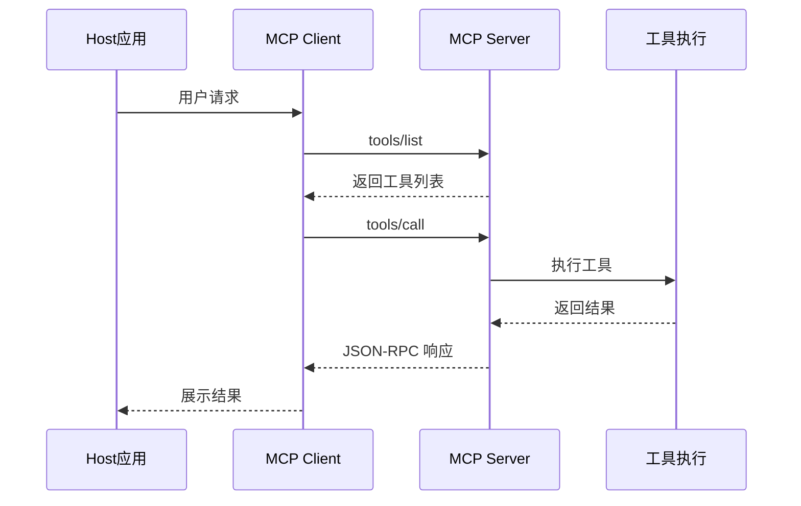

# 工具与MCP协议

想象一下，一位技艺精湛的大厨站在厨房里。他脑中装着上千道菜的做法，但如果没有锅碗瓢盆、没有灶台和刀具，再好的厨艺也无从施展。大语言模型与此类似——它具备强大的推理和语言能力，但要真正"做事"，就需要借助外部工具：查天气、搜资料、调接口、读写文件。工具（Tools）正是智能体与外部世界交互的桥梁。

而当厨房里的工具越来越多、来源各异时，就需要一套统一的"厨具标准"——每把刀的接口一致、每口锅的规格通用。MCP（Model Context Protocol）正是 Anthropic 提出的这样一套标准化工具协议，旨在统一智能体与工具的交互方式。本节将从工具的设计原则出发，逐步深入 MCP 协议的核心概念与实现。

## 工具的本质

### 什么是工具

在智能体语境下，工具是一个可被LLM调用的函数或服务，用于完成模型自身无法直接完成的任务。回到大厨的比喻：大厨知道"红烧肉需要焯水"，但焯水这个动作得靠锅和灶台来完成——工具就是智能体手中的锅和灶台。下表列举了常见的工具类型：

| 工具类型 | 示例 | 解决的问题 |
|----------|------|------------|
| 信息获取 | 搜索引擎、数据库查询 | 模型知识的时效性和覆盖度 |
| 计算执行 | 计算器、代码解释器 | 精确计算和复杂运算 |
| 外部交互 | API调用、文件操作 | 与外部系统的集成 |
| 状态管理 | 记忆存储、会话管理 | 跨对话的状态保持 |

## 工具的设计原则

好的厨具有什么特点？菜刀就是切菜的，不会同时兼做搅拌；刻度量杯让你一目了然地知道该倒多少；如果菜刀钝了，你一摸就知道——而不是切到一半才发现。设计工具的原则与此相通：

**单一职责**：每个工具只做一件事，避免功能过载。就像菜刀负责切、锅负责炒，不要造一把"万能刀锅"。

**输入明确**：参数定义清晰，有明确的类型和约束。好比量杯上的刻度线，让使用者不必猜测。

**输出一致**：返回格式固定，便于LLM理解和处理。就像每道菜出锅时都装在标准的盘子里，后续流程才能顺畅对接。

**错误透明**：错误信息清晰，帮助LLM理解问题并调整策略。如果烤箱温度不对，应该直接报警，而不是默默烤糊。

```python
# 好的工具设计
class WeatherTool:
    """获取天气信息的工具"""
    
    name = "get_weather"
    description = "获取指定城市的当前天气信息"
    
    parameters = {
        "type": "object",
        "properties": {
            "city": {
                "type": "string",
                "description": "城市名称，如'北京'、'上海'"
            },
            "unit": {
                "type": "string",
                "enum": ["celsius", "fahrenheit"],
                "default": "celsius",
                "description": "温度单位"
            }
        },
        "required": ["city"]
    }
    
    def execute(self, city: str, unit: str = "celsius") -> dict:
        """执行工具"""
        try:
            weather_data = self._fetch_weather(city)
            return {
                "success": True,
                "data": {
                    "city": city,
                    "temperature": self._convert_temp(weather_data["temp"], unit),
                    "condition": weather_data["condition"],
                    "humidity": weather_data["humidity"]
                }
            }
        except CityNotFoundError:
            return {
                "success": False,
                "error": f"未找到城市: {city}",
                "suggestion": "请检查城市名称是否正确"
            }
```

# MCP协议概述

理解了单个工具的设计之后，一个自然的问题是：当智能体需要使用来自不同开发者、不同平台的几十种工具时，怎么办？假设你正在组建一个开放式大厨房，每位供应商提供的灶台接口不同、锅具尺寸各异——这将是一场噩梦。MCP 协议就是为了解决这个"工具生态的标准化"问题而诞生的。

### 设计目标

MCP（Model Context Protocol）旨在解决以下问题：

1. **标准化**：统一不同工具的接口规范
2. **可发现性**：让模型能够动态发现可用工具
3. **安全性**：提供权限控制和沙箱执行
4. **可组合性**：支持工具的组合和编排



### 核心概念

```
┌─────────────────────────────────────────────────────┐
│                    MCP架构                          │
├─────────────────────────────────────────────────────┤
│                                                     │
│  ┌─────────────┐     ┌─────────────┐              │
│  │   Client    │────▶│   Server    │              │
│  │  (Claude)   │◀────│ (工具提供者) │              │
│  └─────────────┘     └─────────────┘              │
│         │                   │                      │
│         │     JSON-RPC      │                      │
│         │    over stdio     │                      │
│         │    或 HTTP        │                      │
│         │                   │                      │
│         ▼                   ▼                      │
│  ┌─────────────┐     ┌─────────────┐              │
│  │  Resources  │     │   Tools     │              │
│  │  (资源访问)  │     │  (工具调用)  │              │
│  └─────────────┘     └─────────────┘              │
│                                                     │
└─────────────────────────────────────────────────────┘
```

用厨房的比喻来理解这个架构：Server 就像是一个个"专业厨具供应商"，每家提供特定类型的工具（天气查询、数据库访问等）；Client 则是大厨（LLM应用），他向供应商询问"你有哪些工具？"，然后按需取用。两者之间通过标准化的"订单格式"（JSON-RPC）沟通。

**Server**：提供工具和资源的服务端程序——相当于厨具供应商
**Client**：使用工具的客户端（通常是LLM应用）——相当于大厨
**Tools**：可被调用的函数——相当于具体的厨具（刀、锅、烤箱）
**Resources**：可被读取的数据源——相当于食材仓库的货架清单

## 协议消息格式

这就像大厨和供应商之间的对话有固定格式：大厨说"请给我用某某工具处理某某食材"，供应商回复"好的，结果如下"。MCP 使用 JSON-RPC 2.0 作为这种"对话格式"：

```json
// 请求
{
    "jsonrpc": "2.0",
    "id": 1,
    "method": "tools/call",
    "params": {
        "name": "get_weather",
        "arguments": {
            "city": "北京"
        }
    }
}

// 响应
{
    "jsonrpc": "2.0",
    "id": 1,
    "result": {
        "content": [
            {
                "type": "text",
                "text": "北京当前温度25°C，晴天"
            }
        ]
    }
}
```

## MCP Server实现

### 基础结构

```python
import json
import sys
from typing import Any, Callable

class MCPServer:
    """MCP服务端基础实现"""
    
    def __init__(self, name: str, version: str = "1.0.0"):
        self.name = name
        self.version = version
        self.tools = {}
        self.resources = {}
        
    def tool(self, name: str, description: str, parameters: dict):
        """工具装饰器"""
        def decorator(func: Callable):
            self.tools[name] = {
                "name": name,
                "description": description,
                "inputSchema": parameters,
                "handler": func
            }
            return func
        return decorator
        
    def resource(self, uri: str, name: str, description: str):
        """资源装饰器"""
        def decorator(func: Callable):
            self.resources[uri] = {
                "uri": uri,
                "name": name,
                "description": description,
                "handler": func
            }
            return func
        return decorator
        
    def handle_request(self, request: dict) -> dict:
        """处理JSON-RPC请求"""
        method = request.get("method")
        params = request.get("params", {})
        req_id = request.get("id")
        
        try:
            if method == "initialize":
                result = self._handle_initialize(params)
            elif method == "tools/list":
                result = self._handle_tools_list()
            elif method == "tools/call":
                result = self._handle_tools_call(params)
            elif method == "resources/list":
                result = self._handle_resources_list()
            elif method == "resources/read":
                result = self._handle_resources_read(params)
            else:
                return self._error_response(req_id, -32601, f"Method not found: {method}")
                
            return {"jsonrpc": "2.0", "id": req_id, "result": result}
            
        except Exception as e:
            return self._error_response(req_id, -32000, str(e))
            
    def _handle_initialize(self, params: dict) -> dict:
        return {
            "protocolVersion": "2024-11-05",
            "serverInfo": {
                "name": self.name,
                "version": self.version
            },
            "capabilities": {
                "tools": {"listChanged": True},
                "resources": {"subscribe": True}
            }
        }
        
    def _handle_tools_list(self) -> dict:
        tools = []
        for tool in self.tools.values():
            tools.append({
                "name": tool["name"],
                "description": tool["description"],
                "inputSchema": tool["inputSchema"]
            })
        return {"tools": tools}
        
    def _handle_tools_call(self, params: dict) -> dict:
        tool_name = params.get("name")
        arguments = params.get("arguments", {})
        
        if tool_name not in self.tools:
            raise ValueError(f"Unknown tool: {tool_name}")
            
        handler = self.tools[tool_name]["handler"]
        result = handler(**arguments)
        
        return {
            "content": [
                {"type": "text", "text": json.dumps(result, ensure_ascii=False)}
            ]
        }
        
    def run_stdio(self):
        """通过标准输入输出运行服务"""
        while True:
            line = sys.stdin.readline()
            if not line:
                break
                
            try:
                request = json.loads(line)
                response = self.handle_request(request)
                sys.stdout.write(json.dumps(response) + "\n")
                sys.stdout.flush()
            except json.JSONDecodeError:
                pass
```

### 示例：天气服务

```python
# weather_server.py
from mcp_server import MCPServer

server = MCPServer("weather-service", "1.0.0")

@server.tool(
    name="get_current_weather",
    description="获取指定城市的当前天气",
    parameters={
        "type": "object",
        "properties": {
            "city": {"type": "string", "description": "城市名称"},
            "country": {"type": "string", "description": "国家代码，如CN、US"}
        },
        "required": ["city"]
    }
)
def get_current_weather(city: str, country: str = "CN"):
    # 实际实现会调用天气API
    return {
        "city": city,
        "temperature": 25,
        "condition": "晴",
        "humidity": 60
    }

@server.tool(
    name="get_forecast",
    description="获取未来几天的天气预报",
    parameters={
        "type": "object",
        "properties": {
            "city": {"type": "string"},
            "days": {"type": "integer", "minimum": 1, "maximum": 7}
        },
        "required": ["city", "days"]
    }
)
def get_forecast(city: str, days: int):
    return {
        "city": city,
        "forecast": [
            {"day": i+1, "temp_high": 28-i, "temp_low": 18-i}
            for i in range(days)
        ]
    }

@server.resource(
    uri="weather://cities",
    name="支持的城市列表",
    description="获取支持查询天气的城市列表"
)
def get_cities():
    return {
        "cities": ["北京", "上海", "广州", "深圳", "杭州"]
    }

if __name__ == "__main__":
    server.run_stdio()
```

## MCP Client实现

```python
import subprocess
import json

class MCPClient:
    """MCP客户端"""
    
    def __init__(self, server_command: list):
        self.process = subprocess.Popen(
            server_command,
            stdin=subprocess.PIPE,
            stdout=subprocess.PIPE,
            text=True
        )
        self.request_id = 0
        self._initialize()
        
    def _send_request(self, method: str, params: dict = None) -> dict:
        self.request_id += 1
        request = {
            "jsonrpc": "2.0",
            "id": self.request_id,
            "method": method
        }
        if params:
            request["params"] = params
            
        self.process.stdin.write(json.dumps(request) + "\n")
        self.process.stdin.flush()
        
        response_line = self.process.stdout.readline()
        return json.loads(response_line)
        
    def _initialize(self):
        response = self._send_request("initialize", {
            "protocolVersion": "2024-11-05",
            "clientInfo": {"name": "mcp-client", "version": "1.0.0"}
        })
        return response.get("result")
        
    def list_tools(self) -> list:
        response = self._send_request("tools/list")
        return response.get("result", {}).get("tools", [])
        
    def call_tool(self, name: str, arguments: dict) -> dict:
        response = self._send_request("tools/call", {
            "name": name,
            "arguments": arguments
        })
        return response.get("result")
        
    def close(self):
        self.process.terminate()


# 使用示例
client = MCPClient(["python", "weather_server.py"])

# 列出可用工具
tools = client.list_tools()
print("Available tools:", [t["name"] for t in tools])

# 调用工具
result = client.call_tool("get_current_weather", {"city": "北京"})
print("Weather:", result)

client.close()
```

# 工具组合与编排

在实际开发中，单个工具往往不足以完成复杂任务——就像做一道菜需要先洗、再切、再炒，工具之间也需要协调配合。这就引出了工具编排的概念。

### 工具链

工具链就像烹饪流程：先用搜索工具"备料"（获取原始信息），再用摘要工具"烹制"（提炼要点），最后呈给用户。每一步的输出自然地成为下一步的输入：

```python
class ToolChain:
    """工具链：顺序执行多个工具"""
    
    def __init__(self, tools: list):
        self.tools = tools
        
    def execute(self, initial_input: dict) -> dict:
        result = initial_input
        
        for tool in self.tools:
            # 从上一步结果中提取本步骤需要的参数
            params = self._extract_params(result, tool.parameters)
            result = tool.execute(**params)
            
            if not result.get("success"):
                return result  # 提前终止
                
        return result

# 示例：搜索 -> 总结
search_tool = SearchTool()
summarize_tool = SummarizeTool()

chain = ToolChain([search_tool, summarize_tool])
result = chain.execute({"query": "量子计算最新进展"})
```

### 条件分支

有时候，大厨需要根据食材的状态决定下一步操作——鱼是活的就清蒸，冷冻的就红烧。条件工具的逻辑与此相同：

```python
class ConditionalTool:
    """条件工具：根据条件选择执行不同工具"""
    
    def __init__(self, condition_fn, tool_if_true, tool_if_false):
        self.condition = condition_fn
        self.tool_true = tool_if_true
        self.tool_false = tool_if_false
        
    def execute(self, **kwargs) -> dict:
        if self.condition(kwargs):
            return self.tool_true.execute(**kwargs)
        else:
            return self.tool_false.execute(**kwargs)
```

### 并行执行

回到厨房场景，一位熟练的厨师不会等米饭蒸好了再去炒菜——他会同时开几个灶台并行操作。工具的并行执行也是如此，当多个工具之间没有依赖关系时，同时调用可以显著提升效率：

```python
import asyncio

class ParallelTools:
    """并行执行多个工具"""
    
    def __init__(self, tools: list):
        self.tools = tools
        
    async def execute(self, inputs: list) -> list:
        """并行执行，inputs与tools一一对应"""
        tasks = [
            asyncio.create_task(self._execute_async(tool, inp))
            for tool, inp in zip(self.tools, inputs)
        ]
        return await asyncio.gather(*tasks)
        
    async def _execute_async(self, tool, params):
        # 将同步调用包装为异步
        loop = asyncio.get_event_loop()
        return await loop.run_in_executor(None, lambda: tool.execute(**params))
```

## 安全考量

工具能力越强，安全要求就越高。这就像厨房管理——实习生不能碰大型切割设备，只有持证厨师才能操作明火灶台。在智能体工具体系中，权限控制和输入验证同样不可或缺。

### 权限控制

```python
class SecureTool:
    """带权限控制的工具"""
    
    def __init__(self, tool, required_permissions: list):
        self.tool = tool
        self.required_permissions = required_permissions
        
    def execute(self, user_permissions: list, **kwargs):
        # 检查权限
        missing = set(self.required_permissions) - set(user_permissions)
        if missing:
            return {
                "success": False,
                "error": f"缺少权限: {missing}"
            }
            
        return self.tool.execute(**kwargs)
```

### 输入验证

```python
from jsonschema import validate, ValidationError

class ValidatedTool:
    """带输入验证的工具"""
    
    def __init__(self, tool, schema: dict):
        self.tool = tool
        self.schema = schema
        
    def execute(self, **kwargs):
        try:
            validate(instance=kwargs, schema=self.schema)
        except ValidationError as e:
            return {
                "success": False,
                "error": f"参数验证失败: {e.message}"
            }
            
        return self.tool.execute(**kwargs)
```

回顾本节，有两点值得特别记住。第一，工具之于智能体，正如厨具之于大厨——模型的推理能力再强，也需要工具来"落地执行"。好的工具设计遵循单一职责、输入明确、输出一致、错误透明的原则。第二，MCP 协议的核心价值在于标准化：它让不同来源的工具可以"即插即用"，就像统一了厨房的电压和插座规格。通过遵循 MCP 规范，开发者可以创建可复用、可组合的工具，显著降低智能体应用的开发成本。随着 MCP 生态的发展，我们正在走向一个"工具即服务"的未来——智能体可以像逛超市一样，按需挑选和组合各种能力。
