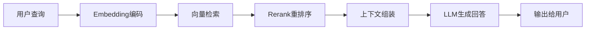

# RAG技术

假设你正在参加一场开卷考试。老师允许你带资料进考场，但时间有限、资料堆积如山。你的策略是什么？当然是先理解题意，然后快速翻到相关页面，最后结合资料和自己的理解写出答案。RAG（Retrieval-Augmented Generation，检索增强生成）做的正是这件事——它让大语言模型在回答问题时能够"查阅参考资料"，而不是完全依赖记忆。这是构建知识密集型智能体应用的核心技术之一。

## RAG概述

### 为什么需要RAG

为什么不能让模型把所有知识都背下来呢？这就像问“为什么不把所有教材都背下来而要带资料进考场”。原因很简单：知识量太大、更新太快、而且很多是私有数据。下表对比了LLM的局限及 RAG 的应对策略：



| LLM局限 | RAG解决方案 |
|---------|------------|
| 知识截止日期 | 实时检索最新信息 |
| 幻觉问题 | 基于检索到的事实生成 |
| 领域知识不足 | 接入专业知识库 |
| 私有数据无法使用 | 安全地使用企业数据 |

### 基本架构

回到开卷考试的场景，RAG 的工作流程就是：理解题意（查询处理）→ 翻找资料（检索）→ 找到相关段落（上下文构建）→ 组织答案（生成）。用图表示如下：

```
用户查询 → 查询处理 → 检索器 → 知识库
                          ↓
                      相关文档
                          ↓
                      上下文构建
                          ↓
                   LLM生成回答 → 用户
```

## 核心组件

理解了 RAG 的整体流程，接下来我们逐一拆解其中的核心组件。如果把 RAG 比作开卷考试，那么 Embedding 模型就是你的"索引能力"——它将文本转化为向量，便于计算语义相似度；向量数据库就是你的"资料柜"；Reranker 则是你的"筛选过程"——从粗活到细活，逐步缩小范围。

### Embedding模型

Embedding模型将文本转换为向量表示，是实现语义检索的基础。简单来说，它把每段文字变成一串数字（向量），使得"意思相近"的文本在数学空间中彼此靠近。举个例子，"今天天气如何"和"今天会下雨吗"的向量会很接近，而与"今天股市怎么样"则较远：

```python
from sentence_transformers import SentenceTransformer

class EmbeddingService:
    def __init__(self, model_name="BAAI/bge-large-zh-v1.5"):
        self.model = SentenceTransformer(model_name)
        
    def encode(self, texts: list) -> np.ndarray:
        """批量编码文本"""
        return self.model.encode(texts, normalize_embeddings=True)
        
    def encode_query(self, query: str) -> np.ndarray:
        """编码查询（可能有不同的指令前缀）"""
        # BGE模型对查询有特殊处理
        query_with_instruction = f"为这个句子生成表示以用于检索相关文章：{query}"
        return self.model.encode([query_with_instruction], normalize_embeddings=True)[0]
```

常用Embedding模型对比：

| 模型 | 维度 | 中文支持 | 特点 |
|------|------|----------|------|
| BGE-large-zh | 1024 | 优秀 | 中文领域领先 |
| text-embedding-3-large | 3072 | 良好 | OpenAI最新模型 |
| GTE-large | 1024 | 优秀 | 阿里开源 |
| E5-large | 1024 | 一般 | 微软出品 |

### 向量数据库

有了向量表示，还需要一个高效的"资料柜"来存储和检索它们。向量数据库就扮演这个角色——你可以把它想象成一个智能书架，每本书都按内容相似度排列，查找时不是翻目录，而是直接拿你的问题去"比对"，找到最相关的那几本：

```python
import chromadb

class VectorStore:
    def __init__(self, collection_name="documents"):
        self.client = chromadb.Client()
        self.collection = self.client.create_collection(
            name=collection_name,
            metadata={"hnsw:space": "cosine"}
        )
        
    def add_documents(
        self,
        documents: list,
        embeddings: np.ndarray,
        ids: list = None,
        metadatas: list = None,
    ):
        """添加文档"""
        if ids is None:
            ids = [f"doc_{i}" for i in range(len(documents))]
            
        self.collection.add(
            embeddings=embeddings.tolist(),
            documents=documents,
            ids=ids,
            metadatas=metadatas,
        )
        
    def search(self, query_embedding: np.ndarray, top_k: int = 5) -> list:
        """检索相似文档"""
        results = self.collection.query(
            query_embeddings=[query_embedding.tolist()],
            n_results=top_k
        )
        
        return [
            {"document": doc, "distance": dist}
            for doc, dist in zip(results["documents"][0], results["distances"][0])
        ]
```

### Reranker模型

初步检索往往会返回不少"看起来相关"的结果，但其中并非每一条都真正有用。这就像你在图书馆翻到了十本可能相关的书，还需要快速浏览一遍，挑出最切题的三本。Reranker 就是这个"精细筛选"的过程，它对初步检索结果进行重新打分和排序：

```python
from transformers import AutoModelForSequenceClassification, AutoTokenizer

class Reranker:
    def __init__(self, model_name="BAAI/bge-reranker-large"):
        self.tokenizer = AutoTokenizer.from_pretrained(model_name)
        self.model = AutoModelForSequenceClassification.from_pretrained(model_name)
        
    def rerank(self, query: str, documents: list, top_k: int = 3) -> list:
        """重排序文档"""
        pairs = [[query, doc] for doc in documents]
        
        inputs = self.tokenizer(
            pairs,
            padding=True,
            truncation=True,
            return_tensors="pt"
        )
        
        with torch.no_grad():
            scores = self.model(**inputs).logits.squeeze()
            
        # 按分数排序
        sorted_indices = torch.argsort(scores, descending=True)[:top_k]
        
        return [
            {"document": documents[i], "score": scores[i].item()}
            for i in sorted_indices
        ]
```

## 多路召回

在实际应用中，单一检索方式往往不够稳健。这就好比找资料时只用一种方法：如果只按关键词搜，可能漏掉用了同义词的文档；如果只按语义搜，可能漏掉包含精确术语的文档。多路召回就是"两条腿走路"——同时用多种策略检索，然后融合结果：

```python
class HybridRetriever:
    """混合检索器"""
    
    def __init__(self, embedding_model, bm25_index, vector_store):
        self.embedding = embedding_model
        self.bm25 = bm25_index
        self.vector_store = vector_store
        
    def retrieve(self, query: str, top_k: int = 10) -> list:
        # 向量检索
        query_embedding = self.embedding.encode_query(query)
        vector_results = self.vector_store.search(query_embedding, top_k)
        
        # BM25关键词检索
        bm25_results = self.bm25.search(query, top_k)
        
        # 融合结果（RRF融合）
        fused = self._reciprocal_rank_fusion([vector_results, bm25_results])
        
        return fused[:top_k]
        
    def _reciprocal_rank_fusion(self, result_lists: list, k: int = 60) -> list:
        """RRF融合算法"""
        scores = {}
        
        for results in result_lists:
            for rank, item in enumerate(results):
                doc = item["document"]
                if doc not in scores:
                    scores[doc] = 0
                scores[doc] += 1 / (k + rank + 1)
                
        # 按融合分数排序
        sorted_docs = sorted(scores.items(), key=lambda x: x[1], reverse=True)
        
        return [{"document": doc, "score": score} for doc, score in sorted_docs]
```

## RAG Pipeline

现在我们把上述组件串联起来，看看一个完整的 RAG 系统是如何运作的。这就像考试时你的全套策略：先理解题意（查询改写），然后多渠道找资料（检索），挑出最相关的几页（重排序），组织语言写答案（生成）。

### 完整流程

```python
class RAGPipeline:
    """完整的RAG流程"""
    
    def __init__(self, retriever, reranker, llm):
        self.retriever = retriever
        self.reranker = reranker
        self.llm = llm
        
    def query(self, question: str) -> str:
        # 1. 查询改写（可选）
        rewritten_query = self._rewrite_query(question)
        
        # 2. 检索
        candidates = self.retriever.retrieve(rewritten_query, top_k=20)
        
        # 3. 重排序
        reranked = self.reranker.rerank(question, 
                                        [c["document"] for c in candidates],
                                        top_k=5)
        
        # 4. 构建上下文
        context = self._build_context(reranked)
        
        # 5. 生成回答
        answer = self._generate(question, context)
        
        return answer
        
    def _rewrite_query(self, query: str) -> str:
        """查询改写：扩展或澄清查询"""
        prompt = f"""请将以下用户查询改写为更适合检索的形式：
        
原始查询：{query}

改写要求：
1. 扩展缩写和专业术语
2. 添加相关的同义词
3. 保持核心语义不变

改写后的查询："""
        
        return self.llm.generate(prompt).strip()
        
    def _build_context(self, documents: list) -> str:
        """构建上下文"""
        context_parts = []
        for i, doc in enumerate(documents, 1):
            context_parts.append(f"[文档{i}]\n{doc['document']}")
            
        return "\n\n".join(context_parts)
        
    def _generate(self, question: str, context: str) -> str:
        """基于上下文生成回答"""
        prompt = f"""基于以下参考资料回答问题。如果资料中没有相关信息，请如实说明。

参考资料：
{context}

问题：{question}

回答："""
        
        return self.llm.generate(prompt)
```

### 高级技术

基础版本的 RAG 已经能解决大多数问题，但面对复杂场景时可能力不从心。假设考试中有一道综合题，你翻完第一遍资料后发现信息不够，需要带着新的线索再翻一遍——这就是递归检索的思路。

#### 递归检索

对于复杂问题，一次检索往往不够，需要多轮迭代：

```python
class RecursiveRAG:
    def __init__(self, rag_pipeline, max_iterations=3):
        self.rag = rag_pipeline
        self.max_iterations = max_iterations
        
    def query(self, question: str) -> str:
        accumulated_context = []
        current_question = question
        
        for i in range(self.max_iterations):
            # 检索
            results = self.rag.retriever.retrieve(current_question)
            accumulated_context.extend([r["document"] for r in results])
            
            # 检查是否有足够信息
            if self._has_sufficient_info(question, accumulated_context):
                break
                
            # 生成后续问题
            current_question = self._generate_followup(question, accumulated_context)
            
        return self.rag._generate(question, "\n".join(accumulated_context))
```

#### 自适应检索

还有一种更智能的策略：并非所有问题都需要查资料。"一加一等于几"这种问题，直接答即可；但"昨天某公司股价是多少"就必须检索。自适应 RAG 先判断问题类型，再决定是否启动检索：

```python
class AdaptiveRAG:
    def __init__(self, llm, rag_pipeline):
        self.llm = llm
        self.rag = rag_pipeline
        
    def query(self, question: str) -> str:
        # 判断是否需要检索
        needs_retrieval = self._needs_retrieval(question)
        
        if needs_retrieval:
            return self.rag.query(question)
        else:
            # 直接用LLM回答
            return self.llm.generate(f"请回答：{question}")
            
    def _needs_retrieval(self, question: str) -> bool:
        prompt = f"""判断以下问题是否需要检索外部知识才能回答。

问题：{question}

判断标准：
- 需要具体事实或数据 -> 需要检索
- 需要最新信息 -> 需要检索
- 是常识性问题或推理问题 -> 不需要检索

请只回答"是"或"否"。"""
        
        response = self.llm.generate(prompt).strip()
        return response == "是"
```

## 知识库构建

前面讲的都是"如何查资料"，但一个前提是——资料本身需要被整理好。假设你考试前把所有讲义随意堆在一起，查找效率当然低；但如果提前按章节贴好书签、做好索引，效率就大不一样了。知识库构建就是这个"整理资料"的过程。

### 文档处理

```python
class DocumentProcessor:
    """文档处理器"""
    
    def __init__(self, chunk_size=500, overlap=50):
        self.chunk_size = chunk_size
        self.overlap = overlap
        
    def load_and_split(self, file_path: str) -> list:
        """加载文档并分块"""
        # 加载文档
        text = self._load_file(file_path)
        
        # 分块
        chunks = self._split_text(text)
        
        # 添加元数据
        return [
            {"content": chunk, "source": file_path, "chunk_id": i}
            for i, chunk in enumerate(chunks)
        ]
        
    def _split_text(self, text: str) -> list:
        """文本分块"""
        chunks = []
        start = 0
        
        while start < len(text):
            end = start + self.chunk_size
            
            # 尝试在句子边界分割
            if end < len(text):
                # 寻找最近的句子结束符
                for sep in ["。", "！", "？", "\n"]:
                    pos = text.rfind(sep, start, end)
                    if pos > start:
                        end = pos + 1
                        break
                        
            chunks.append(text[start:end])
            start = end - self.overlap
            
        return chunks
```

### 索引构建

```python
class KnowledgeBase:
    """知识库"""
    
    def __init__(self, embedding_model, vector_store):
        self.processor = DocumentProcessor()
        self.embedding = embedding_model
        self.store = vector_store
        
    def index_documents(self, file_paths: list):
        """索引文档"""
        all_chunks = []
        
        for path in file_paths:
            chunks = self.processor.load_and_split(path)
            all_chunks.extend(chunks)
            
        # 批量生成embeddings
        texts = [c["content"] for c in all_chunks]
        embeddings = self.embedding.encode(texts)
        
        # 存储
        self.store.add_documents(
            documents=texts,
            embeddings=embeddings,
            metadatas=[{"source": c["source"]} for c in all_chunks]
        )
        
        print(f"索引完成，共{len(all_chunks)}个文档块")
```

## 评估与优化

### 检索质量评估

```python
class RetrievalEvaluator:
    def evaluate(self, queries: list, ground_truth: list, retriever) -> dict:
        """评估检索质量"""
        metrics = {
            "recall@5": [],
            "mrr": [],
            "ndcg@5": []
        }
        
        for query, relevant_docs in zip(queries, ground_truth):
            results = retriever.retrieve(query, top_k=5)
            retrieved_docs = [r["document"] for r in results]
            
            # Recall@5
            recall = len(set(retrieved_docs) & set(relevant_docs)) / len(relevant_docs)
            metrics["recall@5"].append(recall)
            
            # MRR
            for rank, doc in enumerate(retrieved_docs, 1):
                if doc in relevant_docs:
                    metrics["mrr"].append(1 / rank)
                    break
            else:
                metrics["mrr"].append(0)
                
        return {k: np.mean(v) for k, v in metrics.items()}
```

回顾本节，RAG 的核心思想其实非常朴素：与其让模型"死记硬背"，不如让它学会"查书"。Embedding 模型提供了语义索引能力，向量数据库提供了高效存储，Reranker 实现了精细筛选，多路召回保证了检索的全面性。在实际应用中，一个好的 RAG 系统并不是简单的"搜索+生成"，而是需要在分块策略、检索质量和提示设计上反复调优——就像开卷考试的资料组织得越好，答题效率就越高。
