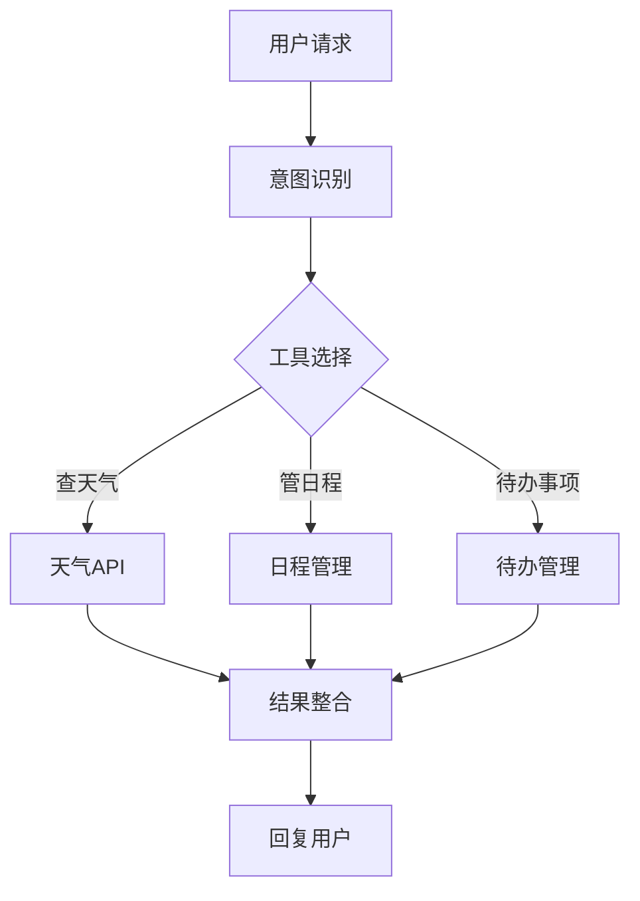

# 实践：个人生活助手

假设你有一位无所不能的私人管家，你只需说一句“明天北京天气怎么样？帮我安排下午两点的会议”，他就能自动查天气、写日程、管待办。本节我们就来构建这样一个助手——它虽然不能替你吃饭，但能帮你管理日常生活中的大小事务。这个实践项目将整合天气查询、日程管理、待办事项等功能，展示智能体开发的完整流程。



## 项目概述

### 功能需求

- 天气查询：获取指定城市的天气信息
- 日程管理：添加、查询、删除日程
- 待办事项：管理待办任务
- 自然语言交互：通过对话完成所有操作

### 技术架构

在动手写代码之前，先看看整体架构。这个助手的工作方式其实很像前面学过的 ReACT 模式：用户说话→ Agent 思考该用什么工具→ 调用工具→ 组织结果回复用户。就像你对管家说“明天出门带伞吗”，管家会先查天气预报，再告诉你结果。

```
用户输入 → Agent（ReACT） → 工具调用 → 返回结果
                ↓
           LLM（Qwen/GPT）
                ↓
           ┌────┴────┐
           ↓         ↓
       工具集     记忆系统
       - 天气     - 对话历史
       - 日程     - 用户偏好
       - 待办
```

## 环境准备

```bash
# 安装依赖
pip install openai langchain chromadb requests

# 目录结构
personal_assistant/
├── main.py
├── tools/
│   ├── __init__.py
│   ├── weather.py
│   ├── calendar.py
│   └── todo.py
├── memory/
│   └── conversation.py
└── config.py
```

## 工具实现

助手的能力取决于它手中的工具。回忆前面工具与 MCP 协议一节的内容，每个工具都应该职责单一、输入明确、输出一致。我们逐个实现。

### 天气工具

天气工具是最经典的外部 API 调用示例。注意代码中的错误处理——这是生产级工具的必备素质，因为网络调用随时可能失败：

```python
# tools/weather.py
import requests
from typing import Optional

class WeatherTool:
    """天气查询工具"""
    
    name = "get_weather"
    description = """获取指定城市的天气信息。
    输入：城市名称（如"北京"、"上海"）
    输出：温度、天气状况、湿度等信息"""
    
    def __init__(self, api_key: str):
        self.api_key = api_key
        self.base_url = "https://api.openweathermap.org/data/2.5/weather"
        
    def run(self, city: str) -> str:
        """执行天气查询"""
        try:
            params = {
                "q": city,
                "appid": self.api_key,
                "units": "metric",
                "lang": "zh_cn"
            }
            
            response = requests.get(self.base_url, params=params)
            data = response.json()
            
            if response.status_code == 200:
                weather_info = {
                    "城市": data["name"],
                    "温度": f"{data['main']['temp']}°C",
                    "体感温度": f"{data['main']['feels_like']}°C",
                    "天气": data["weather"][0]["description"],
                    "湿度": f"{data['main']['humidity']}%",
                    "风速": f"{data['wind']['speed']} m/s"
                }
                return str(weather_info)
            else:
                return f"查询失败：{data.get('message', '未知错误')}"
                
        except Exception as e:
            return f"天气查询出错：{str(e)}"
```

### 日程管理工具

接下来是日程管理。这个工具的特点是需要持久化存储——你不希望助手重启后就忘了你的日程。这里用简单的 JSON 文件实现，生产环境可以换成数据库：

```python
# tools/calendar.py
import json
from datetime import datetime, timedelta
from pathlib import Path

class CalendarTool:
    """日程管理工具"""
    
    def __init__(self, storage_path: str = "calendar.json"):
        self.storage_path = Path(storage_path)
        self.events = self._load_events()
        
    def _load_events(self) -> list:
        if self.storage_path.exists():
            with open(self.storage_path, "r", encoding="utf-8") as f:
                return json.load(f)
        return []
        
    def _save_events(self):
        with open(self.storage_path, "w", encoding="utf-8") as f:
            json.dump(self.events, f, ensure_ascii=False, indent=2)
            
    def add_event(self, title: str, date: str, time: str = None, description: str = None) -> str:
        """添加日程"""
        event = {
            "id": len(self.events) + 1,
            "title": title,
            "date": date,
            "time": time,
            "description": description,
            "created_at": datetime.now().isoformat()
        }
        self.events.append(event)
        self._save_events()
        
        return f"已添加日程：{title}，日期：{date}" + (f"，时间：{time}" if time else "")
        
    def query_events(self, date: str = None, days: int = 7) -> str:
        """查询日程"""
        if date:
            # 查询指定日期
            events = [e for e in self.events if e["date"] == date]
            if events:
                result = f"{date} 的日程：\n"
                for e in events:
                    result += f"- {e['title']}"
                    if e.get("time"):
                        result += f" ({e['time']})"
                    result += "\n"
                return result
            return f"{date} 没有日程安排"
        else:
            # 查询未来N天
            today = datetime.now().date()
            future_dates = [(today + timedelta(days=i)).isoformat() for i in range(days)]
            events = [e for e in self.events if e["date"] in future_dates]
            
            if events:
                events.sort(key=lambda x: (x["date"], x.get("time", "00:00")))
                result = f"未来{days}天的日程：\n"
                for e in events:
                    result += f"- {e['date']}: {e['title']}"
                    if e.get("time"):
                        result += f" ({e['time']})"
                    result += "\n"
                return result
            return f"未来{days}天没有日程安排"
            
    def delete_event(self, event_id: int) -> str:
        """删除日程"""
        for i, event in enumerate(self.events):
            if event["id"] == event_id:
                deleted = self.events.pop(i)
                self._save_events()
                return f"已删除日程：{deleted['title']}"
        return f"未找到ID为{event_id}的日程"


# 工具包装函数
calendar = CalendarTool()

def add_calendar_event(title: str, date: str, time: str = None) -> str:
    """添加日程事件。
    参数：
    - title: 事件标题
    - date: 日期，格式YYYY-MM-DD
    - time: 可选，时间，格式HH:MM
    """
    return calendar.add_event(title, date, time)

def query_calendar(date: str = None) -> str:
    """查询日程。
    参数：
    - date: 可选，指定日期（YYYY-MM-DD），不指定则查询未来7天
    """
    return calendar.query_events(date)
```

### 待办事项工具

待办事项的实现思路与日程类似，但增加了优先级和完成状态的概念。这就像管家手里的任务清单，不仅记录什么要做，还记录轻重缓急和完成情况：

```python
# tools/todo.py
import json
from datetime import datetime
from pathlib import Path

class TodoTool:
    """待办事项管理"""
    
    def __init__(self, storage_path: str = "todos.json"):
        self.storage_path = Path(storage_path)
        self.todos = self._load_todos()
        
    def _load_todos(self) -> list:
        if self.storage_path.exists():
            with open(self.storage_path, "r", encoding="utf-8") as f:
                return json.load(f)
        return []
        
    def _save_todos(self):
        with open(self.storage_path, "w", encoding="utf-8") as f:
            json.dump(self.todos, f, ensure_ascii=False, indent=2)
            
    def add_todo(self, content: str, priority: str = "normal") -> str:
        """添加待办"""
        todo = {
            "id": len(self.todos) + 1,
            "content": content,
            "priority": priority,  # high, normal, low
            "completed": False,
            "created_at": datetime.now().isoformat()
        }
        self.todos.append(todo)
        self._save_todos()
        return f"已添加待办：{content}（优先级：{priority}）"
        
    def list_todos(self, show_completed: bool = False) -> str:
        """列出待办"""
        if show_completed:
            todos = self.todos
        else:
            todos = [t for t in self.todos if not t["completed"]]
            
        if not todos:
            return "当前没有待办事项" if not show_completed else "没有待办事项记录"
            
        # 按优先级排序
        priority_order = {"high": 0, "normal": 1, "low": 2}
        todos.sort(key=lambda x: priority_order.get(x["priority"], 1))
        
        result = "待办事项列表：\n"
        for t in todos:
            status = "✓" if t["completed"] else "○"
            priority_mark = "!" if t["priority"] == "high" else ""
            result += f"{status} [{t['id']}] {priority_mark}{t['content']}\n"
            
        return result
        
    def complete_todo(self, todo_id: int) -> str:
        """完成待办"""
        for todo in self.todos:
            if todo["id"] == todo_id:
                todo["completed"] = True
                todo["completed_at"] = datetime.now().isoformat()
                self._save_todos()
                return f"已完成：{todo['content']}"
        return f"未找到ID为{todo_id}的待办"


# 工具包装函数
todo_tool = TodoTool()

def add_todo(content: str, priority: str = "normal") -> str:
    """添加待办事项。
    参数：
    - content: 待办内容
    - priority: 优先级（high/normal/low），默认normal
    """
    return todo_tool.add_todo(content, priority)

def list_todos() -> str:
    """列出所有未完成的待办事项。"""
    return todo_tool.list_todos()

def complete_todo(todo_id: int) -> str:
    """将指定待办标记为完成。
    参数：
    - todo_id: 待办事项的ID
    """
    return todo_tool.complete_todo(todo_id)
```

## Agent实现

工具都准备好了，现在要把它们组装起来。这一步的核心是“让 LLM 知道自己有哪些工具可用，以及各工具的使用方法”——这就是前面学过的函数描述的实际应用。注意每个工具的 `description` 写得多清楚——这直接决定了 Agent 能否正确选择工具。

### 核心Agent

```python
# main.py
from langchain_openai import ChatOpenAI
from langchain.agents import AgentExecutor, create_react_agent
from langchain.tools import Tool
from langchain.memory import ConversationBufferWindowMemory
from langchain import hub

from tools.weather import WeatherTool
from tools.calendar import add_calendar_event, query_calendar
from tools.todo import add_todo, list_todos, complete_todo

# 配置
OPENAI_API_KEY = "your-api-key"
WEATHER_API_KEY = "your-weather-api-key"

# 初始化LLM
llm = ChatOpenAI(
    model="gpt-4",
    temperature=0,
    api_key=OPENAI_API_KEY
)

# 初始化工具
weather_tool = WeatherTool(WEATHER_API_KEY)

tools = [
    Tool(
        name="GetWeather",
        func=weather_tool.run,
        description="获取指定城市的天气信息。输入城市名称。"
    ),
    Tool(
        name="AddCalendarEvent",
        func=lambda x: add_calendar_event(**eval(x)),
        description="""添加日程事件。输入格式：{"title": "事件名", "date": "YYYY-MM-DD", "time": "HH:MM"}"""
    ),
    Tool(
        name="QueryCalendar",
        func=query_calendar,
        description="查询日程安排。可以输入具体日期(YYYY-MM-DD)或留空查询未来7天。"
    ),
    Tool(
        name="AddTodo",
        func=lambda x: add_todo(**eval(x)),
        description="""添加待办事项。输入格式：{"content": "待办内容", "priority": "high/normal/low"}"""
    ),
    Tool(
        name="ListTodos",
        func=lambda _: list_todos(),
        description="列出所有未完成的待办事项。"
    ),
    Tool(
        name="CompleteTodo",
        func=lambda x: complete_todo(int(x)),
        description="完成待办事项。输入待办的ID号。"
    )
]

# 创建Agent
prompt = hub.pull("hwchase17/react-chat")
agent = create_react_agent(llm, tools, prompt)

# 添加记忆
memory = ConversationBufferWindowMemory(
    memory_key="chat_history",
    k=10,  # 保留最近10轮对话
    return_messages=True
)

# 创建执行器
agent_executor = AgentExecutor(
    agent=agent,
    tools=tools,
    memory=memory,
    verbose=True,
    handle_parsing_errors=True
)

def chat(user_input: str) -> str:
    """与助手对话"""
    response = agent_executor.invoke({"input": user_input})
    return response["output"]

# 运行
if __name__ == "__main__":
    print("个人生活助手已启动！输入'退出'结束对话。")
    print("-" * 50)
    
    while True:
        user_input = input("\n你: ").strip()
        
        if user_input.lower() in ["退出", "exit", "quit"]:
            print("再见！")
            break
            
        if not user_input:
            continue
            
        try:
            response = chat(user_input)
            print(f"\n助手: {response}")
        except Exception as e:
            print(f"\n出错了：{str(e)}")
```

## 使用示例

来看看实际运行效果。下面的对话展示了助手如何处理各种日常请求。注意观察它是如何理解自然语言并选择正确工具的——“明天下午两点的会议”被正确解析为日期、时间和事件类型：

```
个人生活助手已启动！输入'退出'结束对话。
--------------------------------------------------

你: 北京今天天气怎么样？

助手: 北京今天的天气情况：
- 温度：25°C
- 体感温度：26°C
- 天气：晴
- 湿度：45%
- 风速：3.5 m/s

你: 帮我添加一个明天下午2点的会议

助手: 已添加日程：会议，日期：2024-01-16，时间：14:00

你: 我有什么待办事项？

助手: 待办事项列表：
○ [1] !完成项目报告
○ [2] 购买生日礼物
○ [3] 预约牙医

你: 把第二个待办标记为完成

助手: 已完成：购买生日礼物

你: 查看我这周的日程

助手: 未来7天的日程：
- 2024-01-16: 会议 (14:00)
- 2024-01-18: 项目评审 (10:00)
- 2024-01-20: 朋友聚餐 (18:30)
```

## 扩展建议

当基础版本跑通之后，你可以根据实际需求逐步扩展。以下是一些实用的方向：

1. **添加更多工具**：邮件、笔记、提醒等——每增加一个工具，助手的能力就增强一分
2. **接入更多API**：新闻、股票、翻译等
3. **增强记忆系统**：用户偏好学习
4. **添加语音交互**：集成TTS和ASR
5. **部署为服务**：Web API或微信小程序

回顾本节，我们从零搭建了一个完整的生活助手。这个过程浓缩了智能体开发的核心技能：工具设计决定了助手能做什么，Agent 编排决定了它如何思考和行动，记忆管理决定了它能记住多少。建议先把这个基础版本跑通，然后逐步添加更多工具和功能——每次扩展都会加深你对智能体开发的理解。
