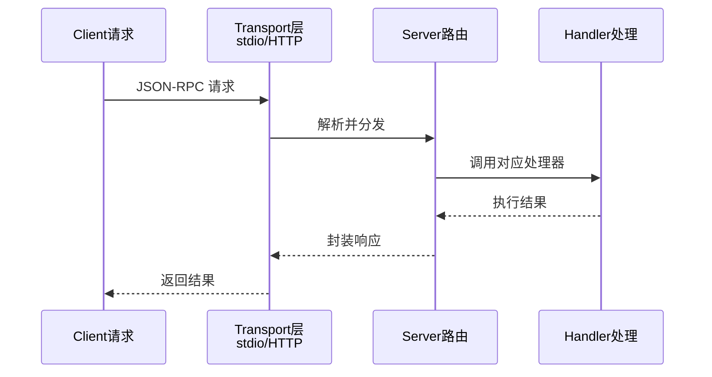

# 实践：编写一个MCP Server

前面在工具与 MCP 协议一节中，我们用“大厨与厨具供应商”的比喻理解了 MCP 的架构。现在我们换一个角色——这次你不是大厨，而是厨具供应商。你要按照 MCP 规范制作一套工具，让任何支持 MCP 的智能体都能直接使用。本节将实现一个提供文件操作和命令执行功能的完整 MCP Server。



## 项目目标

构建一个本地文件系统操作的MCP Server，支持：
- 列出目录内容
- 读取文件
- 写入文件
- 执行Shell命令（受限）

## 项目结构

```
mcp_file_server/
├── server.py          # MCP Server主程序
├── handlers/
│   ├── __init__.py
│   ├── filesystem.py  # 文件系统操作
│   └── shell.py       # Shell命令执行
├── config.py          # 配置文件
└── run.sh            # 启动脚本
```

## 核心实现

### MCP协议基础

最核心的部分是 `MCPServer` 类。它的职责很简单：接收 JSON-RPC 请求，根据方法名分发到对应的处理函数，返回结果。就像前台接待员——客人（Client）说“我要看看你们有什么工具”（tools/list），前台就去取工具清单；客人说“帮我用某工具处理某事”（tools/call），前台就转交给后台师傅。

```python
# server.py
import json
import sys
from typing import Any, Callable, Dict, List, Optional
from dataclasses import dataclass, asdict
import logging

logging.basicConfig(level=logging.INFO)
logger = logging.getLogger(__name__)


@dataclass
class ToolDefinition:
    name: str
    description: str
    inputSchema: dict


@dataclass
class ResourceDefinition:
    uri: str
    name: str
    description: str
    mimeType: Optional[str] = None


class MCPServer:
    """MCP Server实现"""
    
    PROTOCOL_VERSION = "2024-11-05"
    
    def __init__(self, name: str, version: str = "1.0.0"):
        self.name = name
        self.version = version
        self.tools: Dict[str, Dict] = {}
        self.resources: Dict[str, Dict] = {}
        self.resource_templates: Dict[str, Dict] = {}
        
    def tool(self, name: str, description: str, schema: dict):
        """装饰器：注册工具"""
        def decorator(func: Callable):
            self.tools[name] = {
                "definition": ToolDefinition(name, description, schema),
                "handler": func
            }
            return func
        return decorator
        
    def resource(self, uri: str, name: str, description: str, mime_type: str = None):
        """装饰器：注册资源"""
        def decorator(func: Callable):
            self.resources[uri] = {
                "definition": ResourceDefinition(uri, name, description, mime_type),
                "handler": func
            }
            return func
        return decorator
        
    def handle_message(self, message: dict) -> dict:
        """处理JSON-RPC消息"""
        method = message.get("method")
        params = message.get("params", {})
        msg_id = message.get("id")
        
        handlers = {
            "initialize": self._handle_initialize,
            "tools/list": self._handle_tools_list,
            "tools/call": self._handle_tools_call,
            "resources/list": self._handle_resources_list,
            "resources/read": self._handle_resources_read,
            "ping": self._handle_ping,
        }
        
        handler = handlers.get(method)
        
        if not handler:
            return self._error(msg_id, -32601, f"Method not found: {method}")
            
        try:
            result = handler(params)
            return self._success(msg_id, result)
        except Exception as e:
            logger.exception(f"Error handling {method}")
            return self._error(msg_id, -32000, str(e))
            
    def _handle_initialize(self, params: dict) -> dict:
        return {
            "protocolVersion": self.PROTOCOL_VERSION,
            "serverInfo": {
                "name": self.name,
                "version": self.version
            },
            "capabilities": {
                "tools": {"listChanged": True},
                "resources": {"subscribe": False, "listChanged": True}
            }
        }
        
    def _handle_tools_list(self, params: dict) -> dict:
        tools = [asdict(t["definition"]) for t in self.tools.values()]
        return {"tools": tools}
        
    def _handle_tools_call(self, params: dict) -> dict:
        tool_name = params.get("name")
        arguments = params.get("arguments", {})
        
        if tool_name not in self.tools:
            raise ValueError(f"Unknown tool: {tool_name}")
            
        handler = self.tools[tool_name]["handler"]
        result = handler(**arguments)
        
        # 格式化返回内容
        if isinstance(result, str):
            content = [{"type": "text", "text": result}]
        elif isinstance(result, dict):
            content = [{"type": "text", "text": json.dumps(result, ensure_ascii=False)}]
        else:
            content = [{"type": "text", "text": str(result)}]
            
        return {"content": content}
        
    def _handle_resources_list(self, params: dict) -> dict:
        resources = [asdict(r["definition"]) for r in self.resources.values()]
        return {"resources": resources}
        
    def _handle_resources_read(self, params: dict) -> dict:
        uri = params.get("uri")
        
        if uri not in self.resources:
            raise ValueError(f"Unknown resource: {uri}")
            
        handler = self.resources[uri]["handler"]
        content = handler()
        
        return {
            "contents": [
                {"uri": uri, "mimeType": "text/plain", "text": content}
            ]
        }
        
    def _handle_ping(self, params: dict) -> dict:
        return {}
        
    def _success(self, msg_id, result: Any) -> dict:
        return {"jsonrpc": "2.0", "id": msg_id, "result": result}
        
    def _error(self, msg_id, code: int, message: str) -> dict:
        return {"jsonrpc": "2.0", "id": msg_id, "error": {"code": code, "message": message}}
        
    def run_stdio(self):
        """通过标准输入输出运行"""
        logger.info(f"Starting MCP Server: {self.name} v{self.version}")
        
        while True:
            try:
                line = sys.stdin.readline()
                if not line:
                    break
                    
                message = json.loads(line.strip())
                response = self.handle_message(message)
                
                sys.stdout.write(json.dumps(response) + "\n")
                sys.stdout.flush()
                
            except json.JSONDecodeError as e:
                logger.error(f"Invalid JSON: {e}")
            except Exception as e:
                logger.exception("Unexpected error")
```

### 文件系统工具

现在来实现具体的工具。文件系统操作是最实用的 MCP 工具之一。特别注意 `_safe_path` 函数——这是安全设计的核心，确保所有操作都限制在指定目录内，防止智能体意外访问系统其他文件。这就像给实习生发了一张门禁卡，只能进特定的房间：

```python
# handlers/filesystem.py
import os
from pathlib import Path
from typing import Optional

# 安全限制：只允许访问指定目录
ALLOWED_BASE_PATH = Path.home() / "mcp_workspace"
ALLOWED_BASE_PATH.mkdir(exist_ok=True)


def _safe_path(path: str) -> Path:
    """确保路径在允许的范围内"""
    full_path = (ALLOWED_BASE_PATH / path).resolve()
    
    if not str(full_path).startswith(str(ALLOWED_BASE_PATH)):
        raise PermissionError(f"Access denied: {path}")
        
    return full_path


def list_directory(path: str = ".") -> dict:
    """列出目录内容"""
    safe_path = _safe_path(path)
    
    if not safe_path.exists():
        return {"error": f"Path does not exist: {path}"}
        
    if not safe_path.is_dir():
        return {"error": f"Not a directory: {path}"}
        
    entries = []
    for entry in safe_path.iterdir():
        entries.append({
            "name": entry.name,
            "type": "directory" if entry.is_dir() else "file",
            "size": entry.stat().st_size if entry.is_file() else None
        })
        
    return {
        "path": str(safe_path.relative_to(ALLOWED_BASE_PATH)),
        "entries": sorted(entries, key=lambda x: (x["type"] != "directory", x["name"]))
    }


def read_file(path: str) -> str:
    """读取文件内容"""
    safe_path = _safe_path(path)
    
    if not safe_path.exists():
        return f"Error: File does not exist: {path}"
        
    if not safe_path.is_file():
        return f"Error: Not a file: {path}"
        
    # 限制文件大小
    if safe_path.stat().st_size > 1024 * 1024:  # 1MB
        return "Error: File too large (max 1MB)"
        
    try:
        return safe_path.read_text(encoding="utf-8")
    except UnicodeDecodeError:
        return "Error: File is not a text file"


def write_file(path: str, content: str) -> str:
    """写入文件"""
    safe_path = _safe_path(path)
    
    # 确保父目录存在
    safe_path.parent.mkdir(parents=True, exist_ok=True)
    
    safe_path.write_text(content, encoding="utf-8")
    
    return f"Successfully wrote {len(content)} characters to {path}"


def create_directory(path: str) -> str:
    """创建目录"""
    safe_path = _safe_path(path)
    
    safe_path.mkdir(parents=True, exist_ok=True)
    
    return f"Directory created: {path}"
```

### Shell命令工具

Shell 命令执行是一个强大但危险的能力——就像给实习生一把大型切割设备，必须严格限制使用范围。这里采用命令白名单机制，只允许执行安全的只读命令：

```python
# handlers/shell.py
import subprocess
import shlex
from typing import Optional

# 允许的命令白名单
ALLOWED_COMMANDS = {
    "ls", "cat", "head", "tail", "wc", "grep", "find",
    "echo", "date", "pwd", "whoami"
}

MAX_OUTPUT_SIZE = 10000  # 最大输出字符数


def execute_command(command: str, timeout: int = 30) -> dict:
    """执行Shell命令（受限）"""
    
    # 解析命令
    try:
        parts = shlex.split(command)
    except ValueError as e:
        return {"error": f"Invalid command syntax: {e}"}
        
    if not parts:
        return {"error": "Empty command"}
        
    # 检查命令是否在白名单中
    cmd_name = parts[0]
    if cmd_name not in ALLOWED_COMMANDS:
        return {
            "error": f"Command not allowed: {cmd_name}",
            "allowed_commands": list(ALLOWED_COMMANDS)
        }
        
    # 执行命令
    try:
        result = subprocess.run(
            parts,
            capture_output=True,
            text=True,
            timeout=timeout,
            cwd=str(ALLOWED_BASE_PATH)
        )
        
        output = result.stdout
        if len(output) > MAX_OUTPUT_SIZE:
            output = output[:MAX_OUTPUT_SIZE] + "\n... (output truncated)"
            
        return {
            "command": command,
            "stdout": output,
            "stderr": result.stderr,
            "return_code": result.returncode
        }
        
    except subprocess.TimeoutExpired:
        return {"error": f"Command timed out after {timeout} seconds"}
    except Exception as e:
        return {"error": f"Execution error: {str(e)}"}
```

### 组装Server

最后一步是把所有工具注册到 Server 上。注意每个工具的 `schema` 定义——这就是前面讲过的“工具说明书”，它告诉 Client 每个工具接受什么参数、格式是什么。写得越清楚，Agent 使用时犯错的概率就越低：

```python
# main.py
from server import MCPServer
from handlers.filesystem import list_directory, read_file, write_file, create_directory
from handlers.shell import execute_command

# 创建Server
server = MCPServer("file-system-server", "1.0.0")

# 注册文件系统工具
@server.tool(
    name="list_directory",
    description="列出指定目录的内容",
    schema={
        "type": "object",
        "properties": {
            "path": {
                "type": "string",
                "description": "目录路径，相对于工作空间根目录",
                "default": "."
            }
        }
    }
)
def tool_list_directory(path: str = "."):
    return list_directory(path)


@server.tool(
    name="read_file",
    description="读取文件内容",
    schema={
        "type": "object",
        "properties": {
            "path": {
                "type": "string",
                "description": "文件路径"
            }
        },
        "required": ["path"]
    }
)
def tool_read_file(path: str):
    return read_file(path)


@server.tool(
    name="write_file",
    description="写入内容到文件",
    schema={
        "type": "object",
        "properties": {
            "path": {"type": "string", "description": "文件路径"},
            "content": {"type": "string", "description": "文件内容"}
        },
        "required": ["path", "content"]
    }
)
def tool_write_file(path: str, content: str):
    return write_file(path, content)


@server.tool(
    name="execute_command",
    description="执行Shell命令（仅限白名单命令）",
    schema={
        "type": "object",
        "properties": {
            "command": {"type": "string", "description": "要执行的命令"}
        },
        "required": ["command"]
    }
)
def tool_execute_command(command: str):
    return execute_command(command)


# 注册资源
@server.resource(
    uri="file://workspace/readme",
    name="工作空间说明",
    description="工作空间使用说明",
    mime_type="text/plain"
)
def resource_readme():
    return """MCP File System Server 工作空间

这是一个受限的文件操作环境，您可以：
- 列出目录内容
- 读写文本文件
- 执行基本的Shell命令

所有操作都限制在工作空间目录内。
"""


if __name__ == "__main__":
    server.run_stdio()
```

## 测试Server

写完代码后，如何验证它是否能正常工作？最直接的方式是手动发送 JSON-RPC 请求。这就像厨具出厂前的质检环节——逐个测试每个接口是否返回正确结果。

### 手动测试

```bash
# 启动Server
python main.py

# 在另一个终端，发送测试请求
echo '{"jsonrpc":"2.0","id":1,"method":"initialize","params":{}}' | python main.py

# 列出工具
echo '{"jsonrpc":"2.0","id":2,"method":"tools/list","params":{}}' | python main.py

# 调用工具
echo '{"jsonrpc":"2.0","id":3,"method":"tools/call","params":{"name":"list_directory","arguments":{}}}' | python main.py
```

### Python测试脚本

对于更系统化的测试，可以写一个测试脚本。它模拟了 Client 的角色，依次测试初始化、工具列表、工具调用等操作：

```python
# test_server.py
import subprocess
import json

def send_request(request: dict) -> dict:
    proc = subprocess.Popen(
        ["python", "main.py"],
        stdin=subprocess.PIPE,
        stdout=subprocess.PIPE,
        text=True
    )
    
    stdout, _ = proc.communicate(json.dumps(request) + "\n")
    return json.loads(stdout.strip())

# 测试初始化
resp = send_request({
    "jsonrpc": "2.0",
    "id": 1,
    "method": "initialize",
    "params": {}
})
print("Initialize:", resp)

# 测试工具列表
resp = send_request({
    "jsonrpc": "2.0",
    "id": 2,
    "method": "tools/list",
    "params": {}
})
print("Tools:", [t["name"] for t in resp["result"]["tools"]])

# 测试文件操作
resp = send_request({
    "jsonrpc": "2.0",
    "id": 3,
    "method": "tools/call",
    "params": {
        "name": "write_file",
        "arguments": {"path": "test.txt", "content": "Hello MCP!"}
    }
})
print("Write:", resp)
```

## 与Claude Desktop集成

开发完成后，最激动人心的时刻来了——把你的 Server 接入真实的智能体应用。将 Server 配置到 Claude Desktop 只需一个 JSON 配置文件：

```json
// ~/.config/claude/claude_desktop_config.json (Linux/Mac)
// %APPDATA%\Claude\claude_desktop_config.json (Windows)
{
  "mcpServers": {
    "file-system": {
      "command": "python",
      "args": ["/path/to/mcp_file_server/main.py"]
    }
  }
}
```

回顾本节，我们完整地走过了 MCP Server 的开发流程：定义协议处理框架、实现具体工具、组装注册、测试验证、集成应用。其中最关键的经验是：工具描述要清晰（决定了 Agent 能否正确使用），安全措施要到位（路径限制、命令白名单）。你可以以此为基础，扩展更多工具和资源——每个新工具都是智能体能力的一次升级。
