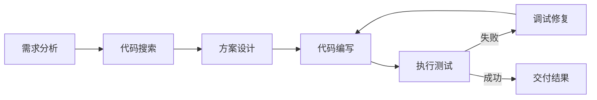

# 实践：编写一个 Code Agent

## 1. Code Agent 概述

想象一下你身边有一位经验丰富的编程搭档。你只需用自然语言描述需求——“帮我写个程序，读取 CSV 销售数据并生成月度报表”，他就会自动拆解任务、写代码、运行测试、发现 bug 后自行修复，最后把能跑通的程序交给你。这就是 Code Agent 的工作方式——一种“结对编程”的体验，只不过你的搭档是一个 AI。

Code Agent 与简单的代码补全工具有本质区别。代码补全像是一个只会接话的助手，而 Code Agent 具备完整的 ReACT 循环能力：

1. **理解需求**：解析用户的自然语言描述，转化为编程任务
2. **规划方案**：分解复杂任务为可执行的子步骤
3. **生成代码**：根据规划生成高质量代码
4. **执行验证**：在沙箱环境中运行代码，获取执行结果
5. **错误修复**：分析错误信息，迭代修正代码
6. **结果交付**：整理输出，提供最终解决方案

本实践将构建一个功能完整的 Code Agent，支持 Python 代码的生成、执行与自动调试。



## 2. 系统架构设计

### 2.1 整体架构

在动手写代码之前，先从全局视角理解系统设计。如果把 Code Agent 比作一个软件开发团队，那么它内部其实有四个“员工”在协作：Planner（项目经理）负责拆解任务，Coder（开发者）负责写代码，Executor（测试环境）负责运行，Debugger（QA 工程师）负责分析问题。

```
┌─────────────────────────────────────────────────────────────┐
│                      Code Agent System                       │
├─────────────────────────────────────────────────────────────┤
│  ┌─────────────┐  ┌─────────────┐  ┌─────────────────────┐  │
│  │   Planner   │  │   Coder     │  │     Executor        │  │
│  │  (任务规划) │  │ (代码生成)  │  │   (沙箱执行)        │  │
│  └──────┬──────┘  └──────┬──────┘  └──────────┬──────────┘  │
│         │                │                     │             │
│         └────────────────┼─────────────────────┘             │
│                          │                                   │
│                   ┌──────▼──────┐                            │
│                   │  Debugger   │                            │
│                   │ (错误分析)  │                            │
│                   └─────────────┘                            │
├─────────────────────────────────────────────────────────────┤
│                     Memory & Context                         │
│  ┌────────────┐  ┌────────────┐  ┌────────────────────────┐ │
│  │ Code Files │  │ Exec Logs  │  │  Conversation History  │ │
│  └────────────┘  └────────────┘  └────────────────────────┘ │
└─────────────────────────────────────────────────────────────┘
```

### 2.2 核心组件

| 组件 | 职责 | 关键能力 |
|------|------|----------|
| Planner | 任务分解与规划 | 需求理解、步骤拆分、依赖分析 |
| Coder | 代码生成 | 多语言支持、上下文感知、风格一致 |
| Executor | 代码执行 | 沙箱隔离、超时控制、资源限制 |
| Debugger | 错误诊断 | 错误分类、根因分析、修复建议 |

## 3. 基础实现

### 3.1 项目结构

```
code_agent/
├── __init__.py
├── agent.py          # 主 Agent 类
├── planner.py        # 任务规划器
├── coder.py          # 代码生成器
├── executor.py       # 代码执行器
├── debugger.py       # 调试器
├── sandbox.py        # 沙箱环境
├── prompts.py        # 提示词模板
├── tools.py          # 工具定义
└── utils.py          # 工具函数
```

### 3.2 沙箱执行环境

安全执行用户代码是 Code Agent 的核心挑战。为什么需要沙箱？假设你让 Agent 写一个处理文件的程序，它的代码里不小心写了一行 `os.remove('/')`——如果直接执行，后果不堪设想。沙箱就像一个“实验室”，代码在里面随便跑，但不会影响外面的真实环境。我们使用进程隔离与资源限制构建沙箱：

```python
# sandbox.py
import subprocess
import tempfile
import os
import signal
from dataclasses import dataclass
from typing import Optional
from enum import Enum

class ExecutionStatus(Enum):
    SUCCESS = "success"
    ERROR = "error"
    TIMEOUT = "timeout"
    MEMORY_LIMIT = "memory_limit"

@dataclass
class ExecutionResult:
    status: ExecutionStatus
    stdout: str
    stderr: str
    return_code: int
    execution_time: float

class PythonSandbox:
    """Python 代码沙箱执行环境"""
    
    def __init__(
        self,
        timeout: int = 30,
        max_memory_mb: int = 512,
        allowed_imports: Optional[list] = None
    ):
        self.timeout = timeout
        self.max_memory_mb = max_memory_mb
        self.allowed_imports = allowed_imports or [
            'math', 'random', 'datetime', 'json', 're',
            'collections', 'itertools', 'functools',
            'typing', 'dataclasses', 'enum',
            'numpy', 'pandas'  # 可选的数据科学库
        ]
    
    def _create_wrapper_code(self, code: str) -> str:
        """创建带有导入检查的包装代码"""
        import_check = f"""
import sys
import importlib

ALLOWED_IMPORTS = {self.allowed_imports}

class ImportGuard:
    def find_module(self, name, path=None):
        base_module = name.split('.')[0]
        if base_module not in ALLOWED_IMPORTS:
            raise ImportError(f"Import of '{{name}}' is not allowed")
        return None

sys.meta_path.insert(0, ImportGuard())
"""
        return import_check + "\n" + code
    
    def execute(self, code: str, input_data: str = "") -> ExecutionResult:
        """在沙箱中执行 Python 代码"""
        import time
        
        # 创建临时文件
        with tempfile.NamedTemporaryFile(
            mode='w', suffix='.py', delete=False
        ) as f:
            wrapped_code = self._create_wrapper_code(code)
            f.write(wrapped_code)
            temp_file = f.name
        
        try:
            start_time = time.time()
            
            # 使用 subprocess 执行，设置资源限制
            process = subprocess.Popen(
                ['python', temp_file],
                stdin=subprocess.PIPE,
                stdout=subprocess.PIPE,
                stderr=subprocess.PIPE,
                text=True,
                preexec_fn=self._set_limits  # Unix only
            )
            
            try:
                stdout, stderr = process.communicate(
                    input=input_data,
                    timeout=self.timeout
                )
                execution_time = time.time() - start_time
                
                if process.returncode == 0:
                    status = ExecutionStatus.SUCCESS
                else:
                    status = ExecutionStatus.ERROR
                    
            except subprocess.TimeoutExpired:
                process.kill()
                stdout, stderr = process.communicate()
                execution_time = self.timeout
                status = ExecutionStatus.TIMEOUT
                stderr = f"Execution timed out after {self.timeout} seconds"
            
            return ExecutionResult(
                status=status,
                stdout=stdout,
                stderr=stderr,
                return_code=process.returncode,
                execution_time=execution_time
            )
            
        finally:
            os.unlink(temp_file)
    
    def _set_limits(self):
        """设置进程资源限制 (Unix)"""
        import resource
        
        # 内存限制
        memory_bytes = self.max_memory_mb * 1024 * 1024
        resource.setrlimit(
            resource.RLIMIT_AS,
            (memory_bytes, memory_bytes)
        )
        
        # CPU 时间限制
        resource.setrlimit(
            resource.RLIMIT_CPU,
            (self.timeout, self.timeout)
        )
```

### 3.3 代码生成器

有了沙箱，接下来实现"写代码"的能力。代码生成器的核心思路是：精心构建 Prompt，让 LLM 像一个负责任的程序员一样输出代码。注意 `temperature=0.2` 这个细节——写代码时我们希望确定性高而非创意性，所以降低随机性：

```python
# coder.py
from typing import Optional, List
from dataclasses import dataclass
import json

@dataclass
class CodeBlock:
    language: str
    code: str
    description: str
    dependencies: List[str]

class CodeGenerator:
    """基于 LLM 的代码生成器"""
    
    SYSTEM_PROMPT = """你是一个专业的 Python 程序员。你的任务是根据需求生成高质量的 Python 代码。

生成代码时请遵循以下规则：
1. 代码必须完整可执行，包含所有必要的导入语句
2. 使用类型注解提高代码可读性
3. 添加必要的注释说明关键逻辑
4. 处理可能的异常情况
5. 遵循 PEP 8 代码风格规范

输出格式要求：
- 使用 ```python 和 ``` 包裹代码块
- 在代码前简要说明实现思路
- 如果需要安装额外依赖，请明确说明"""

    def __init__(self, llm_client):
        self.llm = llm_client
        self.conversation_history = []
    
    def generate(
        self,
        task: str,
        context: Optional[str] = None,
        constraints: Optional[List[str]] = None
    ) -> CodeBlock:
        """生成代码"""
        
        # 构建提示词
        prompt = self._build_prompt(task, context, constraints)
        
        # 调用 LLM
        response = self.llm.chat(
            messages=[
                {"role": "system", "content": self.SYSTEM_PROMPT},
                {"role": "user", "content": prompt}
            ],
            temperature=0.2  # 降低随机性，提高代码一致性
        )
        
        # 解析响应
        code_block = self._parse_response(response)
        
        return code_block
    
    def refine(
        self,
        original_code: str,
        error_message: str,
        execution_output: str
    ) -> CodeBlock:
        """根据错误信息修正代码"""
        
        prompt = f"""原始代码执行出错，请修正。

## 原始代码
```python
{original_code}
```

## 错误信息
{error_message}

## 执行输出
{execution_output}

请分析错误原因，并提供修正后的完整代码。"""

        response = self.llm.chat(
            messages=[
                {"role": "system", "content": self.SYSTEM_PROMPT},
                {"role": "user", "content": prompt}
            ],
            temperature=0.1
        )
        
        return self._parse_response(response)
    
    def _build_prompt(
        self,
        task: str,
        context: Optional[str],
        constraints: Optional[List[str]]
    ) -> str:
        """构建生成提示词"""
        
        prompt_parts = [f"## 任务需求\n{task}"]
        
        if context:
            prompt_parts.append(f"## 上下文信息\n{context}")
        
        if constraints:
            constraint_text = "\n".join(f"- {c}" for c in constraints)
            prompt_parts.append(f"## 约束条件\n{constraint_text}")
        
        prompt_parts.append("请生成满足需求的 Python 代码。")
        
        return "\n\n".join(prompt_parts)
    
    def _parse_response(self, response: str) -> CodeBlock:
        """从 LLM 响应中提取代码块"""
        import re
        
        # 提取代码块
        code_pattern = r'```python\n(.*?)```'
        matches = re.findall(code_pattern, response, re.DOTALL)
        
        if not matches:
            # 尝试提取无语言标记的代码块
            code_pattern = r'```\n(.*?)```'
            matches = re.findall(code_pattern, response, re.DOTALL)
        
        code = matches[0].strip() if matches else ""
        
        # 提取依赖
        dependencies = self._extract_dependencies(code)
        
        # 提取描述（代码块之前的文本）
        description = response.split('```')[0].strip()
        
        return CodeBlock(
            language="python",
            code=code,
            description=description,
            dependencies=dependencies
        )
    
    def _extract_dependencies(self, code: str) -> List[str]:
        """从代码中提取外部依赖"""
        import re
        
        # 匹配 import 语句
        import_pattern = r'^(?:from\s+(\w+)|import\s+(\w+))'
        matches = re.findall(import_pattern, code, re.MULTILINE)
        
        # 标准库模块列表（部分）
        stdlib = {
            'os', 'sys', 're', 'json', 'math', 'random',
            'datetime', 'collections', 'itertools', 'functools',
            'typing', 'dataclasses', 'enum', 'pathlib', 'io',
            'subprocess', 'threading', 'multiprocessing'
        }
        
        dependencies = []
        for match in matches:
            module = match[0] or match[1]
            if module and module not in stdlib:
                dependencies.append(module)
        
        return list(set(dependencies))
```

### 3.4 调试器模块

调试器是 Code Agent 区别于普通代码生成工具的关键。当代码执行出错时，它像一个经验丰富的 debug 专家一样工作：先用规则快速分类错误类型（语法错误？运行时错误？逻辑错误？），再用 LLM 进行深度分析，给出根因和修复建议：

```python
# debugger.py
from dataclasses import dataclass
from typing import List, Optional
from enum import Enum

class ErrorCategory(Enum):
    SYNTAX = "syntax_error"
    RUNTIME = "runtime_error"
    LOGIC = "logic_error"
    IMPORT = "import_error"
    TYPE = "type_error"
    TIMEOUT = "timeout"
    UNKNOWN = "unknown"

@dataclass
class DebugAnalysis:
    category: ErrorCategory
    root_cause: str
    line_number: Optional[int]
    suggestions: List[str]
    confidence: float

class CodeDebugger:
    """代码调试分析器"""
    
    ERROR_PATTERNS = {
        ErrorCategory.SYNTAX: [
            r'SyntaxError',
            r'IndentationError',
            r'TabError'
        ],
        ErrorCategory.IMPORT: [
            r'ImportError',
            r'ModuleNotFoundError'
        ],
        ErrorCategory.TYPE: [
            r'TypeError',
            r'AttributeError'
        ],
        ErrorCategory.RUNTIME: [
            r'ValueError',
            r'KeyError',
            r'IndexError',
            r'ZeroDivisionError',
            r'FileNotFoundError'
        ]
    }
    
    def __init__(self, llm_client):
        self.llm = llm_client
    
    def analyze(
        self,
        code: str,
        error_message: str,
        stdout: str
    ) -> DebugAnalysis:
        """分析代码错误"""
        
        # 1. 规则匹配分类
        category = self._categorize_error(error_message)
        
        # 2. 提取行号
        line_number = self._extract_line_number(error_message)
        
        # 3. LLM 深度分析
        llm_analysis = self._llm_analyze(
            code, error_message, stdout, category
        )
        
        return DebugAnalysis(
            category=category,
            root_cause=llm_analysis['root_cause'],
            line_number=line_number,
            suggestions=llm_analysis['suggestions'],
            confidence=llm_analysis['confidence']
        )
    
    def _categorize_error(self, error_message: str) -> ErrorCategory:
        """根据错误信息分类"""
        import re
        
        for category, patterns in self.ERROR_PATTERNS.items():
            for pattern in patterns:
                if re.search(pattern, error_message):
                    return category
        
        return ErrorCategory.UNKNOWN
    
    def _extract_line_number(self, error_message: str) -> Optional[int]:
        """从错误信息中提取行号"""
        import re
        
        # 匹配 "line X" 模式
        match = re.search(r'line (\d+)', error_message, re.IGNORECASE)
        if match:
            return int(match.group(1))
        return None
    
    def _llm_analyze(
        self,
        code: str,
        error_message: str,
        stdout: str,
        category: ErrorCategory
    ) -> dict:
        """使用 LLM 进行深度错误分析"""
        
        prompt = f"""分析以下 Python 代码的错误：

## 代码
```python
{code}
```

## 错误信息
{error_message}

## 标准输出
{stdout}

## 初步分类
{category.value}

请提供：
1. 错误根因分析（root_cause）
2. 修复建议列表（suggestions）
3. 分析置信度 0-1（confidence）

以 JSON 格式输出。"""

        response = self.llm.chat(
            messages=[{"role": "user", "content": prompt}],
            temperature=0.1
        )
        
        # 解析 JSON 响应
        import json
        import re
        
        json_match = re.search(r'\{.*\}', response, re.DOTALL)
        if json_match:
            try:
                return json.loads(json_match.group())
            except json.JSONDecodeError:
                pass
        
        # 默认返回
        return {
            'root_cause': error_message,
            'suggestions': ['检查错误信息中指出的问题'],
            'confidence': 0.5
        }
```

## 4. 主 Agent 实现

### 4.1 Agent 核心类

现在把所有组件串联起来。主 Agent 的工作流程就像结对编程的完整过程：先和你讨论需求并拆解任务（规划），然后一步步写代码并运行（编码+执行），如果报错就分析原因并修复（调试），直到所有步骤完成。注意 `max_debug_attempts=3` 这个设计——就像真实开发中，如果一个 bug 修了三次还没解决，通常需要换个思路而不是继续死磕：

```python
# agent.py
from typing import Optional, List, Dict, Any
from dataclasses import dataclass, field
from enum import Enum
import json

from .sandbox import PythonSandbox, ExecutionResult, ExecutionStatus
from .coder import CodeGenerator, CodeBlock
from .debugger import CodeDebugger, DebugAnalysis

class AgentState(Enum):
    IDLE = "idle"
    PLANNING = "planning"
    CODING = "coding"
    EXECUTING = "executing"
    DEBUGGING = "debugging"
    COMPLETED = "completed"
    FAILED = "failed"

@dataclass
class TaskStep:
    description: str
    code: Optional[str] = None
    result: Optional[ExecutionResult] = None
    debug_attempts: int = 0
    status: str = "pending"

@dataclass
class AgentContext:
    task: str
    steps: List[TaskStep] = field(default_factory=list)
    current_step: int = 0
    code_history: List[CodeBlock] = field(default_factory=list)
    execution_history: List[ExecutionResult] = field(default_factory=list)
    max_debug_attempts: int = 3

class CodeAgent:
    """Code Agent 主类"""
    
    def __init__(
        self,
        llm_client,
        sandbox_config: Optional[Dict] = None,
        verbose: bool = True
    ):
        self.llm = llm_client
        self.sandbox = PythonSandbox(**(sandbox_config or {}))
        self.coder = CodeGenerator(llm_client)
        self.debugger = CodeDebugger(llm_client)
        self.verbose = verbose
        self.state = AgentState.IDLE
        self.context: Optional[AgentContext] = None
    
    def run(self, task: str) -> Dict[str, Any]:
        """执行完整的 Code Agent 流程"""
        
        self.context = AgentContext(task=task)
        self._log(f"开始执行任务: {task}")
        
        try:
            # 1. 规划阶段
            self.state = AgentState.PLANNING
            steps = self._plan_task(task)
            self.context.steps = steps
            self._log(f"任务分解为 {len(steps)} 个步骤")
            
            # 2. 逐步执行
            for i, step in enumerate(steps):
                self.context.current_step = i
                self._log(f"\n=== 步骤 {i+1}: {step.description} ===")
                
                success = self._execute_step(step)
                if not success:
                    self.state = AgentState.FAILED
                    return self._build_result(success=False)
            
            # 3. 完成
            self.state = AgentState.COMPLETED
            return self._build_result(success=True)
            
        except Exception as e:
            self.state = AgentState.FAILED
            self._log(f"执行异常: {e}")
            return self._build_result(success=False, error=str(e))
    
    def _plan_task(self, task: str) -> List[TaskStep]:
        """将任务分解为可执行步骤"""
        
        prompt = f"""将以下编程任务分解为具体的执行步骤：

任务：{task}

要求：
1. 每个步骤应该是可独立执行的代码单元
2. 步骤之间可以有依赖关系
3. 每个步骤的描述要清晰具体

以 JSON 数组格式输出，每个元素包含 "description" 字段。
示例：[{{"description": "步骤1描述"}}, {{"description": "步骤2描述"}}]"""

        response = self.llm.chat(
            messages=[{"role": "user", "content": prompt}],
            temperature=0.3
        )
        
        # 解析步骤
        import re
        json_match = re.search(r'\[.*\]', response, re.DOTALL)
        if json_match:
            try:
                steps_data = json.loads(json_match.group())
                return [TaskStep(description=s['description']) for s in steps_data]
            except (json.JSONDecodeError, KeyError):
                pass
        
        # 默认单步骤
        return [TaskStep(description=task)]
    
    def _execute_step(self, step: TaskStep) -> bool:
        """执行单个步骤"""
        
        # 生成代码
        self.state = AgentState.CODING
        context = self._build_step_context()
        code_block = self.coder.generate(
            task=step.description,
            context=context
        )
        step.code = code_block.code
        self.context.code_history.append(code_block)
        self._log(f"生成代码:\n{code_block.code[:500]}...")
        
        # 执行与调试循环
        while step.debug_attempts <= self.context.max_debug_attempts:
            # 执行代码
            self.state = AgentState.EXECUTING
            result = self.sandbox.execute(step.code)
            step.result = result
            self.context.execution_history.append(result)
            
            if result.status == ExecutionStatus.SUCCESS:
                self._log(f"执行成功! 输出:\n{result.stdout[:500]}")
                step.status = "completed"
                return True
            
            # 执行失败，进入调试
            self.state = AgentState.DEBUGGING
            step.debug_attempts += 1
            self._log(f"执行失败 (尝试 {step.debug_attempts}/{self.context.max_debug_attempts})")
            self._log(f"错误: {result.stderr[:300]}")
            
            if step.debug_attempts > self.context.max_debug_attempts:
                self._log("达到最大调试次数，放弃")
                step.status = "failed"
                return False
            
            # 分析错误并修正
            analysis = self.debugger.analyze(
                step.code, result.stderr, result.stdout
            )
            self._log(f"错误分析: {analysis.root_cause}")
            
            # 生成修正代码
            refined = self.coder.refine(
                step.code, result.stderr, result.stdout
            )
            step.code = refined.code
            self._log("已生成修正代码，重新执行...")
        
        return False
    
    def _build_step_context(self) -> str:
        """构建当前步骤的上下文信息"""
        
        context_parts = []
        
        # 已完成步骤的代码和结果
        for i, step in enumerate(self.context.steps[:self.context.current_step]):
            if step.status == "completed":
                context_parts.append(
                    f"步骤 {i+1} ({step.description}):\n"
                    f"```python\n{step.code}\n```\n"
                    f"输出: {step.result.stdout[:200] if step.result else 'N/A'}"
                )
        
        return "\n\n".join(context_parts) if context_parts else None
    
    def _build_result(
        self,
        success: bool,
        error: Optional[str] = None
    ) -> Dict[str, Any]:
        """构建最终结果"""
        
        result = {
            "success": success,
            "task": self.context.task,
            "steps": [],
            "final_output": None
        }
        
        for step in self.context.steps:
            result["steps"].append({
                "description": step.description,
                "status": step.status,
                "code": step.code,
                "output": step.result.stdout if step.result else None,
                "debug_attempts": step.debug_attempts
            })
        
        # 最后成功步骤的输出作为最终输出
        for step in reversed(self.context.steps):
            if step.result and step.result.status == ExecutionStatus.SUCCESS:
                result["final_output"] = step.result.stdout
                break
        
        if error:
            result["error"] = error
        
        return result
    
    def _log(self, message: str):
        """日志输出"""
        if self.verbose:
            print(f"[CodeAgent] {message}")
```

## 5. 工具集成与扩展

### 5.1 定义 Agent 工具

回忆前面工具与 MCP 协议的内容，Code Agent 同样需要工具来增强能力。普通程序员写代码时会先看看项目结构、读读现有代码、搜索相关实现——Code Agent 也需要这些能力：

```python
# tools.py
from typing import Callable, Dict, Any, List
from dataclasses import dataclass
import json

@dataclass
class Tool:
    name: str
    description: str
    parameters: Dict[str, Any]
    function: Callable

class ToolRegistry:
    """工具注册表"""
    
    def __init__(self):
        self.tools: Dict[str, Tool] = {}
    
    def register(self, tool: Tool):
        self.tools[tool.name] = tool
    
    def get(self, name: str) -> Tool:
        return self.tools.get(name)
    
    def list_tools(self) -> List[Dict]:
        """生成 OpenAI 格式的工具列表"""
        return [
            {
                "type": "function",
                "function": {
                    "name": tool.name,
                    "description": tool.description,
                    "parameters": tool.parameters
                }
            }
            for tool in self.tools.values()
        ]
    
    def execute(self, name: str, arguments: Dict) -> Any:
        tool = self.tools.get(name)
        if not tool:
            raise ValueError(f"Unknown tool: {name}")
        return tool.function(**arguments)

# 预定义工具
def create_default_tools() -> ToolRegistry:
    registry = ToolRegistry()
    
    # 文件读取工具
    registry.register(Tool(
        name="read_file",
        description="读取指定路径的文件内容",
        parameters={
            "type": "object",
            "properties": {
                "path": {
                    "type": "string",
                    "description": "文件路径"
                }
            },
            "required": ["path"]
        },
        function=lambda path: open(path).read()
    ))
    
    # 文件写入工具
    registry.register(Tool(
        name="write_file",
        description="将内容写入指定文件",
        parameters={
            "type": "object",
            "properties": {
                "path": {
                    "type": "string",
                    "description": "文件路径"
                },
                "content": {
                    "type": "string",
                    "description": "文件内容"
                }
            },
            "required": ["path", "content"]
        },
        function=lambda path, content: open(path, 'w').write(content)
    ))
    
    # 目录列表工具
    registry.register(Tool(
        name="list_directory",
        description="列出目录中的文件和子目录",
        parameters={
            "type": "object",
            "properties": {
                "path": {
                    "type": "string",
                    "description": "目录路径"
                }
            },
            "required": ["path"]
        },
        function=lambda path: "\n".join(os.listdir(path))
    ))
    
    # 搜索工具
    registry.register(Tool(
        name="search_code",
        description="在代码文件中搜索指定模式",
        parameters={
            "type": "object",
            "properties": {
                "pattern": {
                    "type": "string",
                    "description": "搜索模式（正则表达式）"
                },
                "directory": {
                    "type": "string",
                    "description": "搜索目录"
                }
            },
            "required": ["pattern", "directory"]
        },
        function=search_in_files
    ))
    
    return registry

def search_in_files(pattern: str, directory: str) -> str:
    """在文件中搜索模式"""
    import re
    import os
    
    results = []
    for root, dirs, files in os.walk(directory):
        for file in files:
            if file.endswith('.py'):
                filepath = os.path.join(root, file)
                try:
                    with open(filepath, 'r') as f:
                        content = f.read()
                        matches = re.findall(
                            f'.*{pattern}.*',
                            content,
                            re.MULTILINE
                        )
                        if matches:
                            results.append(f"{filepath}:\n" + "\n".join(matches[:5]))
                except Exception:
                    pass
    
    return "\n\n".join(results[:10]) if results else "No matches found"
```

### 5.2 带工具调用的 Agent

```python
# agent_with_tools.py
class CodeAgentWithTools(CodeAgent):
    """支持工具调用的 Code Agent"""
    
    def __init__(self, llm_client, **kwargs):
        super().__init__(llm_client, **kwargs)
        self.tools = create_default_tools()
    
    def _generate_with_tools(self, task: str) -> str:
        """使用工具辅助生成代码"""
        
        messages = [
            {
                "role": "system",
                "content": """你是一个 Code Agent，可以使用工具来完成编程任务。
在生成代码之前，你可以：
1. 使用 read_file 读取相关文件了解上下文
2. 使用 list_directory 查看项目结构
3. 使用 search_code 搜索相关代码

根据收集的信息生成更准确的代码。"""
            },
            {"role": "user", "content": task}
        ]
        
        # 工具调用循环
        max_tool_calls = 5
        for _ in range(max_tool_calls):
            response = self.llm.chat(
                messages=messages,
                tools=self.tools.list_tools(),
                tool_choice="auto"
            )
            
            # 检查是否有工具调用
            if not response.get('tool_calls'):
                return response['content']
            
            # 执行工具调用
            for tool_call in response['tool_calls']:
                func_name = tool_call['function']['name']
                func_args = json.loads(tool_call['function']['arguments'])
                
                self._log(f"调用工具: {func_name}({func_args})")
                
                try:
                    result = self.tools.execute(func_name, func_args)
                except Exception as e:
                    result = f"Error: {e}"
                
                # 添加工具结果到消息历史
                messages.append({
                    "role": "assistant",
                    "content": None,
                    "tool_calls": [tool_call]
                })
                messages.append({
                    "role": "tool",
                    "tool_call_id": tool_call['id'],
                    "content": str(result)[:2000]  # 限制长度
                })
        
        # 达到最大工具调用次数，请求最终响应
        messages.append({
            "role": "user",
            "content": "请根据以上信息生成最终代码。"
        })
        
        return self.llm.chat(messages=messages)['content']
```

## 6. 完整使用示例

### 6.1 基础使用

来看看实际如何使用。下面的示例展示了一个典型的使用场景：用户描述一个数据处理任务，Agent 自动拆解为多个步骤，逐个生成代码并执行。如果某个步骤出错，Agent 会自动调试并重试：

```python
# example_basic.py
from openai import OpenAI

# 简单的 LLM 客户端包装
class LLMClient:
    def __init__(self, api_key: str, base_url: str = None):
        self.client = OpenAI(api_key=api_key, base_url=base_url)
    
    def chat(self, messages, **kwargs):
        response = self.client.chat.completions.create(
            model="gpt-4",
            messages=messages,
            **kwargs
        )
        
        message = response.choices[0].message
        
        if kwargs.get('tools') and message.tool_calls:
            return {
                'content': message.content,
                'tool_calls': [
                    {
                        'id': tc.id,
                        'function': {
                            'name': tc.function.name,
                            'arguments': tc.function.arguments
                        }
                    }
                    for tc in message.tool_calls
                ]
            }
        
        return {'content': message.content}

# 创建 Agent 实例
llm = LLMClient(api_key="your-api-key")
agent = CodeAgent(llm, verbose=True)

# 执行任务
result = agent.run("""
编写一个 Python 程序，实现以下功能：
1. 读取 CSV 文件中的销售数据
2. 按月份统计销售额
3. 找出销售额最高的月份
4. 生成一个简单的文本报告
""")

print("\n=== 执行结果 ===")
print(json.dumps(result, indent=2, ensure_ascii=False))
```

### 6.2 交互式会话

更进一步，我们可以把 Code Agent 包装成交互式助手。这就像真实的结对编程体验：你随时可以说“帮我写个程序”、“解释一下这段代码”、“把这里改成异步的”，助手会根据你的意图做出相应操作：

```python
# example_interactive.py
class InteractiveCodeAgent:
    """交互式 Code Agent"""
    
    def __init__(self, llm_client):
        self.agent = CodeAgent(llm_client)
        self.history = []
    
    def chat(self, user_input: str) -> str:
        """处理用户输入"""
        
        # 分析用户意图
        intent = self._analyze_intent(user_input)
        
        if intent == "generate_code":
            result = self.agent.run(user_input)
            self.history.append(("task", user_input, result))
            return self._format_result(result)
        
        elif intent == "explain_code":
            return self._explain_last_code()
        
        elif intent == "modify_code":
            return self._modify_last_code(user_input)
        
        elif intent == "execute_code":
            return self._execute_provided_code(user_input)
        
        else:
            return "我可以帮你生成、执行、调试 Python 代码。请描述你的需求。"
    
    def _analyze_intent(self, text: str) -> str:
        """分析用户意图"""
        keywords = {
            "generate_code": ["写", "生成", "创建", "实现", "编写"],
            "explain_code": ["解释", "说明", "什么意思", "怎么理解"],
            "modify_code": ["修改", "改成", "改为", "优化", "重构"],
            "execute_code": ["运行", "执行", "测试"]
        }
        
        for intent, words in keywords.items():
            if any(w in text for w in words):
                return intent
        
        return "generate_code"  # 默认生成代码
    
    def _format_result(self, result: dict) -> str:
        """格式化结果输出"""
        if result['success']:
            output = "✅ 任务完成!\n\n"
            for i, step in enumerate(result['steps']):
                output += f"**步骤 {i+1}**: {step['description']}\n"
                output += f"```python\n{step['code']}\n```\n"
                if step['output']:
                    output += f"输出:\n```\n{step['output']}\n```\n\n"
            return output
        else:
            return f"❌ 任务失败: {result.get('error', '未知错误')}"

# 使用示例
def main():
    llm = LLMClient(api_key="your-api-key")
    assistant = InteractiveCodeAgent(llm)
    
    print("Code Agent 交互模式（输入 'quit' 退出）")
    print("-" * 50)
    
    while True:
        user_input = input("\n👤 You: ").strip()
        if user_input.lower() == 'quit':
            break
        
        response = assistant.chat(user_input)
        print(f"\n🤖 Agent: {response}")

if __name__ == "__main__":
    main()
```

## 7. 高级特性

### 7.1 多文件项目支持

在实际开发中，程序很少只有一个文件。真实的编程搭档会先浏览项目结构、理解现有代码，然后才开始写新功能。多文件支持让 Code Agent 也能做到这一点：

```python
class ProjectCodeAgent(CodeAgent):
    """支持多文件项目的 Code Agent"""
    
    def __init__(self, llm_client, project_root: str, **kwargs):
        super().__init__(llm_client, **kwargs)
        self.project_root = project_root
        self.project_files: Dict[str, str] = {}
    
    def _scan_project(self):
        """扫描项目文件"""
        import os
        
        for root, dirs, files in os.walk(self.project_root):
            # 跳过常见的非代码目录
            dirs[:] = [d for d in dirs if d not in [
                '.git', '__pycache__', 'node_modules', 'venv', '.venv'
            ]]
            
            for file in files:
                if file.endswith('.py'):
                    filepath = os.path.join(root, file)
                    rel_path = os.path.relpath(filepath, self.project_root)
                    try:
                        with open(filepath, 'r') as f:
                            self.project_files[rel_path] = f.read()
                    except Exception:
                        pass
    
    def _build_project_context(self) -> str:
        """构建项目上下文"""
        self._scan_project()
        
        context_parts = [
            f"项目根目录: {self.project_root}",
            f"项目文件数: {len(self.project_files)}",
            "\n文件结构:"
        ]
        
        for path in sorted(self.project_files.keys()):
            context_parts.append(f"  - {path}")
        
        return "\n".join(context_parts)
    
    def run_in_project(self, task: str) -> Dict[str, Any]:
        """在项目上下文中执行任务"""
        
        project_context = self._build_project_context()
        enhanced_task = f"""
{task}

## 项目信息
{project_context}

请在现有项目结构的基础上完成任务。
"""
        return self.run(enhanced_task)
```

### 7.2 测试生成与验证

好的程序员不仅写代码，还写测试。下面的扩展让 Agent 在生成主代码后自动创建单元测试，并运行测试验证正确性——这就是“测试驱动开发”的智能体版本：

```python
class TestAwareCodeAgent(CodeAgent):
    """具备测试意识的 Code Agent"""
    
    def run_with_tests(self, task: str) -> Dict[str, Any]:
        """生成代码并自动创建测试"""
        
        # 1. 生成主代码
        code_result = self.run(task)
        if not code_result['success']:
            return code_result
        
        main_code = code_result['steps'][-1]['code']
        
        # 2. 生成测试代码
        test_task = f"""
为以下代码生成单元测试：

```python
{main_code}
```

要求：
1. 使用 pytest 框架
2. 覆盖正常情况和边界情况
3. 包含至少 3 个测试用例
"""
        
        test_result = self.run(test_task)
        
        # 3. 运行测试验证
        if test_result['success']:
            test_code = test_result['steps'][-1]['code']
            
            # 组合代码运行测试
            combined_code = f"""
{main_code}

# === 测试代码 ===
{test_code}

# 运行测试
if __name__ == "__main__":
    import pytest
    pytest.main([__file__, "-v"])
"""
            validation_result = self.sandbox.execute(combined_code)
            
            return {
                **code_result,
                "tests": {
                    "code": test_code,
                    "validation": {
                        "success": validation_result.status == ExecutionStatus.SUCCESS,
                        "output": validation_result.stdout,
                        "errors": validation_result.stderr
                    }
                }
            }
        
        return code_result
```

## 8. 最佳实践与注意事项

### 8.1 安全性考虑

安全是 Code Agent 的重中之重。每一行由 Agent 生成的代码都可能有潜在风险，就像让实习生独立操作工业设备一样，必须有完善的安全措施：

| 风险 | 防护措施 | 实现方式 |
|------|----------|----------|
| 代码注入 | 沙箱隔离 | subprocess + 资源限制 |
| 无限循环 | 超时控制 | timeout 参数 |
| 内存耗尽 | 内存限制 | RLIMIT_AS |
| 文件系统访问 | 目录限制 | chroot 或路径检查 |
| 网络访问 | 网络隔离 | seccomp 或 Docker |

### 8.2 性能优化

```python
# 缓存机制
from functools import lru_cache

class CachedCodeAgent(CodeAgent):
    
    @lru_cache(maxsize=100)
    def _cached_generate(self, task_hash: str, task: str) -> str:
        """缓存相同任务的生成结果"""
        return self.coder.generate(task).code
    
    def generate_with_cache(self, task: str) -> str:
        import hashlib
        task_hash = hashlib.md5(task.encode()).hexdigest()
        return self._cached_generate(task_hash, task)
```

### 8.3 错误处理最佳实践

1. **分层错误处理**：区分用户错误、系统错误、LLM 错误
2. **优雅降级**：当高级功能失败时回退到基础功能
3. **详细日志**：记录完整的执行轨迹便于调试
4. **用户反馈**：将技术错误转化为用户友好的提示

## 9. 思考题

回顾本节，我们从零构建了一个完整的 Code Agent。它的核心能力可以用四个词概括：规划、编码、执行、调试——正是一位真实程序员的核心工作流。以下思考题帮助你进一步思考 Code Agent 的潜力与边界：

1. **沙箱安全**：如何在支持更多库（如 requests）的同时保证安全性？考虑使用 Docker 容器化方案。

2. **多语言支持**：设计一个架构支持 Python、JavaScript、Go 等多种语言的代码生成与执行。

3. **增量编辑**：当用户要求修改已有代码时，如何实现精确的增量编辑而非完全重写？

4. **协作模式**：设计一个多 Agent 协作的 Code Agent 系统，包含架构师 Agent、开发者 Agent、测试 Agent 等角色。

5. **学习能力**：如何让 Code Agent 从历史执行记录中学习，提高代码生成的成功率？

## 参考资料

1. OpenAI Codex 技术报告
2. DeepMind AlphaCode 论文
3. LangChain Agents 文档
4. AutoGPT 项目
5. MetaGPT: Multi-Agent Framework
