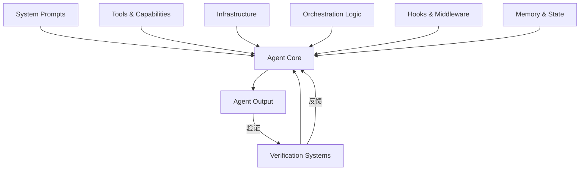
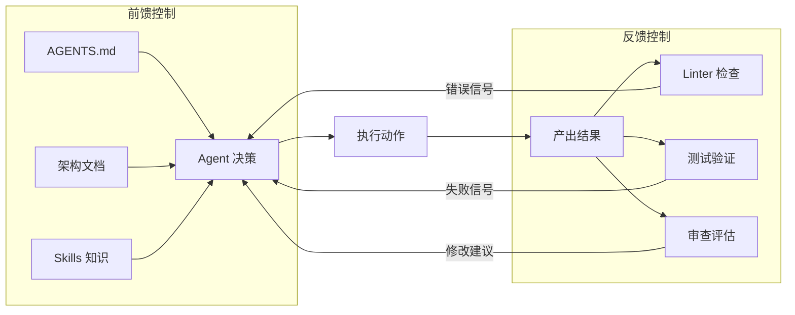
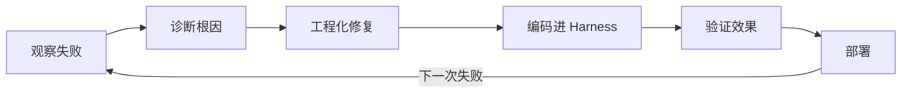

# Harness Engineering

一辆 F1 赛车的引擎再强劲，没有空气动力学套件、悬挂系统和进站团队的配合，也赢不了比赛。真正决定圈速的是围绕引擎构建的整套系统。AI 智能体同理——大语言模型是引擎，围绕它构建的工具链、约束条件、反馈回路和基础设施构成了 **Harness**（驾驭系统）：

$$Agent = Model + Harness$$

Terminal-Bench 2.0 的基准测试表明：仅改变 Harness 质量，同一模型的排名可偏移超过 25 个位次。配备精良 Harness 的中等模型，完全可以击败 Harness 粗糙的顶级模型。

Harness Engineering 就是设计这套驾驭系统的工程学科——构建模型之外的一切，使智能体从"偶尔能用"变为"持续可靠"。

## 从 Prompt Engineering 到 Harness Engineering

过去几年，Prompt Engineering 是与大模型交互的核心技能，关注的是**如何更好地措辞指令**。但当智能体需要自主完成跨越数十步的复杂任务时，仅靠文本指令的精雕细琢远远不够。

| 维度 | Prompt Engineering | Harness Engineering |
|------|-------------------|---------------------|
| 核心问题 | 如何措辞指令？ | 如何构建可靠系统？ |
| 作用范围 | 单次推理 | 完整任务生命周期 |
| 控制手段 | 文本指令 | 工具 + 约束 + 反馈回路 + 基础设施 |
| 失败模式 | 模型误解意图 | 系统缺乏纠错机制 |
| 可复现性 | 依赖模型一致性 | 依赖工程化保障 |
| 类比 | 给员工写邮件 | 构建整套项目管理体系 |

Prompt Engineering 并未过时，它是 Harness 的组成部分之一（System Prompt 组件）。但当任务从单次问答升级到多步骤自主执行时，失败模式发生了质变：单次推理的失败是"模型不理解意图"，多步骤任务的失败则是"系统缺乏纠错机制"——智能体在第 3 步犯的小错误，到第 15 步可能已导致整个任务偏离轨道。Prompt Engineering 无法解决这种系统性问题。

## Harness 的核心组件

一个完整的 Harness 包含七个层次的组件，它们协同工作，共同约束和增强智能体的行为。

### 1. System Prompts — 核心指令层

系统提示定义了智能体的身份、能力边界和行为约束。它不是简单的任务描述，而是一套完整的行为宪法：

```
你是一个代码重构助手。
约束条件：
- 不得修改公共 API 接口签名
- 每次变更必须保持现有测试通过
- 单次提交不超过 200 行变更
```

### 2. Tools and Capabilities — 能力接口层

通过 MCP 服务器、Functions、Skills 等机制暴露给智能体的操作能力。工具的选择和设计直接影响智能体的行为空间——提供文件读写工具，智能体就能操作代码；提供浏览器工具，它就能采集网页信息。

工具设计中存在多方对齐问题——LLM、MCP Server、业务设计者和最终用户四方中任何一方的信息缺失都会导致调用失败。由此衍生出几条工具描述的优化原则：

- **命名即功能（Affordance）**：工具名称应自解释，`calculate_quarterly_tax` 优于 `process_data`
- **参数描述必须精确**：不要写"输入一个 ID"，而是写"员工六位数字工号，如 '028451'"
- **错误信息应包含修复路径**：不返回 `invalid input`，而返回 `employee_id must be 6 digits, got 3 — did you omit the leading zeros?`
- **Schema 中嵌入示例值**：让 LLM 从示例中推断格式，而非依赖纯文字描述

工具数量的控制同样关键。多个团队的实践表明，大幅精简工具数量后任务完成率反而提升——工具不是越多越好，而是越精准越好。

### 3. Infrastructure — 基础设施层

沙箱环境、文件系统、代码执行引擎、浏览器实例——这些是智能体实际运行的物理（或虚拟）环境。智能体需要的不仅是"运行测试"的指令，更需要一个隔离的容器环境来安全执行代码。

### 4. Orchestration Logic — 编排逻辑层

子智能体的生成、任务分发、模型路由和交接协议。当一个复杂任务需要分解时，编排层决定哪个子模块处理哪个子任务，以及它们之间如何传递上下文。

### 5. Hooks and Middleware — 确定性控制层

这是 Harness 中最容易被忽略但最具杠杆效应的组件。Hooks 在智能体的推理循环中插入确定性的检查点——上下文压缩、格式校验、敏感信息过滤。它们不依赖模型的判断力，而是通过硬编码逻辑强制执行规则。

在生产环境中，Hook 的应用通常落入四种模式：

**安全门控（PreToolUse）**——在工具执行前拦截危险操作，如 `rm -rf` 或 `DROP TABLE`。这是生产环境的必需品。

**质量回路（PostToolUse）**——在工具执行后自动触发质量检查。当智能体写入文件后，Hook 自动运行 Linter，将诊断结果注入上下文作为反馈信号，智能体在下一步自行修正。这形成了一个紧凑的自纠错闭环：

```python
# PostToolUse Hook 示例：文件写入后自动触发 Lint 检查
def post_file_write_hook(event):
    if event.tool == "file_write" and event.path.endswith(".py"):
        diagnostics = run_ruff(event.path)
        if diagnostics:
            # 将诊断结果注入上下文，智能体下一步会看到并修复
            return {"feedback": format_diagnostics(diagnostics)}
    return None
```

**完成门控（Stop）**——当智能体宣称任务完成时，在真正结束前运行完整测试套件。测试未通过则阻止任务结束，将失败信息返回给智能体继续修复。

**可观测性（All Events）**——将智能体的每一步意图和结果流式传输到监控系统。这不直接影响智能体行为，但为事后诊断和 Harness 迭代提供了数据基础。

### 6. Memory and State Management — 状态管理层

进度文件、Git 版本记录、知识库检索——这些机制让智能体在长任务中保持连贯性。没有状态管理的智能体就像一个每隔五分钟就失忆的工作者。

### 7. Verification Systems — 验证系统层

测试套件、类型检查器、Linter、代码审查智能体——它们构成了质量保障的最后防线。



这七个组件并非独立运作。验证系统的结果会触发 Hooks 的干预，Memory 会影响 System Prompt 的动态组装，Orchestration 决定何时调用哪些 Tools。它们形成一个有机的整体。

## 前馈与反馈：两种控制机制

Thoughtworks 的研究提出了一个精辟的分类框架：Harness 中的所有控制手段可以归为两类——**前馈控制（Guides）** 和 **反馈控制（Sensors）**。

### 前馈控制：预防胜于治疗

前馈控制在智能体行动之前提供指导，目的是从源头减少错误发生的概率。它们是“路标”和“护栏”：

- **AGENTS.md 文件**：项目级的智能体行为规范
- **架构文档**：系统设计约束和依赖关系
- **编码规范**：命名约定、目录结构、模式要求
- **Skills 注入**：领域专业知识的按需加载

前馈控制的形式可以很简单。一个典型的项目级 AGENTS.md 可能只包含十几条规则：

```
# 行为约束
- 不得直接修改 /db/migrations/ 目录下的文件
- 所有 API 端点必须通过 /middleware/auth.py 进行鉴权
- 单次提交不超过 200 行变更
- 新增的公共函数必须附带单元测试
- 使用 snake_case 命名，禁止 camelCase
```

每一条规则的价值在于它消除了一类潜在错误，且对所有未来会话生效。

### 反馈控制：观察并自我修正

反馈控制在智能体行动之后检测结果，提供纠偏信号：

- **Linter 和类型检查**：即时的语法和类型错误反馈
- **测试套件**：功能正确性验证
- **代码审查智能体**：语义层面的质量评估
- **浏览器截图**：UI 渲染结果的视觉验证

反馈控制的关键不仅在于检测错误，更在于反馈信号的质量。一条“测试失败”的信息远不如“测试 test_user_login 失败：期望 HTTP 200 但收到 401，检查 auth middleware 是否正确配置”。前者只告诉智能体“错了”，后者告诉它“错在哪里、可能怎么修”。这就是前文提到的 Sensor + Guide 组合模式。

### 为什么两者缺一不可？

仅有反馈控制的系统容易陷入无限循环——犯错、检测、修复、引入新错，缺乏修复方向。仅有前馈控制的系统则无法验证自己是否做对了。实践中，两类控制的配比需根据任务类型调整：编译型语言（Rust、Go）的反馈控制天然强大（编译器本身就是强力 Sensor）；动态语言（Python、JavaScript）缺少编译阶段反馈，前馈控制就更加重要。



### 计算性 vs 推理性

反馈控制内部还存在一个重要区分：

| 类型 | 机制 | 速度 | 可靠性 | 示例 |
|------|------|------|--------|------|
| 计算性（Computational） | 确定性规则 | 毫秒级 | 100% 一致 | 类型检查、Linter、单元测试 |
| 推理性（Inferential） | AI 判断 | 秒级 | 非确定性 | 代码审查 Agent、语义分析 |

最佳实践是优先部署计算性反馈（快速、可靠），将推理性反馈作为补充层处理那些规则无法覆盖的语义问题。

## 上下文工程与渐进式披露

智能体的上下文窗口是有限且珍贵的资源。近年来这个领域已发展出自己的名称——Context Engineering（上下文工程），它与 Harness Engineering 高度重叠。

### 渐进式披露（Progressive Disclosure）

核心原则：**不要一次性加载所有内容**。信息应按需逐层展开，分为三级：

1. **第一层：索引层**——项目结构、模块职责、入口点地图（始终在上下文中）
2. **第二层：接口层**——当智能体决定操作某个模块时，加载该模块的公共 API、类型定义和约束条件
3. **第三层：实现层**——只有在需要修改具体文件时，才加载文件内容

这种分层策略可将初始上下文消耗从数万 token 压缩到几千 token。

### 上下文管理的反模式

**上下文腐烂（Context Rot）**——将所有规范、约束、历史记录堆进一个庞大的系统提示。随着内容膨胀，早期规则会被模型"遗忘"。某团队的系统提示从 500 token 膨胀到 8000 token 后，智能体开始系统性地忽略最早写入的安全约束。

**描述膨胀（Description Bloat）**——注册过多工具，每个工具描述消耗大量 token。40 个工具的 JSON Schema 可能消耗 3000—5000 token，且模型选择正确工具的准确率会急剧下降。

### 解决方案：目录式索引

```python
# 好的做法：精炼的顶层索引
PROJECT_INDEX = """
## 项目结构
- /src/auth/ — 认证模块（JWT + OAuth2）
- /src/api/ — REST API 路由定义
- /src/models/ — 数据模型层
- /src/services/ — 业务逻辑服务

## 关键约定
- 所有 API 返回统一 ResponseWrapper 格式
- 数据库操作通过 Repository 模式
- 详细规范见 /docs/conventions.md
"""

# 不好的做法：将所有文件内容拼接
FULL_CODEBASE = open("all_files.txt").read()  # 可能 50000+ tokens
```

目录式索引让智能体知道"去哪里找"，而非"把所有内容都记住"。

### AGENTS.md 的写作约束

AGENTS.md 是当前最广泛采用的项目级前馈控制手段。一项对 138 个开源仓库的研究发现，自动生成的 AGENTS.md 文件多消耗 20% 以上的 token，任务完成率却未提升。原因在于多数自动生成的文件充斥着目录列表和代码库概述——智能体完全有能力自行发现项目结构，它们缺乏的是"不应该做什么"的行为约束。

有效的 AGENTS.md 应遵循以下原则：

- **控制在 60 行以内**：超过这个长度，规则的边际效用开始递减
- **只写行为规则，不写文档**：“不得直接修改 migration 文件”比“src/db/ 目录包含数据库迁移文件”有用得多
- **分层作用域**：组织级规则放在根目录，项目级规则放在项目根，模块级规则放在对应子目录
- **禁止自动生成**：每条规则都应来自真实的失败观察，而非主观臆测

## 三个治理维度

Harness 的验证体系可以按治理目标分为三个维度，每个维度的成熟度和实现难度各不相同。理解这三个维度有助于确定 Harness 建设的优先级。

### 维度一：可维护性治理（Maintainability Harness）

关注内部代码质量——命名规范、函数长度、圈复杂度、重复代码检测。这是最成熟的维度，因为已有大量确定性工具可用（ESLint、Pylint、SonarQube）。

### 维度二：架构适应性治理（Architecture Fitness Harness）

关注系统级特性——性能基准、安全扫描、依赖审计、API 兼容性。这个维度需要更复杂的测试基础设施，如负载测试环境和安全扫描流水线。

### 维度三：行为正确性治理（Behavior Harness）

关注功能是否满足业务需求——这是最困难的维度。代码风格完美、架构优雅，但实现的功能不是用户要的——这类错误很难被自动化工具捕获，往往需要在前馈控制中明确写出业务约束。

| 维度 | 难度 | 典型工具 | 自动化程度 |
|------|------|----------|-----------|
| 可维护性 | ★★☆ | Linter, 格式化器 | 高 |
| 架构适应性 | ★★★ | 性能测试, 安全扫描 | 中 |
| 行为正确性 | ★★★★ | E2E 测试, 人工验收 | 低 |

三个维度层层递进，投入优先级应从易到难。

## 实现模式与代码示例

以下是一个 Harness 配置示例，展示各组件如何组装成完整的智能体运行环境：

```python
from dataclasses import dataclass, field
from typing import Callable
from enum import Enum


class ControlType(Enum):
    FEEDFORWARD = "feedforward"
    FEEDBACK = "feedback"


@dataclass
class HarnessComponent:
    name: str
    control_type: ControlType
    handler: Callable
    priority: int = 0


@dataclass
class AgentHarness:
    """智能体 Harness 配置"""
    
    # 前馈控制：行动前的指导
    system_prompt: str = ""
    architecture_docs: list[str] = field(default_factory=list)
    coding_conventions: dict = field(default_factory=dict)
    
    # 工具注册
    tools: list[dict] = field(default_factory=list)
    max_tools_per_context: int = 15  # 避免描述膨胀
    
    # 反馈控制：行动后的验证
    verification_pipeline: list[HarnessComponent] = field(default_factory=list)
    
    # 编排配置
    max_iterations: int = 20
    compaction_threshold: int = 80000  # tokens
    
    # 状态管理
    progress_tracking: bool = True
    checkpoint_interval: int = 5  # 每 N 步保存状态

    def build_context(self, task: str) -> str:
        """渐进式上下文组装"""
        context_parts = [self.system_prompt]
        
        # 按相关性加载架构文档（而非全部加载）
        relevant_docs = self._select_relevant_docs(task)
        context_parts.extend(relevant_docs)
        
        # 工具描述裁剪
        active_tools = self._select_tools(task)[:self.max_tools_per_context]
        context_parts.append(self._format_tools(active_tools))
        
        return "\n\n".join(context_parts)

    def run_verification(self, output: str) -> list[dict]:
        """执行反馈控制流水线"""
        issues = []
        for component in sorted(self.verification_pipeline, key=lambda c: c.priority):
            result = component.handler(output)
            if result.get("issues"):
                issues.extend(result["issues"])
        return issues


# 使用示例
harness = AgentHarness(
    system_prompt="""你是一个后端开发助手。
约束：
- 遵循 RESTful 设计原则
- 所有接口必须有错误处理
- 数据库操作使用事务""",
    
    coding_conventions={
        "naming": "snake_case for Python, camelCase for JS",
        "max_function_lines": 50,
        "test_coverage_threshold": 0.8,
    },
    
    verification_pipeline=[
        HarnessComponent(
            name="type_check",
            control_type=ControlType.FEEDBACK,
            handler=lambda code: run_mypy(code),
            priority=1,  # 最先执行：快速、确定性
        ),
        HarnessComponent(
            name="lint",
            control_type=ControlType.FEEDBACK,
            handler=lambda code: run_ruff(code),
            priority=2,
        ),
        HarnessComponent(
            name="test_suite",
            control_type=ControlType.FEEDBACK,
            handler=lambda code: run_pytest(code),
            priority=3,
        ),
        HarnessComponent(
            name="ai_review",
            control_type=ControlType.FEEDBACK,
            handler=lambda code: ai_code_review(code),
            priority=10,  # 最后执行：慢速、推理性
        ),
    ],
)
```

代码体现了几个关键设计决策：`max_tools_per_context` 防止描述膨胀；验证流水线按 `priority` 排序，确定性检查先于推理性审查；`build_context` 根据任务动态选择相关文档和工具，而非全量加载。

### 完整工作流示例

将上述组件串联起来，典型的代码修改任务工作流如下：

```
1. 接收任务 → build_context() 组装精简上下文
2. System Prompt + AGENTS.md 提供行为约束          ← 前馈控制
3. 智能体选择工具并执行
4. PreToolUse Hook 拦截危险操作                     ← 安全门控
5. 工具执行完成
6. PostToolUse Hook 运行 Linter 并注入诊断            ← 质量回路
7. 智能体根据诊断结果自行修正
8. 重复 3-7 直到任务完成
9. Stop Hook 运行完整测试套件                       ← 完成门控
10. 测试全部通过 → 任务结束
```

如果第 9 步测试失败，智能体回到第 3 步继续修复。修复轮次超过阈值（`max_iterations`）则标记失败并生成诊断报告。

## 常见反模式

以下反模式来自实际工程实践，理解它们有助于在设计时主动规避。

### 反模式一：无限反馈循环

```
Agent 生成代码 → 测试失败 → Agent 修改代码 → 引入新 bug → 测试再次失败 → ...
```

根因：缺乏前馈指导。解决方案：设定修复尝试上限（如 5 轮），并在每轮反馈中附带修复建议而不仅仅是错误信息（将 Sensor 升级为 Sensor + Guide 组合）。

### 反模式二：上下文过载

将所有可能相关的文档一次性灌入系统提示。研究表明，上下文文档超过一定阈值后，模型准确率会出现 20 个百分点以上的降幅——给得越多，反而做得越差。应对策略是对外部响应进行压缩，保留关键信息。

### 反模式三：工具爆炸

注册 50+ 个工具，模型选择准确率随工具数量增加而显著下降。更危险的变体是"工具风暴"——智能体短时间内发起大量调用，当下游服务故障时重试逻辑引发级联效应。应对策略：按任务阶段动态加载工具子集，为每个工具设置调用预算并引入速率限制。

### 反模式四：缺乏状态持久化

长任务中不保存中间状态。上下文压缩时，之前的推理和决策记录全部丢失，智能体不得不重新"理解"任务。解决方案：压缩前将关键决策和进度写入持久化文件，压缩后自动重新加载。

### 反模式五：全推理性验证

所有验证都依赖 AI 判断，不使用任何确定性工具。这导致验证本身不可靠——AI 审查 AI 的输出，双方都可能犯错且无法互相纠正。

### 反模式六：检索振荡

RAG 类智能体的典型失败模式。智能体在多轮检索中在不同方向间振荡，始终无法收敛。根因在于缺乏检索结束条件。应对策略：将检索循环上限设为 3 次，每次重新检索前必须明确标注"上一次结果缺失了什么具体信息"。

## 转向循环：从失败到系统性改进

上述反模式描述的是单次会话中的失败。更根本的问题是：如何将每次失败转化为永久性的系统改进？这就是转向循环（Steering Loop）的核心思想。

模式很直接：观察失败 → 诊断根因 → 将修复编码进 Harness → 验证效果 → 部署。关键在于修复不是一次性的人工干预，而是变成永久的规则或 Hook，确保相同错误不会再发生。



一个具体场景：代码智能体反复提交超大变更（500+ 行）。根因不是模型能力不足，而是 Harness 中缺少约束。在 AGENTS.md 中增加"每次提交不超过 200 行变更"这条规则后，所有未来会话都自动遵守。

这就是转向循环的**复利效应**：普通调试是线性的，解决一个问题下次还可能再遇到；转向循环是累积性的，解决一个问题，同类问题永远消失。

更激进的做法是让智能体自己优化 Harness。某研究团队的实验表明，智能体通过分析执行轨迹自主迭代 Harness 配置，遍历 60 种配置组合后找到的最优配置取得了特定模型类别的最高分——Harness Engineering 本身也有可能被自动化。

## Harness 的度量与演进

Harness 的影响并非理论猜想，多个独立基准测试提供了量化证据：

- Terminal-Bench 2.0：同一模型在不同 Harness 下排名差异巨大（第 33 vs 第 5）
- 某智能体框架 Harness 优化后，基准得分从 52.8% 提升至 66.5%
- 138 个开源仓库的研究：自动生成的 AGENTS.md 多消耗 20%+ token，任务完成率未提升

结论：Harness 质量是智能体性能的主要决定因素，但糟糕的 Harness 不如没有 Harness。

### 关键指标

如何评估一个 Harness 的质量？以下指标提供了量化框架：

- **任务完成率**：智能体在无人干预下成功完成任务的比例
- **平均修正轮次**：从首次输出到通过所有验证所需的迭代次数
- **上下文利用率**：有效 token 占总上下文 token 的比例
- **故障恢复率**：遇到错误后成功自我修复的比例
- **确定性覆盖率**：被计算性验证覆盖的输出比例

这五个指标应当作为一个整体来观察。单独追踪任务完成率还不够——如果完成率很高但平均修正轮次也很高，说明智能体在“磨”而不是在“做”，应当加强前馈控制。如果确定性覆盖率低但故障恢复率也低，说明反馈控制存在盲区。

### 演进策略

Harness 不是一次性设计完成的产物，它需要持续迭代：

**阶段一：基础验证**——部署 Linter 和基本测试，建立最低质量底线。

**阶段二：前馈增强**——根据常见失败模式编写 AGENTS.md，将隐性知识显性化。

**阶段三：闭环优化**——分析验证失败模式，将高频错误转化为前馈规则，形成自我进化的闭环。

**阶段四：度量驱动**——建立量化仪表盘，追踪各指标趋势，数据驱动定向加固。

每一轮迭代都遵循同一模式：观察失败点，分析是前馈不足还是反馈不足，然后定向加固。

下表概括了四个阶段的核心特征：

| 阶段 | 核心动作 | 主要控制类型 | 典型产出物 |
|------|----------|------------|----------|
| 基础验证 | 部署确定性检查工具 | 反馈 | Linter 配置、测试套件 |
| 前馈增强 | 将失败观察转化为规则 | 前馈 | AGENTS.md、行为约束 |
| 闭环优化 | 自动捕获并转化高频错误 | 前馈+反馈 | Hook 规则、动态规则更新 |
| 度量驱动 | 基于数据定向优化 | 全链路 | 监控仪表盘、A/B 测试 |
