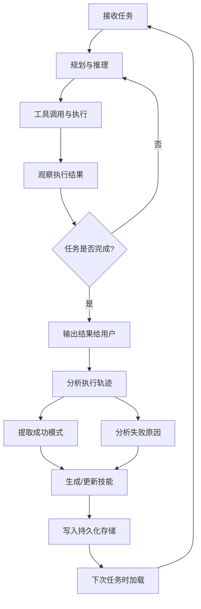
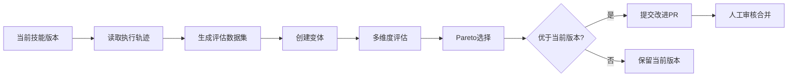
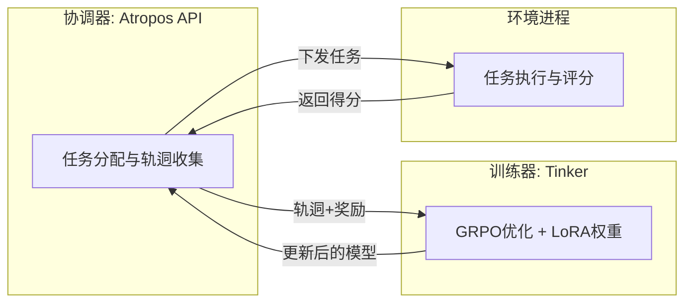

# 智能体自我进化

你可能遇到过这样的场景：花了半小时教一个AI助手处理你们公司的报销流程，第二天打开新对话——它全忘了。你再教一遍。第三天，同样的事情再来一次。更让人沮丧的是，它在第一次犯的错误，第五次还在犯。每次交互都像在训练一个失忆的新人。

换个角度想：一个实习生如果真的这样，你大概率会认为他不适合这份工作。人类之所以能胜任复杂岗位，不是因为一开始就什么都会，而是因为能从经验中提炼规律，把"踩过的坑"变成"下次绕开的路线"。

如果智能体也能做到这一点——从执行中总结经验、从失败中提取教训、把成功的操作固化为可复用的能力——那么它就不再是一个"有记忆的聊天机器人"，而是一个真正意义上会成长的系统。这就是智能体自我进化要解决的核心问题。

## 什么是自我进化

自我进化（Self-Evolution）是指智能体在部署后，通过自身的执行经验和反馈信号，自主改进其行为策略、知识储备和技能组合的能力。

这个定义有三个关键词需要拆开理解：

- **部署后**：不是训练阶段的参数更新，而是智能体已经上线运行后的持续改进
- **自主**：不依赖人类重新标注数据或启动新一轮微调
- **改进行为，必要时也改进参数**：早期的自我进化系统仅通过外部知识结构（技能文件、记忆系统、策略库）来实现能力提升，不触碰模型权重。但前沿实践已突破这一边界，形成了**两层自我改进架构**：

```
第一层 · Prompt进化（轻量）
  优化对象：技能描述、工具定义、策略提示词
  方法：GEPA等进化算法
  资源需求：仅需LLM推理（无GPU训练）
  周期：分钟到小时

第二层 · 模型训练（深度）
  优化对象：模型权重（通过LoRA适配器）
  方法：GRPO等强化学习算法
  资源需求：GPU集群或训练API
  周期：小时到天
```

想象你买了一辆自动驾驶汽车。第一层进化相当于这辆车每天自己总结驾驶经验——"这个路口左转经常遇到行人"、"下雨天这段路减速效果更好"——并把经验写进决策手册。第二层进化则更激进：它相当于车载芯片根据积累的行驶数据重新训练视觉识别模型，让感知能力本身得到提升。两层机制互为补充——手册告诉它"做什么"，训练让它"做得更好"。

与其他能力提升范式相比：

| 维度 | 微调 (Fine-tuning) | RLHF | 上下文学习 (ICL) | 自我进化 |
|------|-------------------|------|-----------------|--------|
| 是否修改权重 | 是 | 是 | 否 | 视层级而定† |
| 需要训练资源 | GPU集群 | GPU集群 | 无 | 视层级而定† |
| 改进持久性 | 永久 | 永久 | 仅当次会话 | 跨会话持久 |
| 改进来源 | 人工标注数据 | 人类偏好信号 | 少样本示例 | 自身执行经验 |
| 改进粒度 | 全局能力 | 偏好对齐 | 任务级 | 技能级/策略级/权重级 |
| 部署后可用 | 否 | 否 | 是 | 是 |

> † 自我进化包含两个层级：**Prompt进化层**（如GEPA）不修改权重、无需GPU；**模型训练层**（如基于GRPO的强化学习）通过LoRA适配器更新权重，需要GPU或训练API。后续章节将分别展开。

ICLR 2026 的一篇 oral 论文《A Survey of Self-Evolving Agents》系统梳理了这一领域，将自我进化定义为"无需外部人类干预的、基于经验的能力闭环提升"。这篇综述表明，自我进化已经从概念验证走向了工程可落地阶段。

## 自我进化的五个维度

自我进化不是单一能力，而是多个维度的协同提升。

### 维度一：程序性学习（Procedural Learning）

程序性学习是指智能体从完成复杂任务的过程中，提取出可复用的操作流程并存储为"技能"。

假设你正在处理一个跨时区团队的会议安排任务。第一次，你手动查每个人的时区、计算重叠时段、考虑午休时间、发送日历邀请。第二次遇到同类任务时，你已经有了一套流程：先查时区差、再找公共窗口、排除非工作时段、最后发通知。这套流程就是程序性记忆。

智能体的程序性学习同理——完成一次复杂任务后，分析执行轨迹，将其中的关键步骤抽象为可重用的技能描述。

### 维度二：知识精炼（Knowledge Refinement）

已有的技能并非一成不变。智能体在反复执行某项技能的过程中，可以根据成功率和执行反馈逐步优化技能描述。

比如一个"代码调试"技能，最初的描述可能是"分析报错信息，定位问题代码，修复并验证"。经过多次执行后，智能体发现：对于类型错误，直接检查变量类型比阅读完整调用栈更高效。于是技能描述被精炼为包含条件分支的更细致流程。

### 维度三：工具优化（Tool Optimization）

工具的调用方式也可以进化。智能体通过分析哪些工具组合在特定任务中效果最好，逐步调整工具选择策略和参数配置。

### 维度四：策略适应（Strategy Adaptation）

不同类型的任务适合不同的解决策略。面对数学推理任务时，逐步分解更有效；面对信息检索任务时，先广度搜索再深度聚焦更高效。智能体通过积累不同策略在不同任务上的表现数据，学会"因题制宜"。

### 维度五：跨会话记忆（Cross-Session Memory）

最基础也最关键的一个维度：记住用户是谁、偏好什么、上次做了什么。没有跨会话记忆，前面四个维度的进化成果都无法在下次对话中发挥作用。

## 闭环学习：从执行到改进

自我进化的核心是一个闭环——智能体不只是执行任务，还要在执行结束后"回头看"，从结果中提取改进信号。



这个闭环有几个关键设计要点：

**异步学习**：学习过程不阻塞用户体验。任务完成后立即返回结果，学习在后台异步进行。

**轨迹分析而非结果分析**：不只看"任务是否成功"，而是分析执行的每一步。NeurIPS 2025 的 SE-Agent 工作证明，基于轨迹的优化在多步推理任务中显著优于仅基于结果的反馈。一次成功的任务中可能包含低效的步骤，一次失败的任务中可能包含值得保留的局部策略。

**渐进式改进**：不是一次性重写技能，而是小幅迭代。每次改进都基于新证据与已有经验的融合。

## 技能系统与程序性记忆

技能（Skill）是自我进化的核心存储单元。它不是代码片段，而是一份结构化的"操作指南"——描述在什么条件下、用什么步骤、调用哪些工具来完成某类任务。

一个典型的技能文件结构：

```markdown
# SKILL: deploy-python-service

## 触发条件
用户请求部署 Python 服务到生产环境

## 前置检查
- 确认项目有 requirements.txt 或 pyproject.toml
- 确认有 Dockerfile 或需要生成
- 确认目标环境的访问凭证已配置

## 执行步骤
1. 运行测试套件，确认全部通过
2. 构建 Docker 镜像，标签格式为 {service}:{git-sha[:7]}
3. 推送镜像到容器仓库
4. 更新部署配置（replicas、env vars）
5. 执行滚动更新
6. 验证健康检查端点返回 200

## 常见问题
- 如果测试失败：先修复测试，不要跳过
- 如果端口冲突：检查现有服务占用情况
- 如果健康检查超时：检查启动时间，必要时调整 initialDelaySeconds

## 改进记录
- v1: 初始版本，从2024-03-15部署任务中提取
- v2: 增加端口冲突处理（2024-03-22失败案例）
- v3: 增加滚动更新而非直接替换（2024-04-01线上事故教训）
```

技能的生成过程本质上是一次"执行轨迹→结构化知识"的蒸馏：

```python
class SkillExtractor:
    """从执行轨迹中提取可复用技能"""
    
    def __init__(self, llm_client):
        self.llm = llm_client
    
    def extract_skill(self, trajectory: list[dict]) -> str:
        """
        分析完整执行轨迹，提取通用技能模板
        
        Args:
            trajectory: 执行步骤列表，每步包含
                        {action, observation, reasoning, tool_calls}
        """
        # 第一步：识别轨迹中的关键决策点
        decision_points = self._identify_decisions(trajectory)
        
        # 第二步：区分任务特定步骤和通用步骤
        generic_steps = self._generalize_steps(trajectory, decision_points)
        
        # 第三步：提取错误恢复模式
        error_patterns = self._extract_error_handling(trajectory)
        
        # 第四步：生成技能描述
        skill_prompt = f"""
        基于以下执行轨迹分析，生成一份可复用的技能描述：
        
        通用步骤：{generic_steps}
        决策点：{decision_points}
        错误处理：{error_patterns}
        
        要求：
        - 去除所有任务特定的细节（具体文件名、用户名等）
        - 保留可迁移的操作逻辑和判断条件
        - 包含前置检查和常见错误处理
        """
        
        return self.llm.generate(skill_prompt)
    
    def _identify_decisions(self, trajectory):
        """识别执行中的分支决策点"""
        decisions = []
        for i, step in enumerate(trajectory):
            if step.get("alternatives_considered"):
                decisions.append({
                    "step": i,
                    "chosen": step["action"],
                    "alternatives": step["alternatives_considered"],
                    "reasoning": step["reasoning"]
                })
        return decisions
```

## 基于进化算法的技能优化

技能创建之后如何持续变好？一种高效的方法是 GEPA（Genetic-Pareto Prompt Evolution）——用进化算法的思路来优化技能描述，而无需任何GPU训练。

GEPA 的核心洞察：技能描述本质上是一段 prompt，而 prompt 的优化可以看作一个搜索问题——在"描述空间"中找到效果最好的那个版本。

整个流程如下：



具体步骤：

**1. 读取执行轨迹**：收集该技能最近N次执行的完整记录——成功的、失败的、部分成功的。

**2. 生成评估数据集**：从真实轨迹中构造测试用例。不是人工编写的单元测试，而是从实际使用中自动提取的场景。

**3. 创建变体（Mutation）**：对当前技能描述施加多种变异操作：
- 添加缺失的边界条件处理
- 精简冗余的步骤描述
- 重新组织步骤顺序
- 补充从失败案例中学到的新信息

```python
class SkillEvolver:
    """基于进化算法的技能优化器"""
    
    def evolve(self, current_skill: str, traces: list[dict]) -> str | None:
        # 生成多个变体
        variants = []
        for strategy in ["simplify", "add_edge_cases", "reorder", "specialize"]:
            variant = self._mutate(current_skill, traces, strategy)
            variants.append(variant)
        
        # 在评估数据集上测试每个变体
        scores = []
        for variant in variants:
            score = self._evaluate(variant, traces)
            scores.append(score)  # 多维度: [成功率, 执行步数, token消耗]
        
        # Pareto最优选择：没有任何维度更差，至少一个维度更好
        best = self._pareto_select(variants, scores, current_skill)
        return best  # None表示当前版本已经是最优
    
    def _mutate(self, skill: str, traces: list, strategy: str) -> str:
        """根据策略生成变体"""
        failed_traces = [t for t in traces if not t["success"]]
        
        if strategy == "add_edge_cases" and failed_traces:
            prompt = f"""
            当前技能：
            {skill}
            
            以下执行失败了：
            {self._summarize_failures(failed_traces)}
            
            请修改技能描述，增加对这些失败场景的处理，
            但不要让描述变得过于冗长。
            """
            return self.llm.generate(prompt)
        # ... 其他策略
```

**4. Pareto选择**：评估不止看成功率一个维度，还要考虑执行效率（步骤数）和资源消耗（token数）。只有在不损害任何维度的前提下改善了至少一个维度的变体，才被视为"更好"。

**5. 安全提交**：改进不是静默生效的。最佳变体以 Pull Request 的形式提交，附带完整的评估数据——包括在哪些测试用例上表现更好，以及变更的具体diff。

## 强化学习训练：从技能优化到权重更新

GEPA优化的是描述任务的“说明书”，但智能体的基座能力——语言理解、推理链质量、工具调用的准确性——依然受限于底层模型本身。假设你正在培训一个客服团队：GEPA相当于给他们更好的操作手册，但如果员工本身的专业素养不足，手册写得再好也很难根本性地提升服务质量。第二层进化——基于强化学习的模型训练——解决的正是这个问题。

### GRPO：无需Critic的策略优化

Group Relative Policy Optimization（GRPO）是这套训练体系的核心算法。与经典PPO的关键区别在于：GRPO不需要独立的Critic网络来估计状态价值。它的做法是对同一任务生成一组响应（默认组大小16），然后在组内做相对排名——得分高于组均值的响应获得正向激励，低于的获得负向激励。

这个思路很像考试“曲线评分”：不看绝对分数，看你在这批考生里的相对位置。只要你表现得比同组多数人好，就获得奖励，而不需要一个独立的“评分员”来判断你的绝对水平。这省去了训练和维护Critic模型的开销，显著降低了显存占用和计算量。

典型的训练参数配置：

```python
# GRPO 训练默认参数
grpo_config = {
    "group_size": 16,          # 每个任务生成的响应数
    "batch_size": 128,         # 每步更新的样本量
    "learning_rate": 4e-5,     # LoRA学习率
    "lora_rank": 32,           # LoRA秩，控制可训练参数量
    "kl_coefficient": 0.01,    # KL散度正则化系数
    "max_steps": 500,          # 训练步数上限
}
```

权重更新通过 LoRA 适配器实现，而非全参数微调。这意味着训练产生的是一组较小的增量权重，可以随时加载或卸载，原始模型不受影响。

### Tinker-Atropos 训练基础设施

强化学习训练不是单个进程就能完成的，它需要三个组件协调工作：



**Atropos** 扮演调度中心的角色：它维护任务队列，将任务分发给环境进程执行，收集执行轨迵和得分，再将它们打包发送给Tinker用于权重更新。**Tinker** 是实际执行GRPO优化的训练器，管理LoRA适配器的加载与保存。**环境进程**则是智能体实际“做题”的场所——它提供任务、观察智能体的行为、并给出分数。

启动训练需要配置 API 密钥（TINKER_API_KEY 用于训练器通信，WANDB_API_KEY 用于实验追踪），随后分别启动三个进程即可。

### 训练环境：预定义的能力基准

强化学习需要明确的奖励信号，而奖励信号来自环境的评分。目前已有多个预定义的训练环境：

| 环境 | 任务内容 | 规模 | 评分方式 | 特点 |
|------|---------|------|---------|------|
| TerminalBench2 | 终端/编程任务 | 89题 | 二值通过/失败 | 基础能力评估 |
| TBLite | 难度标定任务 | 100题 | 难度加权 | 比TB2快2.6-8倍 |
| YC-Bench | CEO模拟决策 | 长周期 | 多维度策略评分 | 长规划能力 |
| HermesSweEnv | SWE-bench风格代码修复 | 变动 | 测试用例通过率 | 工程实战 |

假设你想训练智能体提升编程能力。TerminalBench2 提供了 89 个终端操作任务，从简单的文件操作到复杂的系统配置，每个任务有确定的通过/失败判定。而 YC-Bench 则走向另一个极端——它模拟创业公司CEO的决策场景，考察智能体在长周期、多目标、信息不完全条件下的策略规划能力。

除了内置环境，也可以继承 `BaseEnv` 创建自定义环境，根据业务场景设计专属的任务和评分逻辑。

### 智能体自主触发训练

一个引人注目的设计是：训练不一定需要人手动启动。智能体可以通过内置的RL工具接口自主管理训练流程：

- `rl_list_environments` — 查看可用的训练环境
- `rl_select_environment` — 选择目标环境
- `rl_start_training` — 启动训练任务
- `rl_check_status` — 监控训练进度
- `rl_get_results` — 获取训练结果

换个角度看，这相当于给智能体一张“健身房会员卡”——它可以自己决定什么时候去键炼哪方面的能力，不需要教练（用户）每次都亲自带它去。

### 离线轨迵导出

强化学习之外，还有一条更传统的路径：将智能体的执行轨迵导出为监督微调（SFT）数据。`batch_runner.py` 可以批量运行任务，将完整的对话历史——包括推理过程、工具调用、观察结果——导出为 ShareGPT 格式。这些轨迵可以直接用于微调，让新模型快速复制优秀智能体的行为模式。

### 两层进化对比

| 维度 | GEPA（Prompt进化） | GRPO（模型训练） |
|------|----------------------|----------------------|
| 优化对象 | 技能提示词、工具描述 | 模型权重（经LoRA） |
| GPU需求 | 无 | 需要（或Tinker API） |
| 典型成本 | ~$2–10/次 | 显著GPU算力 |
| 时间周期 | 分钟到小时 | 小时到天 |
| 产出物 | 更好的指令文本 | 更好的token级决策 |
| 可逆性 | 容易（PR审查即可） | 复杂（涉及模型版本管理） |

两层机制并非二选一。实践中的典型路径是：先用GEPA快速迭代技能描述，积累足够的执行数据后，再启动GRPO训练来强化模型底层能力。前者是日常的微调整，后者是阶段性的深度训练。

## 记忆架构与跨会话学习

自我进化需要持久化存储来承载进化的成果。一个典型的智能体记忆架构包含多个层次：

**事实记忆（MEMORY.md）**：存储持久化的事实性信息——项目结构、技术栈、部署环境配置等。这些信息不因会话结束而丢失。

**用户模型（USER.md）**：存储用户的偏好、习惯和历史交互模式——喜欢简洁还是详细的回答、技术水平如何、关注哪些领域。

**技能库（skills/）**：上一节讨论的技能文件集合，按领域和触发条件组织。

**会话索引**：对历史会话进行摘要和全文索引（如使用 FTS5），支持后续检索"我上次是怎么处理这个问题的"。

记忆的更新策略也需要设计：

- **主动推送**：周期性检查记忆与当前状态的一致性，发现过时信息时主动更新
- **被动触发**：执行任务时发现与已有记忆冲突的新事实，触发更新
- **衰减机制**：长时间未被引用的记忆逐步降低优先级，避免信息过载

MemRL 的研究表明，将记忆系统与强化学习信号结合——即通过任务成败来调整记忆内容的权重——可以显著提升跨会话的任务完成率。

## 案例：Hermes Agent

Hermes Agent 是 Nous Research 于 2026 年初开源的自我进化智能体框架。它的价值不在于模型本身的能力，而在于围绕"如何让智能体在使用中变得更好"这个问题，提供了一套完整的工程实现。

### 架构概览

```mermaid
graph TD
    subgraph 输入层
        U[用户输入]
        P[平台适配: Telegram/Discord/CLI]
    end
    
    subgraph 核心循环
        R[推理引擎]
        T[工具执行: 40+ 内置工具]
        O[观察与反馈]
        M[MCP 集成]
    end
    
    subgraph 进化层①["第一层: Prompt进化"]
        SK[技能系统: skills/]
        MEM[记忆系统: MEMORY.md + USER.md]
        EV[GEPA 进化引擎]
        SS[会话搜索: FTS5]
    end

    subgraph 进化层②["第二层: 模型训练"]
        RL[RL工具接口]
        GR[GRPO训练 + LoRA]
        TA[Tinker-Atropos 基础设施]
    end
    
    subgraph 执行环境
        L[本地终端]
        D[Docker]
        SSH[SSH远程]
        CL[云端: Modal/Singularity]
    end
    
    U --> P
    P --> R
    R --> T
    T --> O
    O --> R
    R --> SK
    SK --> R
    R --> MEM
    T --> L
    T --> D
    T --> SSH
    T --> CL
    O --> EV
    EV --> SK
    R --> RL
    RL --> GR
    GR --> TA
    TA --> R
    T --> M
```

### 核心设计决策

**模型无关（Model-Agnostic）**：支持 200+ 模型后端。第一层进化（技能系统、记忆系统）与推理层完全解耦，无论底层用哪个模型都通用。第二层进化（GRPO训练）则针对具体模型生成LoRA适配器，可以在本地用小模型积累技能和训练数据，然后无缝迁移到更强的模型上使用。

**平台感知**：同一个智能体实例可以通过 Telegram、Discord、CLI 等多种前端交互。进化成果在所有平台间共享。

**子智能体隔离**：对于复杂任务，Hermes 可以派生子智能体（Subagent）。子智能体有独立的上下文窗口，但通过"上下文防火墙"与主智能体隔离——只传递必要信息，避免上下文污染。

### 自我进化的实际运行

以一个具体场景说明整个进化过程：

用户第一次要求 Hermes 将一个 Python 项目从 Poetry 迁移到 uv。Hermes 完成了任务——期间经历了依赖冲突、lock文件格式转换、CI配置调整等多个步骤。

任务完成后，进化层启动：

```python
# 伪代码：Hermes 任务后学习流程
def post_task_learning(execution_trace, task_result):
    # 1. 判断是否值得提取技能
    complexity = assess_complexity(execution_trace)
    if complexity < THRESHOLD:
        return  # 太简单的任务不提取
    
    # 2. 检查是否已有类似技能
    existing = skill_store.search("python package manager migration")
    
    if existing:
        # 3a. 已有技能：尝试改进
        improved = evolve_skill(existing, execution_trace)
        if improved:
            submit_improvement_pr(existing, improved)
    else:
        # 3b. 无类似技能：创建新技能
        new_skill = extract_skill(execution_trace)
        skill_store.add(new_skill, source_trace=execution_trace)
    
    # 4. 更新记忆
    facts = extract_facts(execution_trace)
    memory_store.update(facts)  # 例如: "该项目现在使用uv管理依赖"
```

第二次，另一个用户请求类似的迁移。Hermes 加载之前创建的技能，执行效率显著提升——知道了常见的坑在哪里，不再需要反复试错。

### 六种终端后端

Hermes 的工具执行不限于本地环境。支持六种终端后端——本地进程、Docker 容器、SSH 远程机器、Daytona 工作区、Singularity 容器以及 Modal 无服务器函数。智能体可以根据任务需要选择合适的执行环境，比如在 Docker 中运行不可信代码，在 Modal 上运行GPU密集型任务。

## 安全约束与人类监督

自我进化不意味着无监督的自由生长。一个失控的进化过程可能导致技能退化、行为漂移甚至安全隐患。

**测试套件守护**：每次技能更新必须通过完整的回归测试。测试用例来自该技能的历史成功执行，确保改进不会破坏已有能力。

**语义保持约束**：技能变体在"核心意图"上必须与原版一致。不允许出现"为了提高成功率而绕过安全检查"这类退化。实现方式是对变体做语义相似度检测，低于阈值的变体直接丢弃。

**大小限制**：技能描述有严格的长度上限。防止进化过程中技能无限膨胀，最终超出上下文窗口。

**人工审核门控**：所有技能改进以 PR（Pull Request）形式提交，需要人工审核后才能合并。这是最后一道防线——人类始终保有对进化方向的否决权。

```python
class SafetyGates:
    """技能进化的安全约束"""
    
    MAX_SKILL_SIZE = 4096  # tokens
    MIN_SEMANTIC_SIMILARITY = 0.85
    MIN_TEST_PASS_RATE = 1.0  # 所有测试必须通过
    
    def validate_evolution(self, original: str, evolved: str, 
                           test_results: dict) -> bool:
        # 检查大小约束
        if count_tokens(evolved) > self.MAX_SKILL_SIZE:
            return False
        
        # 检查语义保持
        similarity = compute_semantic_similarity(original, evolved)
        if similarity < self.MIN_SEMANTIC_SIMILARITY:
            return False
        
        # 检查测试通过率
        if test_results["pass_rate"] < self.MIN_TEST_PASS_RATE:
            return False
        
        return True
```

这套安全机制的设计哲学是：**让进化自由探索，但用硬性约束框定边界。** 智能体可以自主生成任意数量的变体和改进方案，但任何变更都必须通过安全验证才能生效。

## 局限性与开放问题

自我进化技术仍处于早期阶段，诸多问题尚无共识性解决方案。

**能力边界不明确**：智能体如何判断"这个任务超出了我的能力范围，不应该尝试提取技能"？过度自信会导致提取出低质量甚至错误的技能。

**进化方向的偏差累积**：如果早期的几次执行恰好遇到了非典型场景，提取出的技能可能会"以偏概全"。后续基于这个偏差技能的进化会进一步放大错误——类似于强化学习中的 reward hacking 问题。

**多用户环境下的进化冲突**：当多个用户共享同一智能体实例时，一个用户的偏好进化可能与另一个用户冲突。如何在个性化和通用性之间取得平衡，目前没有优雅的解法。

**评估困难**：如何衡量"进化成功了"？成功率提升是一个指标，但可能掩盖了在罕见但重要场景上的退化。缺乏标准化的自我进化评估基准。

**知识遗忘与膨胀**：技能库会无限增长吗？过时的技能何时清除？这涉及一个经典的知识管理难题——在"记住更多"和"保持精简"之间找到平衡。

**实时交互RL尚未落地**：目前的强化学习训练均基于预定义的基准环境（TerminalBench2、YC-Bench等）。从真实用户对话中直接提取训练信号（live conversation RL）已有提案（GitHub #498），但尚未实现。这意味着模型训练层的能力提升仍然是“离线”的，无法直接从日常使用中持续学习。

这些问题的解决可能需要跨多个方向的协同突破——更好的不确定性估计、更精细的记忆衰减策略、以及更完善的多租户隔离机制。自我进化的最终目标不是让智能体“什么都学会”，而是让它“知道该学什么、怎么学、以及什么时候该停下来问人”。
