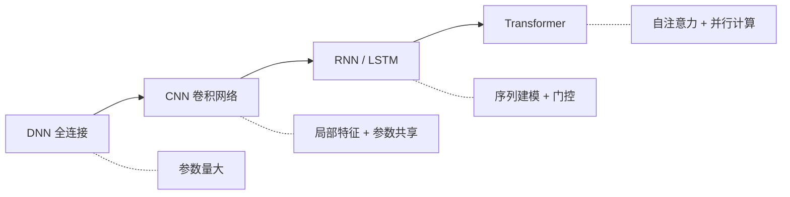

# 3.1 经典神经网络结构

本节回顾深度学习发展历程中的三类经典网络：全连接网络（DNN）、卷积神经网络（CNN）和长短期记忆网络（LSTM）。虽然 Transformer 已成为主流架构，但理解这些经典结构有助于把握深度学习的核心思想——就像学开车一样，先理解手动挡的原理，再开自动挡会更得心应手。

## 3.1.1 深度神经网络（DNN）

最基本的神经网络是全连接前馈网络（Feedforward Neural Network），也称深度神经网络（Deep Neural Network, DNN）。其结构由多个全连接层堆叠而成。

### 数学形式

设输入为 $\mathbf{x} \in \mathbb{R}^{d_0}$，$L$ 层全连接网络的计算过程为：

$$\mathbf{h}^{(0)} = \mathbf{x}$$
$$\mathbf{z}^{(l)} = \mathbf{W}^{(l)} \mathbf{h}^{(l-1)} + \mathbf{b}^{(l)}, \quad l = 1, \ldots, L$$
$$\mathbf{h}^{(l)} = \sigma(\mathbf{z}^{(l)}), \quad l = 1, \ldots, L-1$$
$$\mathbf{y} = \mathbf{z}^{(L)}$$

其中 $\mathbf{W}^{(l)} \in \mathbb{R}^{d_l \times d_{l-1}}$ 是第 $l$ 层的权重矩阵，$\mathbf{b}^{(l)} \in \mathbb{R}^{d_l}$ 是偏置向量，$\sigma$ 是非线性激活函数。

### 万能逼近定理

全连接网络的理论基础是**万能逼近定理**（Universal Approximation Theorem）。Cybenko（1989）证明：对于任意连续函数 $f: [0,1]^n \to \mathbb{R}$ 和任意 $\epsilon > 0$，存在一个单隐藏层神经网络 $g$，使得：

$$\sup_{\mathbf{x} \in [0,1]^n} |f(\mathbf{x}) - g(\mathbf{x})| < \epsilon$$

想象一下，你去一家自助餐厅。万能逼近定理告诉你：只要食材足够多（神经元足够多），厨师总能调配出你想要的任何口味。然而，这个定理并没有告诉你需要多少食材，也没有告诉你烹饪的步骤。实践中，深度网络（多层）往往比宽度网络（单层但神经元数量巨大）更有效——这涉及到表示学习的层次性。就像复杂的菜肴需要分步骤完成：先炒底料，再煸香辅料，最后下主材，而不是把所有食材一锅扔进去。

### 参数量分析

设每层维度为 $d$，$L$ 层全连接网络的参数量为：

$$\text{Params} = \sum_{l=1}^{L} (d_{l-1} \cdot d_l + d_l) \approx O(L \cdot d^2)$$

假设你正在设计一个通讯录系统。如果每个人都要存所有人的联系方式，$N$ 个人就需要 $N^2$ 条记录。DNN 面临类似的困境：对于处理图像的任务，若输入是 $224 \times 224 \times 3$ 的图片，第一层就需要 $224 \times 224 \times 3 \times d_1 \approx 1.5 \times 10^5 \cdot d_1$ 个参数。当隐藏层维度 $d_1 = 1000$ 时，仅第一层就有 1.5 亿参数。这种参数量在早期是不可接受的——相当于让一个公司的每位员工都必须记住全球所有人的电话号码。

### 全连接网络的局限

1. **参数量与输入维度平方相关**：对高维输入（如图像）不友好
2. **不具备平移不变性**：图像中的物体移动位置后，网络需要重新学习
3. **不具备局部性**：每个神经元与所有输入相连，忽略了空间结构

这些问题催生了卷积神经网络。

## 3.1.2 卷积神经网络（CNN）

卷积神经网络（Convolutional Neural Network, CNN）利用卷积操作提取局部特征，通过参数共享大幅减少参数量。如果说全连接网络是"每个神经元看全部输入"，那么 CNN 就是"每个神经元只看一小块局部区域"——就像质检员用放大镜一块一块地检查产品，而不是试图一眼看全整个产品。

### 卷积操作的数学定义

对于二维输入 $\mathbf{X} \in \mathbb{R}^{H \times W}$ 和卷积核 $\mathbf{K} \in \mathbb{R}^{k \times k}$，卷积操作定义为：

$$(\mathbf{X} * \mathbf{K})_{ij} = \sum_{m=0}^{k-1} \sum_{n=0}^{k-1} \mathbf{X}_{i+m, j+n} \cdot \mathbf{K}_{m,n}$$

实际上这是**互相关**（cross-correlation）而非严格的卷积（卷积需要翻转卷积核）。深度学习社区沿用"卷积"这一术语。

### 关键设计元素

**步幅（Stride）**：卷积核滑动的步长。步幅为 $s$ 时，输出尺寸从 $H \times W$ 变为 $\lfloor (H-k)/s + 1 \rfloor \times \lfloor (W-k)/s + 1 \rfloor$。

**填充（Padding）**：在输入边缘补零。常用"same" padding 保持输出与输入尺寸相同。

**多通道**：输入有 $C_{\text{in}}$ 个通道时，卷积核为 $\mathbf{K} \in \mathbb{R}^{C_{\text{out}} \times C_{\text{in}} \times k \times k}$，输出有 $C_{\text{out}}$ 个通道。

### 参数共享与平移等变性

CNN 的核心优势在于**参数共享**：同一卷积核在整个输入上滑动，提取相同的局部模式。一个 $3 \times 3$ 的卷积核处理 $224 \times 224$ 的输入，只需要 $3 \times 3 \times C_{\text{in}} \times C_{\text{out}}$ 个参数，与输入尺寸无关。

参数共享带来**平移等变性**（translation equivariance）：输入平移 $\delta$，输出也平移 $\delta$。设 $T_\delta$ 表示平移操作，则：

$$\text{Conv}(T_\delta(\mathbf{X})) = T_\delta(\text{Conv}(\mathbf{X}))$$

这意味着 CNN 不需要为物体在图像中的每个位置分别学习特征。

## 感受野（Receptive Field）

第 $l$ 层某神经元的**感受野**是指影响它输出的原始输入区域。对于 $L$ 层 $k \times k$ 卷积、步幅为 1 的网络：

$$\text{RF}_L = 1 + L(k - 1)$$

举个例子，5 层 $3 \times 3$ 卷积的感受野是 $1 + 5 \times 2 = 11$。你可能遇到过这种情况：坐在体育场最后一排看球赛，一次只能看清球场的一小块区域。但你可以移动视线，先看左边，再看右边，最终拼出全局画面。CNN 的多层堆叠正是这个道理——每层只看一小块，但层层叠加之后，高层神经元的"视野"足以覆盖整幅图像。这解释了为什么堆叠多层小卷积核比使用单层大卷积核更优：参数量更少，非线性更多，感受野相同。

### 池化层（Pooling）

池化操作在局部窗口内聚合信息，降低特征图分辨率。常见的池化方式：

**最大池化**（Max Pooling）：$y_{ij} = \max_{(m,n) \in \text{window}} x_{i \cdot s + m, j \cdot s + n}$

**平均池化**（Average Pooling）：$y_{ij} = \frac{1}{|\text{window}|} \sum_{(m,n) \in \text{window}} x_{i \cdot s + m, j \cdot s + n}$

池化提供了一定程度的**平移不变性**（translation invariance）：局部平移不影响池化输出。

### 经典 CNN 架构

**LeNet-5**（1998）：LeCun 提出，用于手写数字识别。结构为 Conv-Pool-Conv-Pool-FC-FC。

**AlexNet**（2012）：Krizhevsky 等人在 ImageNet 上取得突破。引入 ReLU 激活、Dropout 正则化、数据增强。

**VGGNet**（2014）：Simonyan 和 Zisserman 证明了深度的重要性。使用连续的 $3 \times 3$ 卷积堆叠。

**ResNet**（2015）：He 等人引入残差连接，解决了深度网络的训练困难。152 层的 ResNet 在 ImageNet 上错误率低于 5%。

## 3.1.3 循环神经网络与 LSTM

序列数据（文本、语音、时间序列）具有时序依赖性。循环神经网络（Recurrent Neural Network, RNN）通过隐藏状态传递历史信息。如果说 CNN 是"看图片"的专家，那么 RNN 就是"听故事"的专家——它一个字一个字地听，同时记住前面说过什么。

### 基础 RNN

设输入序列为 $\mathbf{x}_1, \ldots, \mathbf{x}_T$，RNN 的计算过程为：

$$\mathbf{h}_t = \sigma(\mathbf{W}_{xh} \mathbf{x}_t + \mathbf{W}_{hh} \mathbf{h}_{t-1} + \mathbf{b}_h)$$
$$\mathbf{y}_t = \mathbf{W}_{hy} \mathbf{h}_t + \mathbf{b}_y$$

隐藏状态 $\mathbf{h}_t$ 编码了从 $\mathbf{x}_1$ 到 $\mathbf{x}_t$ 的历史信息。参数 $\mathbf{W}_{xh}, \mathbf{W}_{hh}, \mathbf{W}_{hy}$ 在所有时间步共享。

## 梯度消失与梯度爆炸

RNN 的训练需要**时间反向传播**（Backpropagation Through Time, BPTT）。考虑损失对 $\mathbf{h}_0$ 的梯度：

$$\frac{\partial L}{\partial \mathbf{h}_0} = \frac{\partial L}{\partial \mathbf{h}_T} \prod_{t=1}^{T} \frac{\partial \mathbf{h}_t}{\partial \mathbf{h}_{t-1}} = \frac{\partial L}{\partial \mathbf{h}_T} \prod_{t=1}^{T} \mathbf{W}_{hh}^\top \text{diag}(\sigma'(\mathbf{z}_t))$$

当 $T$ 很大时，梯度中包含 $\mathbf{W}_{hh}$ 的高次幂。若 $\mathbf{W}_{hh}$ 的最大奇异值大于 1，梯度会**指数爆炸**；若小于 1，梯度会**指数消失**。

不妨设想一场"传话游戏"：一排人依次传递一句话，经过 100 个人之后，原始信息要么被放大到荒谬的程度（"今天天气不错"变成"今天天崩地裂"），要么消失殆尽（变成含糊不清的嘟囔）。基础 RNN 面对的正是这种困境——模型很难将 100 步之前的信息忠实地传递到当前时刻。

### LSTM：门控机制

长短期记忆网络（Long Short-Term Memory, LSTM）由 Hochreiter 和 Schmidhuber 于 1997 年提出，通过**门控机制**解决梯度消失问题。

LSTM 引入**细胞状态** $\mathbf{c}_t$（cell state）作为信息的"传送带"，通过三个门控制信息流动。想象一条高速公路：细胞状态是主车道，信息可以畅通无阻地传递；三个门则是上下匙道和出口，决定什么信息可以上高速、什么信息该下高速、什么信息该输出。

**遗忘门**（Forget Gate）：决定丢弃哪些旧信息

$$\mathbf{f}_t = \sigma(\mathbf{W}_f [\mathbf{h}_{t-1}, \mathbf{x}_t] + \mathbf{b}_f)$$

**输入门**（Input Gate）：决定写入哪些新信息

$$\mathbf{i}_t = \sigma(\mathbf{W}_i [\mathbf{h}_{t-1}, \mathbf{x}_t] + \mathbf{b}_i)$$
$$\tilde{\mathbf{c}}_t = \tanh(\mathbf{W}_c [\mathbf{h}_{t-1}, \mathbf{x}_t] + \mathbf{b}_c)$$

**细胞状态更新**：

$$\mathbf{c}_t = \mathbf{f}_t \odot \mathbf{c}_{t-1} + \mathbf{i}_t \odot \tilde{\mathbf{c}}_t$$

**输出门**（Output Gate）：决定输出哪些信息

$$\mathbf{o}_t = \sigma(\mathbf{W}_o [\mathbf{h}_{t-1}, \mathbf{x}_t] + \mathbf{b}_o)$$
$$\mathbf{h}_t = \mathbf{o}_t \odot \tanh(\mathbf{c}_t)$$

其中 $\odot$ 表示逐元素乘法，$\sigma$ 是 sigmoid 函数，输出在 $(0, 1)$ 之间，起到"门"的作用。

### 梯度流分析

细胞状态的更新 $\mathbf{c}_t = \mathbf{f}_t \odot \mathbf{c}_{t-1} + \ldots$ 使得梯度可以"高速公路"式地传播：

$$\frac{\partial \mathbf{c}_T}{\partial \mathbf{c}_1} = \prod_{t=2}^{T} \mathbf{f}_t$$

当遗忘门 $\mathbf{f}_t \approx 1$ 时，梯度可以几乎无损地传播。这与残差连接（ResNet）的思想类似：让梯度有一条"直通道路"。

### GRU：简化的门控 RNN

门控循环单元（Gated Recurrent Unit, GRU）由 Cho 等人于 2014 年提出，将 LSTM 的三个门简化为两个：

$$\mathbf{z}_t = \sigma(\mathbf{W}_z [\mathbf{h}_{t-1}, \mathbf{x}_t])$$
$$\mathbf{r}_t = \sigma(\mathbf{W}_r [\mathbf{h}_{t-1}, \mathbf{x}_t])$$
$$\tilde{\mathbf{h}}_t = \tanh(\mathbf{W}_h [\mathbf{r}_t \odot \mathbf{h}_{t-1}, \mathbf{x}_t])$$
$$\mathbf{h}_t = (1 - \mathbf{z}_t) \odot \mathbf{h}_{t-1} + \mathbf{z}_t \odot \tilde{\mathbf{h}}_t$$

GRU 参数量更少，实践中性能与 LSTM 相当。

## 3.1.4 从 RNN 到 Transformer

尽管 LSTM/GRU 缓解了梯度消失，RNN 家族仍有根本性局限：

**顺序计算**：$\mathbf{h}_t$ 依赖 $\mathbf{h}_{t-1}$，无法并行化。这就像一条单车道公路——无论你有多少辆车（GPU核心），同一时刻只能通过一辆。长序列的训练速度受限于 GPU 的时序计算。

**长程依赖的"遗忘"**：虽然理论上 LSTM 可以保持长程信息，但实践中，细胞状态在数百步后仍会"稀释"。换个角度看，这好比你让一个人连续听 3 小时的演讲后复述第一分钟的内容——即使记忆力再好，细节也不可避免地模糊了。

**固定的压缩瓶颈**：整个历史信息被压缩进固定维度的 $\mathbf{h}_t$，信息损失不可避免。

2017 年的 Transformer 彻底抛弃了循环结构，用**自注意力**（Self-Attention）直接计算序列中任意两个位置的关系。每个位置可以直接"看到"整个序列，不再需要通过循环传递信息。同时，所有位置的计算可以并行，训练效率大幅提升。

下一节我们将详细讨论构成 Transformer 的第一个基础模块——多层感知机（MLP）。
