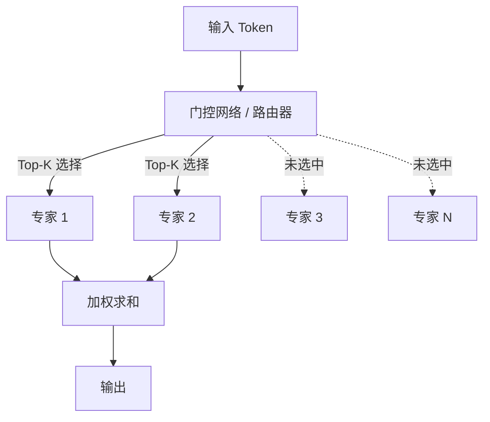

# 3.11 MoE 稀疏网络

**混合专家**（Mixture of Experts, MoE）是一种稀疏激活的神经网络架构。与密集模型不同，MoE 对每个输入只激活部分参数（"专家"），在增加模型容量的同时控制计算成本。本节讨论 MoE 的原理、设计选择以及在大语言模型中的应用。

想象一下医院的分诊流程：患者到达后，不是每个科室的医生都来看一遍，而是先经过分诊台（路由器/门控网络）的初步判断，然后只被送往最相关的一两个专科（专家）。心脏不舒服就看心内科，骨折就去骨科，而不需要眼科、皮肤科等所有科室都参与。MoE 的逻辑完全一样：每个输入 token 只被送往少数几个“专家”网络处理，大部分参数处于“休息”状态。这样医院可以雇佣很多专家（大参数量），但每位患者的就诊时间（计算量）并不会显著增加。

## 3.11.1 MoE 的基本概念

### 稀疏激活的动机

密集 Transformer 的一个特点是：无论输入是什么，所有参数都参与计算。但研究发现，FFN 层中大量神经元在给定输入上不活跃（输出接近零）。这启发了一个问题：能否只激活"相关"的参数？

MoE 的核心思想是：将 FFN 替换为多个"专家"FFN，每个输入只路由到少数专家。

### 形式化定义

设有 $E$ 个专家网络 $\{f_1, \ldots, f_E\}$，门控网络 $G: \mathbb{R}^d \to \mathbb{R}^E$ 计算每个专家的权重。MoE 层的输出为：

$$\text{MoE}(\mathbf{x}) = \sum_{i=1}^E G(\mathbf{x})_i \cdot f_i(\mathbf{x})$$

其中 $G(\mathbf{x})_i$ 是输入 $\mathbf{x}$ 路由到专家 $i$ 的权重。

### 稀疏门控

计算所有专家的输出仍是密集计算。**稀疏门控**只选择 Top-$k$ 个专家：

$$G(\mathbf{x}) = \text{TopK}(\text{softmax}(\mathbf{W}_g \mathbf{x}), k)$$

其中 $\text{TopK}$ 将非 Top-$k$ 的权重置零。通常 $k = 1$ 或 $k = 2$。

例如，对于 $E = 8$ 个专家、$k = 2$：每个 token 只路由到 2 个专家，计算量只有密集模型的 $2/8 = 25\%$。

## 3.11.2 门控机制

### 线性门控

最简单的门控是线性投影：

$$\mathbf{g} = \mathbf{W}_g \mathbf{x}, \quad \mathbf{W}_g \in \mathbb{R}^{E \times d}$$

每个专家对应一个可学习的向量 $\mathbf{W}_g[i]$，输入与之的点积决定路由权重。

### Noisy Top-K

为了鼓励探索和负载均衡，可以在门控输出上加噪声：

$$\mathbf{g} = \mathbf{W}_g \mathbf{x} + \epsilon \cdot \text{softplus}(\mathbf{W}_{\text{noise}} \mathbf{x})$$

其中 $\epsilon \sim \mathcal{N}(0, 1)$。噪声使得边界情况的路由更随机，有助于训练稳定。

### 专家选择（Expert Choice）

传统 MoE 是 **Token Choice**：每个 token 选择 Top-$k$ 专家。

**Expert Choice** 反转这一过程：每个专家选择 Top-$k$ token。这保证了每个专家处理固定数量的 token，自然实现负载均衡。

$$\text{Expert}_i \text{ 处理} = \text{TopK}(\mathbf{G}_{:,i}, C)$$

其中 $C$ 是每个专家的容量（处理的 token 数）。

## 3.11.3 负载均衡

### 负载不均衡问题

MoE 训练中的一个核心挑战是**负载不均衡**：某些专家可能被过度使用，而其他专家几乎不被选中。极端情况下，模型可能退化为只使用少数专家，浪费了模型容量。

回到医院的比喻：如果分诊台总是把患者送往同一个“明星医生”，那个医生就会严重超负荷，而其他专家无人问津。这不仅浪费了医院资源，也使“明星医生”的诊疗质量下降。辅助损失的作用就是强制分诊台均匀地分配患者。

### 辅助损失

常用的解决方案是添加**辅助损失**（Auxiliary Loss）惩罚负载不均衡。

设 $f_i$ 是专家 $i$ 被选中的频率，$p_i$ 是门控给专家 $i$ 的平均概率：

$$\mathcal{L}_{\text{aux}} = \alpha \cdot E \cdot \sum_{i=1}^E f_i \cdot p_i$$

其中 $\alpha$ 是超参数（如 0.01）。这个损失在 $f_i = p_i = 1/E$（完美均衡）时最小。

### 容量因子

**容量因子**（Capacity Factor, CF）限制每个专家能处理的 token 数上限：

$$\text{容量} = \frac{\text{batch tokens}}{E} \times \text{CF}$$

超出容量的 token 被丢弃（或使用兜底策略）。CF 通常设为 1.25-2.0。

CF 过小会丢弃太多 token；CF 过大则无法起到负载均衡的作用。

## 3.11.4 MoE 架构设计

### 专家数量

专家数量 $E$ 决定了模型的**总参数量**与**激活参数量**的比值。

| $E$ | 总参数 | 激活参数（Top-2） | 比值 |
|-----|--------|-------------------|------|
| 8 | 8x | 2x | 4:1 |
| 64 | 64x | 2x | 32:1 |
| 128 | 128x | 2x | 64:1 |

Mixtral 8x7B 有 8 个专家，每个 7B 参数，总参数约 47B，激活参数约 13B。

### 哪些层使用 MoE

并非所有层都需要是 MoE。常见设计：

- **每隔 N 层**：如每 2 层放一个 MoE 层
- **只在 FFN**：注意力层保持密集，只将 FFN 替换为 MoE
- **深层优先**：模型后半部分使用更多 MoE 层

### 共享专家

某些设计包含**共享专家**：一个对所有 token 都激活的专家，加上若干路由专家。

$$\text{MoE}(\mathbf{x}) = f_{\text{shared}}(\mathbf{x}) + \sum_{i=1}^E G(\mathbf{x})_i \cdot f_i(\mathbf{x})$$

共享专家学习通用模式，路由专家学习特化模式。

## 3.11.5 代表性模型

### Switch Transformer

Google 的 Switch Transformer（2021）使用 $k = 1$（每个 token 只路由到一个专家），大幅简化了 MoE。

特点：
- 最多 2048 个专家
- 1.6 万亿参数
- 专家并行（Expert Parallelism）分布式训练

### Mixtral 8x7B

Mistral AI 的 Mixtral（2023）是高效 MoE 模型的代表：

- 8 个专家，每个 7B 参数
- Top-2 路由
- 滑动窗口注意力（4096 窗口）
- 总参数 47B，激活参数 13B
- 性能接近 LLaMA 2 70B

### DeepSeek MoE

DeepSeek 的 MoE 设计引入了**细粒度专家分割**：

- 将大专家切分为更小的专家
- 更多专家（如 64 个）配合 Top-6 路由
- 共享专家 + 路由专家

这种设计提高了专家利用率和参数效率。

## 3.11.6 训练与推理

### 训练挑战

**通信开销**：MoE 需要将 token 路由到不同专家，在分布式训练中涉及大量 all-to-all 通信。

**不稳定性**：门控网络的离散选择（Top-K）使训练不稳定。需要仔细调整辅助损失权重和学习率。

**专家坍缩**：某些专家可能"死亡"（永远不被选中），需要监控和干预。

### 推理优化

**专家卸载**：将不常用的专家卸载到 CPU，需要时再加载。适合内存受限场景。

**批处理优化**：将路由到同一专家的 token 批处理执行，提高 GPU 利用率。

**推测执行**：并行计算多个可能被选中的专家，选择实际需要的结果。

### 量化

MoE 模型因专家众多，量化尤为重要。常见做法：

- 每个专家独立量化（专家可能有不同的数值分布）
- 门控网络保持 FP16（路由决策需要精度）
- 激活值谨慎量化（路由错误可能被放大）

## 3.11.7 MoE vs 密集模型

### 优势

1. **参数效率**：用更少的计算获得更大的模型容量
2. **扩展性**：专家可以独立扩展
3. **特化**：不同专家可能学到不同的知识或能力

### 劣势

1. **内存占用**：总参数量大，推理需要加载所有专家
2. **训练复杂度**：负载均衡、通信开销等额外挑战
3. **不稳定性**：对超参数敏感

### 适用场景

MoE 适合：
- 追求极致性能且有足够内存
- 需要快速推理（激活参数少）
- 任务多样性高（不同专家处理不同类型）

密集模型适合：
- 内存受限场景
- 需要简单部署
- 任务相对同质

## 3.11.8 专家的可解释性

### 专家特化

研究发现，MoE 的专家会自然形成**特化**：

- 某些专家处理特定语言（如中文、英文）
- 某些专家处理特定领域（如代码、数学）
- 某些专家处理特定句法结构

这种特化是自发涌现的，不需要显式指导。这和医院里专科医生的形成过程很像：没有人规定“你必须成为心脏专家”，而是在长期实践中，每个医生自然而然地积累了特定领域的专长。训练过程中的梅化器也以相同方式工作：它学会了“什么类型的输入应该送往哪个专家”。

### 路由分析

分析门控网络的路由决策，可以了解：

- 哪些专家被哪类输入激活
- 专家之间的互补关系
- 潜在的模型问题（如专家利用不均）

### 专家编辑

专家的模块化使得**定向编辑**成为可能：

- 删除特定专家以移除某种能力
- 增强特定专家以强化某种能力
- 替换专家以更新知识

这比密集模型的权重编辑更直观、更可控。就像医院的人事管理：如果某个科室的专家退休了，可以直接招聘新人替换，而不影响其他科室的运作。密集模型则更像一个所有医生共同看诊的“大通铺”，要换一个人就得重新调整整个团队的工作方式。
