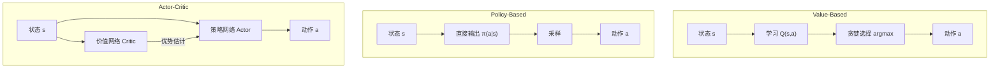

# 5.3 Value-Based 与 Policy-Based 算法

强化学习算法可以粗略分为两大类：**Value-based** 方法学习价值函数然后导出策略，**Policy-based** 方法直接优化策略参数。两类方法有不同的特点和适用场景，现代算法往往结合两者的优势。

想象两种截然不同的学开车方式。Value-based 就像先在脑海中给每个路况打分——"前方空旷值 8 分，前方拥堵值 3 分"——然后永远选分最高的方向走。Policy-based 则是直接训练你的驾驶反射——看到什么路况，方向盘往哪打、油门踩多深，不需要经过"打分"这个中间步骤。两种思路各有千秋，就像有些棋手靠评估局面（value）下棋，有些靠模式直觉（policy）出招。

## 5.3.1 Value-Based 方法

### 核心思想

Value-based 方法的核心是学习最优动作价值函数 $Q^*(s, a)$。一旦 $Q^*$ 已知，最优策略就是贪婪选择：

$$\pi^*(a|s) = \arg\max_a Q^*(s, a)$$

这类方法不直接参数化策略，策略隐式地由价值函数导出。

### Q-Learning

**Q-Learning**（Watkins, 1989）是最经典的 value-based 算法。其更新规则为：

$$Q(s_t, a_t) \leftarrow Q(s_t, a_t) + \alpha \left[ r_t + \gamma \max_{a'} Q(s_{t+1}, a') - Q(s_t, a_t) \right]$$

关键点：

1. **Off-policy**：目标中用 $\max_{a'} Q(s_{t+1}, a')$，即最优动作的价值，与实际采取的动作无关
2. **TD 更新**：每一步都更新，不需等轨迹结束
3. **收敛性**：在表格设定下（有限状态-动作空间），满足一定条件时收敛到 $Q^*$

举个例子。假设你在一座陌生城市找餐厅吃饭。Q-Learning 的策略是：每到一个路口，你给每个方向打分（Q 值），然后走分最高的方向。每次到达目的地后，你回头更新沿途路口的打分——"这个路口往左走最终吃到了好饭，加分"。关键是，即使你当时因为好奇走了个弯路（实际动作），更新时你依然假设未来会走最优路径（$\max_{a'}$），这就是 off-policy 的精髓。

### Deep Q-Network (DQN)

**DQN**（Mnih et al., 2013）将 Q-Learning 扩展到深度学习：用神经网络 $Q_\theta(s, a)$ 近似 $Q$ 函数。

DQN 的关键创新：

**经验回放**（Experience Replay）：将交互数据 $(s, a, r, s')$ 存入缓冲区，训练时随机采样 mini-batch。这打破了数据的时间相关性，提高样本效率和稳定性。

**目标网络**（Target Network）：用定期更新的目标网络 $Q_{\theta^-}$ 计算 TD 目标：

$$y_t = r_t + \gamma \max_{a'} Q_{\theta^-}(s_{t+1}, a')$$

这避免了"自己追自己"的不稳定。

不妨设想你在训练一只猎犬。如果猎犬每次看到的"标准答案"也在随着训练变化（因为标准也是它自己给的），它就会晕头转向。目标网络的做法是：每隔一段时间把"标准答案"冻住不动，让猎犬追一个固定的目标，等追上了再更新标准。这比"追一个也在跑的目标"稳定得多。

**损失函数**：

$$L(\theta) = \mathbb{E}_{(s,a,r,s') \sim \text{Buffer}} \left[ (y_t - Q_\theta(s, a))^2 \right]$$

### DQN 的改进

**Double DQN**：解耦动作选择和价值估计，减少过估计：

$$y_t = r_t + \gamma Q_{\theta^-}(s_{t+1}, \arg\max_{a'} Q_\theta(s_{t+1}, a'))$$

**Dueling DQN**：将 $Q(s, a)$ 分解为状态价值 $V(s)$ 和优势 $A(s, a)$：

$$Q_\theta(s, a) = V_\theta(s) + A_\theta(s, a) - \frac{1}{|A|} \sum_{a'} A_\theta(s, a')$$

**优先级经验回放**（PER）：TD 误差大的样本更可能被采样，提高学习效率。

### Value-Based 的局限

1. **离散动作**：标准 DQN 需要对每个动作输出一个 $Q$ 值，不适用于连续动作空间
2. **确定性策略**：导出的策略是确定性的（贪婪），难以建模随机策略
3. **探索困难**：需要 $\epsilon$-greedy 等启发式探索策略

## 5.3.2 Policy-Based 方法

### 核心思想

Policy-based 方法直接参数化策略 $\pi_\theta(a|s)$，通过梯度上升最大化期望回报：

$$\theta \leftarrow \theta + \alpha \nabla_\theta J(\theta)$$

假设你正在学骑自行车。你不会先给每个身体姿势打分（那太复杂了——方向盘角度、身体倾斜度、踏板力度都是连续变量），你只是不断尝试、不断调整，摔了就知道刚才的姿势不对，稳住了就保持。这种"直接调整行为本身"而非"先评估再决策"的方式，就是 policy-based 的精神。

### 优势

1. **连续动作**：自然支持连续动作空间（如高斯策略）
2. **随机策略**：可以学习随机策略，天然包含探索
3. **更好的收敛性**：在函数逼近下，策略梯度有更好的理论保证

### 代表算法

**REINFORCE**：最简单的策略梯度，用 MC 回报估计梯度。

**Actor-Critic**：用 Critic 估计价值，降低方差。

**A3C/A2C**：异步/同步的 Actor-Critic，多环境并行采样。

**TRPO**（Trust Region Policy Optimization）：用 KL 散度约束策略更新幅度：

$$\max_\theta \mathbb{E} \left[ \frac{\pi_\theta(a|s)}{\pi_{\theta_{\text{old}}}(a|s)} A^{\pi_{\theta_{\text{old}}}}(s, a) \right]$$
$$\text{s.t.} \quad \mathbb{E}[D_{\text{KL}}(\pi_{\theta_{\text{old}}} \| \pi_\theta)] \leq \delta$$

**PPO**：用裁剪代替约束，实现更简单高效的信任域更新。

### Policy-Based 的局限

1. **高方差**：梯度估计依赖采样，方差大
2. **样本效率低**：通常是 on-policy，数据不能重复使用
3. **需要方差缩减**：实践中必须配合基线、GAE 等技术

## 5.3.3 方法对比

| 维度 | Value-Based | Policy-Based |
|------|-------------|--------------|
| 策略形式 | 隐式（从 $Q$ 导出） | 显式参数化 |
| 动作空间 | 通常离散 | 离散/连续 |
| 策略类型 | 确定性 | 确定性/随机 |
| 样本效率 | 高（off-policy） | 低（on-policy） |
| 稳定性 | 较差（函数逼近下） | 较好 |
| 收敛保证 | 弱 | 强（局部最优） |

### 选择指南

**倾向 Value-Based**：
- 离散动作空间
- 样本获取成本高
- 环境可以模拟/回放

**倾向 Policy-Based**：
- 连续动作空间
- 需要随机策略
- 需要可解释的策略

你可能遇到过这种情况：玩棋牌游戏（离散动作、可以大量模拟）时 value-based 如鱼得水，但让机器人端茶倒水（连续动作、无法暴力枚举）时就只能靠 policy-based。现实中大多数有趣的问题——包括 LLM 对齐——往往需要两者结合。

## 5.3.4 Actor-Critic：融合两者

### 统一框架

**Actor-Critic** 结合了两类方法的优势：

- **Actor**（策略网络）：$\pi_\theta(a|s)$，policy-based
- **Critic**（价值网络）：$V_\phi(s)$ 或 $Q_\phi(s,a)$，value-based

Critic 不直接决定动作，而是为 Actor 提供低方差的梯度估计。

这就像餐厅里的厨师和品酒师的分工：厨师（Actor）负责做菜，品酒师（Critic）负责评价。厨师不需要品酒师亲自下厨，但品酒师的反馈能帮厨师更快找到正确的方向。

### 变体

**A2C**（Advantage Actor-Critic）：Critic 估计 $V(s)$，优势为 $A = r + \gamma V(s') - V(s)$。

**SAC**（Soft Actor-Critic）：最大化熵正则化的期望回报，off-policy。

**TD3**（Twin Delayed DDPG）：用两个 Critic 减少过估计，延迟更新 Actor。

### RLHF 中的选择

LLM 的 RLHF 本质是策略优化：

- **PPO**：on-policy Actor-Critic，需要 Critic 网络
- **DPO**：off-policy，但绕过了显式奖励模型和 Critic
- **GRPO**：on-policy，用组内比较替代 Critic

PPO 是最成熟的方案，但 Critic 的训练增加了复杂度。DPO 和 GRPO 简化了流程，是当前的研究热点。

## 5.3.5 离散 vs 连续动作

### 离散动作

LLM 的动作空间是离散的（词表中选 token），但规模巨大（30k-150k）。

**Softmax 策略**：

$$\pi_\theta(a|s) = \frac{\exp(z_a / \tau)}{\sum_{a'} \exp(z_{a'} / \tau)}$$

其中 $z_a$ 是 token $a$ 的 logit，$\tau$ 是温度。

**与语言模型的对应**：语言模型本身就是一个 softmax 策略，输出 next token 的概率分布。

### 连续动作

机器人控制等任务需要连续动作。常用**高斯策略**：

$$\pi_\theta(a|s) = \mathcal{N}(\mu_\theta(s), \sigma_\theta(s)^2)$$

网络输出均值 $\mu$ 和标准差 $\sigma$。

**对数概率**：

$$\log \pi_\theta(a|s) = -\frac{(a - \mu)^2}{2\sigma^2} - \log \sigma - \frac{1}{2} \log(2\pi)$$

**重参数化采样**：$a = \mu + \sigma \cdot \epsilon$，$\epsilon \sim \mathcal{N}(0, 1)$，使采样可微。

## 5.3.6 On-Policy vs Off-Policy

### 定义

**On-policy**：用当前策略 $\pi_\theta$ 采样的数据训练 $\pi_\theta$。

**Off-policy**：可以用其他策略（如旧版本、专家）采样的数据训练 $\pi_\theta$。

换个角度理解：on-policy 就像"自己亲自开车学驾驶"——你只能从自己的驾驶经历中学习，别人的经验你用不上。Off-policy 则像"看别人开车的录像来学"——你可以从各种司机的驾驶记录中提取教训，不需要事事亲力亲为。显然后者的学习效率更高（一个人的驾驶时间有限），但也有风险：别人的驾驶习惯和你不同，直接照搬可能水土不服。

### 重要性采样

Off-policy 学习的关键技术是**重要性采样**（Importance Sampling）：

$$\mathbb{E}_{a \sim \pi_b} \left[ \frac{\pi_\theta(a|s)}{\pi_b(a|s)} A(s, a) \right] = \mathbb{E}_{a \sim \pi_\theta} [A(s, a)]$$

用行为策略 $\pi_b$ 的数据估计目标策略 $\pi_\theta$ 的期望。

### 样本效率

- **On-policy**：数据只能用一次，采完即弃
- **Off-policy**：数据可重复使用（经验回放）

Off-policy 样本效率高，但重要性权重可能方差大，需要额外技术（如裁剪、重要性权重截断）。

### LLM 场景

- **PPO**：技术上是 off-policy（数据采自 $\pi_{\theta_{\text{old}}}$），但实践中只用一小段时间内的数据，接近 on-policy
- **DPO**：off-policy，用预先收集的偏好数据
- **GRPO**：on-policy，每次更新都需要新采样
