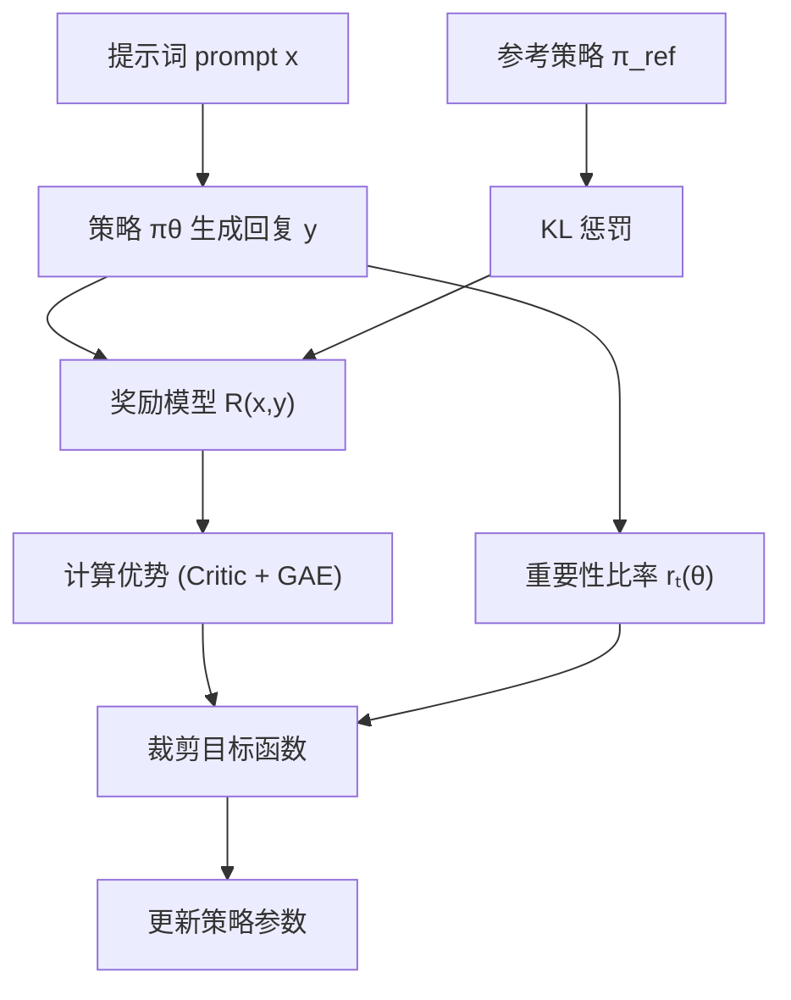
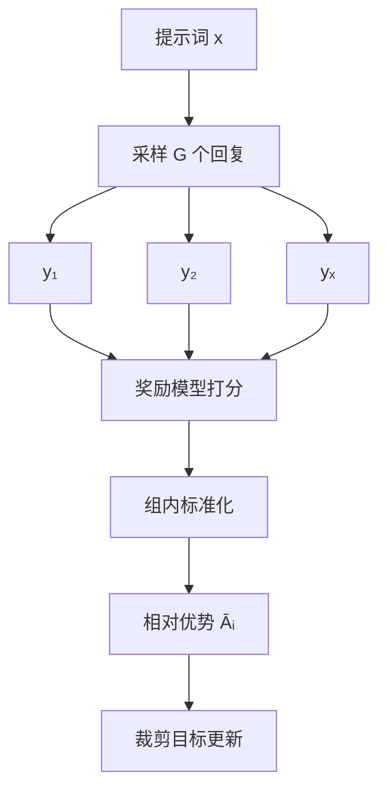

# 5.5 On-Policy 优化

**On-policy** 算法使用当前策略采集的数据进行学习，保证了梯度估计的无偏性，是 RLHF 的主流方案。本节重点讨论 PPO、GRPO 等算法，以及 LLM 训练中的特殊考量：KL 散度控制、重要性采样爆炸、MoE 专家重放等。

## 5.5.1 PPO：近端策略优化

### 从 TRPO 到 PPO

**TRPO**（Trust Region Policy Optimization）用 KL 散度约束策略更新幅度：

$$\max_\theta \mathbb{E}_{s, a \sim \pi_{\theta_{\text{old}}}} \left[ \frac{\pi_\theta(a|s)}{\pi_{\theta_{\text{old}}}(a|s)} A^{\pi_{\theta_{\text{old}}}}(s, a) \right]$$
$$\text{s.t.} \quad \mathbb{E}_s [D_{\text{KL}}(\pi_{\theta_{\text{old}}}(\cdot|s) \| \pi_\theta(\cdot|s))] \leq \delta$$

想象一下你正在和老板谈加薪。你当然想要越多越好（最大化期望回报），但如果一口气要求涨薪 200%，老板多半直接拒绝甚至把你辞退（策略崩溃）。TRPO 的做法是：每次谈判设一个"安全边界"——涨薪幅度不能超过 $\delta$——确保每次小步推进，不触碰老板的底线。数学上，这个"安全边界"就是 KL 散度约束：新旧策略不能差太多。

TRPO 理论优美但实现复杂，需要计算约束优化。

**PPO**（Proximal Policy Optimization, Schulman et al., 2017）用裁剪目标函数近似 TRPO：

$$L^{\text{CLIP}}(\theta) = \mathbb{E}_t \left[ \min(r_t(\theta) A_t, \text{clip}(r_t(\theta), 1-\epsilon, 1+\epsilon) A_t) \right]$$

其中 $r_t(\theta) = \frac{\pi_\theta(a_t|s_t)}{\pi_{\theta_{\text{old}}}(a_t|s_t)}$ 是重要性权重（概率比）。

PPO 比 TRPO 简单得多——它不需要解约束优化问题，只是在目标函数里加了个"限速器"。回到加薪的场景：PPO 不设硬性约束，而是换一种策略——如果你的要求已经比现状高了 20%（$\epsilon = 0.2$），系统就不再奖励你提更高的要求。这比设置严格的谈判规则（TRPO 的约束优化）容易执行得多。

### 裁剪的直觉

设 $\epsilon = 0.2$，考虑两种情况：

**$A_t > 0$（好动作）**：
- 如果 $r_t < 1.2$，目标是 $r_t A_t$，鼓励增大 $\pi_\theta(a_t|s_t)$
- 如果 $r_t \geq 1.2$，目标被裁剪为 $1.2 A_t$，阻止继续增大

**$A_t < 0$（差动作）**：
- 如果 $r_t > 0.8$，目标是 $r_t A_t$，鼓励减小 $\pi_\theta(a_t|s_t)$
- 如果 $r_t \leq 0.8$，目标被裁剪为 $0.8 A_t$，阻止继续减小

裁剪阻止了策略的剧烈变化，起到信任域的作用。

换个角度看：对于一个好动作，你希望增加它的概率，但 PPO 不允许你"过度兴奋"——概率涨到原来的 1.2 倍就够了，再涨也不给额外奖励。对于一个差动作，你希望降低它的概率，但也不允许"矫枉过正"——降到原来的 0.8 倍就停手。这种"有节制的改进"确保了训练的稳定。

### PPO 的完整目标

PPO 的损失函数通常包含三部分：

$$L(\theta, \phi) = L^{\text{CLIP}}(\theta) - c_1 L^{\text{VF}}(\phi) + c_2 S[\pi_\theta]$$

- **策略损失** $L^{\text{CLIP}}$：裁剪目标
- **价值损失** $L^{\text{VF}} = (V_\phi(s) - V_{\text{target}})^2$：Critic 的 MSE 损失
- **熵奖励** $S[\pi_\theta] = -\sum_a \pi_\theta(a|s) \log \pi_\theta(a|s)$：鼓励探索

### PPO 在 RLHF 中的应用

在 LLM 的 RLHF 中：

1. **采样**：给定 prompt $x$，用 $\pi_\theta$ 生成回复 $y$
2. **打分**：用奖励模型 $R(x, y)$ 评分
3. **计算优势**：用 Critic 和 GAE 计算每个 token 位置的优势
4. **更新**：用 PPO 目标更新策略

KL 惩罚通常加入奖励：

$$r(x, y) = R(x, y) - \beta D_{\text{KL}}(\pi_\theta(y|x) \| \pi_{\text{ref}}(y|x))$$

或分摊到每个 token：

$$r_t = -\beta \log \frac{\pi_\theta(a_t|s_t)}{\pi_{\text{ref}}(a_t|s_t)}$$

## 5.5.2 GRPO：组相对策略优化

### 动机

PPO 需要训练 Critic 网络，增加了复杂度。能否绕过 Critic？

**GRPO**（Group Relative Policy Optimization, Shao et al., 2024）的思路：对同一个 prompt 采样多个回复，用回复之间的相对排名作为优势估计。

举个例子。假设老师出了一道作文题，让全班 16 个同学都写一篇。传统 PPO 的做法是请一位"评分专家"（Critic）给每篇作文估算分数。GRPO 的做法更简单粗暴：直接看这 16 篇作文的打分排名，高于平均的就是"好"，低于平均的就是"差"。不需要专门的评分专家，同学之间互相比较就够了。

### 算法设计

给定 prompt $x$，采样 $G$ 个回复 $\{y_1, \ldots, y_G\}$，用奖励模型打分 $\{r_1, \ldots, r_G\}$。

**组内标准化**：

$$\hat{A}_i = \frac{r_i - \text{mean}(\{r_j\})}{\text{std}(\{r_j\})}$$

这样，优势的期望为零，好于平均的回复有正优势，差于平均的有负优势。

**GRPO 目标**：

$$L^{\text{GRPO}}(\theta) = \mathbb{E}_{x, \{y_i\}} \left[ \frac{1}{G} \sum_{i=1}^G \min(r_i(\theta) \hat{A}_i, \text{clip}(r_i(\theta), 1-\epsilon, 1+\epsilon) \hat{A}_i) \right]$$

其中 $r_i(\theta) = \frac{\pi_\theta(y_i|x)}{\pi_{\theta_{\text{old}}}(y_i|x)}$。

### GRPO 的优势

1. **无需 Critic**：优势直接从组内比较得到
2. **实现简单**：与 SFT 类似的数据流
3. **自然的基线**：组内均值作为基线，自动适应不同 prompt 的难度

### GRPO 的挑战

1. **采样成本**：每个 prompt 需要多个回复（通常 $G = 4 \sim 16$）
2. **组大小选择**：$G$ 太小，优势估计方差大；$G$ 太大，采样成本高
3. **回复长度差异**：不同回复长度不同，如何公平比较？

## 5.5.3 DAPO 与 GSPO

### DAPO：解耦对齐偏好优化

**DAPO**（Decoupled Alignment Preference Optimization）改进了 GRPO 的几个方面：

1. **动态采样**：根据策略的当前状态调整采样数量
2. **解耦优化**：分离正样本（好回复）和负样本（差回复）的梯度贡献
3. **自适应 KL**：动态调整 KL 惩罚系数

### GSPO：组间比较

**GSPO**（Group Sparse Policy Optimization）在 GRPO 基础上引入稀疏更新：

1. 只用组内最好和最差的回复更新
2. 中间回复作为锚点，提供稳定性
3. 减少了噪声标签的影响

### 算法演进趋势

从 PPO → GRPO → DAPO/GSPO，可以看到几个趋势：

1. **简化**：去掉 Critic，减少组件
2. **相对化**：用相对排名代替绝对奖励
3. **稀疏化**：只用最有信息量的样本

这个演进趋势有点像考试评分制度的变迁：从"请专家逐题评分"（PPO + Critic），到"全班排名、高于平均就是好"（GRPO），再到"只看最好和最差的卷子来定标准"（GSPO）。每一步都在简化流程，同时试图保留核心信息。

## 5.5.4 KL 散度与重要性采样爆炸

### KL 惩罚的作用

RLHF 中的 KL 惩罚 $D_{\text{KL}}(\pi_\theta \| \pi_{\text{ref}})$ 有多重作用：

1. **防止奖励 hacking**：限制模型过度优化奖励，偏离正常语言
2. **保持多样性**：防止模式坍缩到少数高奖励回复
3. **稳定训练**：限制策略变化幅度

假设你正在培训一个销售员。你用"成交金额"作为奖励来激励他。如果没有任何约束（KL 惩罚），他可能发展出各种极端话术——夸大产品功效、给虚假承诺——奖励指标很高但严重偏离了正常的销售行为。KL 惩罚就像公司的合规部门：允许你在一定范围内优化话术，但不能偏离"正常销售"（参考策略）太远。

### KL 散度的计算

在 LLM 中，KL 散度计算为：

$$D_{\text{KL}}(\pi_\theta \| \pi_{\text{ref}}) = \sum_t \sum_a \pi_\theta(a|s_t) \log \frac{\pi_\theta(a|s_t)}{\pi_{\text{ref}}(a|s_t)}$$

实践中，用采样估计：

$$\hat{D}_{\text{KL}} = \frac{1}{T} \sum_t \log \frac{\pi_\theta(a_t|s_t)}{\pi_{\text{ref}}(a_t|s_t)}$$

其中 $a_t$ 是实际生成的 token。

### 重要性采样爆炸

当 $\pi_\theta$ 与 $\pi_{\text{old}}$ 差异较大时，重要性权重 $r_t = \frac{\pi_\theta(a_t|s_t)}{\pi_{\text{old}}(a_t|s_t)}$ 可能非常大或非常小：

- $r_t \to \infty$：$\pi_\theta$ 认为这个动作概率很高，但 $\pi_{\text{old}}$ 认为很低
- $r_t \to 0$：反过来

极端的 $r_t$ 导致梯度爆炸或消失，训练不稳定。

不妨设想一个极端场景：旧策略认为某个 token 的概率只有 0.001，但新策略认为是 0.5。重要性权重就是 $0.5 / 0.001 = 500$——这一个样本的梯度贡献相当于 500 个正常样本。这种"以一当百"的异常权重会让梯度方向完全被少数极端样本支配，训练就像被一阵突如其来的狂风吹偏了航向。

### 缓解方法

**PPO 裁剪**：$\text{clip}(r_t, 1-\epsilon, 1+\epsilon)$ 限制权重范围。

**KL 惩罚**：加大 $\beta$ 使策略更新更保守。

**权重截断**：直接截断 $r_t \in [r_{\min}, r_{\max}]$。

**Per-token KL**：将 KL 惩罚加到每个 token 的奖励中，而非只加在序列末尾。

## 5.5.5 MoE 与专家重放

### MoE 模型的 RL 挑战

**MoE**（Mixture of Experts）模型在 RL 训练中面临特殊挑战：

1. **专家负载不均**：某些专家可能被过度/不足使用
2. **专家遗忘**：不常用的专家能力退化
3. **路由不稳定**：策略更新可能导致路由决策剧烈变化

这就像一家公司的部门协作问题。假设公司有 8 个部门（专家），一个前台（路由器）负责把任务分配给各部门。如果 RL 训练只奖励最终产出，前台可能渐渐把所有活都扔给两三个能干的部门，其他部门闲着——久而久之闲着的部门能力退化（专家遗忘），最终公司的整体能力反而下降。

### 专家重放（Expert Replay）

**专家重放**技术旨在保持所有专家的活跃：

1. 记录每个专家被激活的频率
2. 对低频专家，人为增加其被选中的概率或重放历史数据
3. 用辅助损失鼓励负载均衡

### 负载均衡损失

标准的 MoE 负载均衡损失：

$$L_{\text{balance}} = \alpha \cdot N \cdot \sum_{i=1}^N f_i \cdot P_i$$

其中 $f_i$ 是专家 $i$ 处理的 token 比例，$P_i$ 是路由到专家 $i$ 的平均概率，$N$ 是专家数量。

### 在 RL 中的应用

RL 训练可能破坏预训练时建立的专家分工。缓解方法：

1. **冻结路由器**：只训练专家网络，保持路由不变
2. **路由正则化**：惩罚路由分布与预训练时的偏离
3. **分层训练**：先训练非 MoE 层，再精调 MoE 层

## 5.5.6 On-Policy 蒸馏

### 在线蒸馏

**On-policy 蒸馏**结合了蒸馏和 RL：

1. 学生策略 $\pi_\theta$ 生成回复
2. 教师（大模型或奖励模型）评估/改进回复
3. 学生从改进的回复中学习

与 off-policy 蒸馏不同，数据来自学生自己的分布，避免了分布偏移。

回到驾驶的场景：off-policy 蒸馏像看教练开车的录像来学；on-policy 蒸馏则是你自己开车，教练坐在副驾驶实时指导——"刚才那个弯应该早点打方向盘"。因为错误发生在你自己的驾驶过程中，教练的纠正直接对应你当前的水平和习惯，学习效果更好。

### 迭代蒸馏

**迭代蒸馏**多轮进行：

Round 1：学生生成 → 教师筛选/改写 → 学生学习
Round 2：更新后的学生生成 → 教师筛选/改写 → 学生学习
...

每轮学生能力提升，生成的回复质量也提升，形成良性循环。

### 与 Rejection Sampling 的结合

**Rejection Sampling Fine-tuning（RFT）**：

1. 学生对每个 prompt 生成 $K$ 个回复
2. 用奖励模型选择最好的
3. 在最好的回复上做 SFT

这是一种简单的 on-policy 蒸馏：用当前策略采样，筛选后学习。

### Self-Play 式蒸馏

受 AlphaZero 启发：

1. 学生"自我对弈"（生成多个回复，互相比较）
2. 选择获胜者作为训练数据
3. 迭代提升

OpenAI 的一些工作表明，这种方式可以让模型超越训练数据的水平。

## 5.5.7 实践建议

### 超参数选择

| 超参数 | 典型值 | 作用 |
|--------|--------|------|
| $\epsilon$（PPO clip） | 0.2 | 策略更新幅度 |
| $\beta$（KL 系数） | 0.01 - 0.1 | KL 惩罚强度 |
| $\lambda$（GAE） | 0.95 | 偏差-方差权衡 |
| $\gamma$（折扣） | 0.99 - 1.0 | 未来奖励权重 |
| Batch size | 512 - 2048 | 梯度估计稳定性 |
| Mini-batch | 64 - 256 | 内存效率 |

### 调试技巧

1. **监控 KL 散度**：KL 爆炸说明更新太激进
2. **监控奖励**：奖励持续上升但 KL 爆炸可能是奖励 hacking
3. **监控 clip 比例**：太多 clip 说明 $\epsilon$ 太小或学习率太大
4. **检查优势分布**：优势应该以零为中心，方差适中

假设你在调试 PPO 训练，发现奖励指标蹭蹭往上涨但生成的回复越来越怪异（重复、套话多）。这多半是"奖励 hacking"——模型找到了奖励模型的漏洞。这就像学生发现了考试的出题规律后疯狂应试，分数很高但实际能力并没有提升。此时应该加大 KL 惩罚或检查奖励模型的质量。

### 常见问题

**奖励不涨**：检查奖励模型质量、学习率、KL 惩罚是否过强。

**KL 爆炸**：降低学习率、增大 KL 惩罚、减小 $\epsilon$。

**回复退化**：可能过拟合奖励模型，加大 KL 惩罚或减少训练步数。

**训练不稳定**：增大 batch size、使用梯度裁剪、检查数值稳定性。
