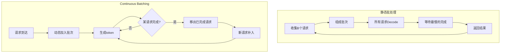
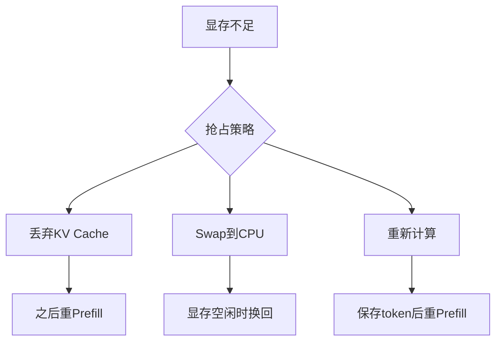

# 6.5 Continuous Batching

**Continuous Batching**（连续批处理）是 LLM 推理系统的核心调度技术。传统的静态批处理必须等待批内所有请求完成才能开始新批次，导致严重的资源浪费。Continuous Batching 允许请求动态加入和离开批次，大幅提升系统吞吐量。

想象机场安检的场景。传统的静态批处理就像「分批放行」：等一组 10 人全部通过安检后，才放下一组 10 人进入。如果第 1 个人只背了个小包，30 秒就过了，但第 8 个人托运了 3 个行李箱，需要 5 分钟——所有人都得傻等。而 Continuous Batching 就像现实中的安检通道：前一个人一走，后一个人立刻补上，通道始终保持满载运行。



## 6.5.1 静态批处理的问题

### 传统流程

静态批处理（Static Batching）的流程：

1. 收集 $B$ 个请求组成一个批次
2. Prefill 所有请求
3. Decode 直到**所有**请求结束
4. 返回结果，开始下一批

### 效率问题

**等待浪费**：批内请求的输出长度不同。短请求先结束，但必须等待最长的请求完成——就像团建活动里，跑最快的人必须在终点等最慢的人到齐才能开始下一环。

示例：
```
请求 1: 输出 50 tokens，耗时 5s
请求 2: 输出 500 tokens，耗时 50s
请求 3: 输出 100 tokens，耗时 10s

静态批处理：必须等 50s，请求 1、3 的 GPU 利用率极低
```

**Padding 浪费**：长度对齐需要 padding，填充部分做无用计算。

**延迟尖峰**：批次边界造成等待，新请求的延迟取决于批内最慢的请求。

### 资源利用率

假设批内请求的输出长度均匀分布在 $[L_{\min}, L_{\max}]$，有效利用率：

$$\text{利用率} = \frac{\text{平均长度}}{\text{最大长度}} = \frac{(L_{\min} + L_{\max})/2}{L_{\max}}$$

若 $L_{\min} = 10$，$L_{\max} = 500$，利用率仅 51%。

## 6.5.2 Continuous Batching 原理

### 核心思想

**Continuous Batching**（也称 Iteration-Level Scheduling）在每个 Decode 迭代后重新评估批次组成：

- 已完成的请求立即移出
- 新到达的请求立即加入
- 批次大小动态变化

### 调度流程

```
迭代 1: [Req1, Req2, Req3] → 生成 token → Req1 结束
迭代 2: [Req2, Req3, Req4] → 加入新请求 Req4，生成 token
迭代 3: [Req2, Req3, Req4] → 生成 token → Req3 结束
迭代 4: [Req2, Req4, Req5] → 加入 Req5，生成 token
...
```

没有明确的“批次边界”，请求流水式处理。这正是机场安检通道的工作方式——不存在「第一批」「第二批」的划分，旅客的流动是连续的。

### 优势

1. **无等待**：请求完成即返回，不必等待同批其他请求——背小包的人过了安检就直接走，不用等托运行李的人
2. **高利用率**：GPU 始终满负载运行
3. **低延迟**：新请求可以立即加入，无需等待批次结束
4. **灵活调度**：可以优先处理紧急请求

## 6.5.3 Prefill 与 Decode 的调度

### 混合批处理

Continuous Batching 需要处理两类请求：

- **Prefill 请求**：新到达，需要处理 prompt
- **Decode 请求**：正在生成中

两者计算特性不同：Prefill 是计算密集型，Decode 是内存密集型。

### 调度策略

**串行策略**：先完成所有 Prefill，再 Decode。

- 简单，但可能饿死 Decode 请求

**交错策略**：每几个迭代做一次 Prefill。

- 平衡延迟和吞吐

**分离策略**：Prefill 和 Decode 用不同的 GPU。

- 最优利用率，但增加复杂度

### Chunked Prefill 与调度

结合 Chunked Prefill，可以将长 Prefill 分块，与 Decode 请求混合：

```
迭代 1: [Decode: Req1, Req2] + [Prefill Chunk: Req3_part1]
迭代 2: [Decode: Req1, Req2] + [Prefill Chunk: Req3_part2]
迭代 3: [Decode: Req1, Req2, Req3] → Req3 Prefill 完成，加入 Decode
```

这避免了长 Prefill 阻塞 Decode。

## 6.5.4 实现挑战

### KV Cache 管理

Continuous Batching 的 KV Cache 管理更复杂：

- 请求动态加入/离开，KV Cache 需要动态分配/释放
- 不同请求的 KV Cache 长度不同

**Paged Attention** 是理想的解决方案：分页管理天然支持动态分配。

### 变长序列处理

批内请求长度不同，如何高效计算？

**Padding**：填充到最长，简单但浪费。

**Packed Attention**：将多个短序列拼接成一个长序列，用注意力掩码区分。

**Ragged Tensor**：使用不规则张量，避免 padding。

vLLM 等系统使用定制的 kernel 处理变长序列，避免 padding 开销。

### 内存碎片

请求频繁加入/离开可能导致显存碎片。Paged Attention 的分页机制有效缓解了这一问题。

## 6.5.5 调度算法

### First-Come-First-Served (FCFS)

最简单的策略：按到达顺序处理。

- 公平，但可能延迟长请求

### Shortest-Job-First (SJF)

优先处理预计最快完成的请求。

- 最小化平均延迟
- 需要预测输出长度（不准确）
- 可能饿死长请求

### 优先级调度

根据请求优先级调度：

- 付费用户 > 免费用户
- 交互式 > 批处理
- 紧急 > 普通

### 公平调度

保证所有请求获得公平的资源份额：

$$\text{Fair share} = \frac{\text{总资源}}{\text{活跃请求数}}$$

已获得较多资源的请求被降低优先级。

### vLLM 的调度

vLLM 使用**FCFS + 抢占**策略：

1. 默认 FCFS
2. 当显存不足时，抢占最后加入的请求（暂停并 swap out）
3. 显存空闲时恢复被抢占的请求

## 6.5.6 Preemption 与 Swap

### 抢占的必要性

当并发请求过多，KV Cache 显存不足时，需要**抢占**（Preemption）部分请求。这就像机场安检通道突然拥挤时，不得不让部分旅客暂时回到候机区等待，等通道空出来再继续。



### 抢占策略

**丢弃**：丢弃被抢占请求的 KV Cache，之后重新 Prefill。

- 简单，但浪费已做的计算

**Swap**：将 KV Cache 换出到 CPU 内存，之后换回。这就像先把行李存到候机区的寄存处，等有位置了再取回继续安检。

- 保留进度，但增加 I/O 开销

**Recompute**：只保存 prompt 和已生成的 token，被抢占后重新 Prefill。

- 中间方案，适合 Prefill 开销较小的情况

### vLLM 的 Swap 机制

vLLM 支持 KV Cache 的 GPU-CPU swap：

1. 显存不足时，选择最后进入的请求
2. 将其 KV Cache 异步拷贝到 CPU
3. 释放 GPU 上的块
4. 显存空闲时，异步拷回并恢复

Paged Attention 使 swap 可以按块进行，更加灵活。

## 6.5.7 性能优化

### 批大小选择

Continuous Batching 的有效批大小动态变化。目标是：

- 最大化 GPU 利用率
- 不超出显存限制
- 保持合理延迟

通常设置一个最大批大小，由调度器动态调整。

### Prefill 优先级

Prefill 会影响正在 Decode 的请求的延迟。策略：

- **立即 Prefill**：新请求立即处理，可能增加 Decode 延迟
- **延迟 Prefill**：积累请求后批量 Prefill，减少中断
- **Chunked Prefill**：分块处理，平滑影响

### 负载均衡

多 GPU 部署时，需要将请求均匀分配：

- **轮询**：简单但不考虑负载
- **最少连接**：分配给当前请求最少的 GPU
- **加权**：考虑 GPU 能力差异

### 监控指标

- **队列深度**：待处理请求数，反映系统负载
- **延迟分布**：P50、P95、P99 延迟
- **吞吐量**：每秒处理的 token 数
- **抢占率**：被抢占的请求比例，反映资源压力

## 6.5.8 系统实现

### vLLM

vLLM 是 Continuous Batching + Paged Attention 的标杆实现：

- Python API + C++/CUDA kernel
- 支持多种模型（LLaMA、Mistral、Qwen 等）
- 集成 Ray 实现分布式推理

### TensorRT-LLM

NVIDIA 的 TensorRT-LLM 提供类似功能：

- 高度优化的 CUDA kernel
- 与 Triton Inference Server 集成
- 支持多 GPU 并行

### SGLang

SGLang 在 Continuous Batching 基础上优化了编程接口：

- RadixAttention：更高效的 Prefix Caching
- 结构化生成优化
- 控制流支持
