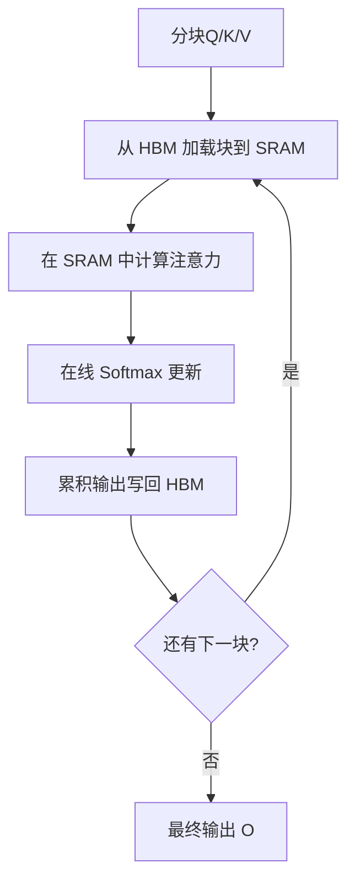
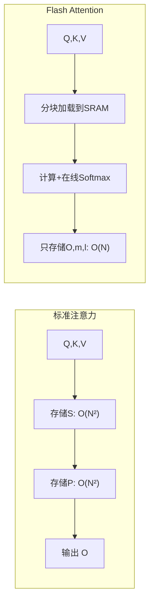

# 7.1 Flash Attention

**Flash Attention** 是 Dao et al.（2022）提出的高效注意力算法，通过精心设计的分块计算和内存访问模式，在不牺牲精度的情况下，大幅减少显存占用并提升计算速度。Flash Attention 已成为现代 LLM 训练和推理的标准组件。

假设你要读一本 500 页的书，传统的做法是把整本书全部摆在桌子上（注意力矩阵存入显存），但桌子太小放不下。Flash Attention 的思路是：每次只从书架取几页到桌上读，读完做好笔记就放回去，再取下几页。桌子（SRAM）虽小但速度快，书架（HBM）虽大但取书慢——关键是尽量减少走向书架的次数。

## 7.1.1 标准注意力的瓶颈

### 计算过程

标准自注意力的计算：

$$\mathbf{S} = \mathbf{Q}\mathbf{K}^\top / \sqrt{d_k}$$
$$\mathbf{P} = \text{softmax}(\mathbf{S})$$
$$\mathbf{O} = \mathbf{P}\mathbf{V}$$

其中 $\mathbf{Q}, \mathbf{K}, \mathbf{V} \in \mathbb{R}^{N \times d}$，$N$ 是序列长度。

### 显存问题

中间结果 $\mathbf{S}, \mathbf{P} \in \mathbb{R}^{N \times N}$，显存占用 $O(N^2)$。

对于 $N = 8192$，$\mathbf{S}$ 和 $\mathbf{P}$ 各占 256MB（FP32）或 128MB（FP16）。在多层、多头的情况下，这个开销非常可观。

### 内存带宽瓶颈

GPU 的计算能力远超内存带宽。以 A100 为例：

- 计算能力：312 TFLOPS（FP16 Tensor Core）
- 显存带宽：2 TB/s
- 算术强度阈值：312 / 2 = 156 FLOPS/byte

标准注意力的算术强度远低于这个阈值——大量时间花在读写中间结果 $\mathbf{S}$、$\mathbf{P}$ 上，而非实际计算。这就像一位算力惊人的数学家，大部分时间不是在计算，而是在翻找草稿纸和抄写中间结果。

## 7.1.2 Flash Attention 原理

### 核心思想

Flash Attention 的核心思想是**分块计算**（Tiling）——回到读书的场景，就是「每次只取几页到桌上，读完放回再取」：

1. 将 $\mathbf{Q}, \mathbf{K}, \mathbf{V}$ 分成小块
2. 每次只加载一块到 GPU 的高速缓存（SRAM，相当于桌面）
3. 在 SRAM 中完成该块的全部计算
4. 将结果增量写回 HBM（显存，相当于书架）
5. **不存储完整的** $\mathbf{S}$ **和** $\mathbf{P}$——省去了「把整本书摆在桌上」的开销



### 在线 Softmax

分块计算 softmax 的难点：softmax 需要全局归一化，但我们不想存储完整的 $\mathbf{S}$。

这就像考试时排名次——你需要知道所有人的分数才能确定每个人的百分位排名。但如果学生一个个进来报分，你能不能「边收分边更新排名」而不用等所有人都到齐？在线 Softmax 算法正是这个思路。

**在线 Softmax**（Online Softmax）算法解决了这个问题。维护两个统计量：

- $m$：当前最大值
- $l$：当前指数和

对于新的一块 $\mathbf{S}_{\text{new}}$：

1. 计算新块的最大值 $m_{\text{new}}$
2. 更新全局最大值 $m = \max(m, m_{\text{new}})$
3. 用 $m$ 校正之前的指数和
4. 累加新块的指数和

这样，softmax 可以分块计算，无需存储完整的 $\mathbf{S}$。

### 分块计算流程

设块大小为 $B_r$（Query 块）和 $B_c$（Key/Value 块）。

外循环遍历 Key/Value 块，内循环遍历 Query 块：

```
for j in range(0, N, B_c):  # Key/Value 块
    K_j, V_j = load(K[j:j+B_c], V[j:j+B_c])  # 从 HBM 加载到 SRAM
    
    for i in range(0, N, B_r):  # Query 块
        Q_i = load(Q[i:i+B_r])
        O_i, m_i, l_i = load(O[i:i+B_r], m[i:i+B_r], l[i:i+B_r])
        
        # 在 SRAM 中计算
        S_ij = Q_i @ K_j.T / sqrt(d)
        m_ij = max(S_ij, dim=-1)
        P_ij = exp(S_ij - m_ij)
        l_ij = sum(P_ij, dim=-1)
        
        # 更新 O, m, l（在线 softmax）
        m_new = max(m_i, m_ij)
        l_new = exp(m_i - m_new) * l_i + exp(m_ij - m_new) * l_ij
        O_new = (exp(m_i - m_new) * l_i * O_i + exp(m_ij - m_new) * P_ij @ V_j) / l_new
        
        # 写回 HBM
        store(O[i:i+B_r], O_new)
        store(m[i:i+B_r], m_new)
        store(l[i:i+B_r], l_new)
```

### 复杂度分析

**显存**：

- 标准注意力：$O(N^2)$（存储 $\mathbf{S}$ 和 $\mathbf{P}$）
- Flash Attention：$O(N)$（只存储 $\mathbf{O}$、$m$、$l$）

**HBM 访问**：

- 标准注意力：$O(N^2 d + N^2)$（读写 $\mathbf{Q}, \mathbf{K}, \mathbf{V}, \mathbf{S}, \mathbf{P}, \mathbf{O}$）
- Flash Attention：$O(N^2 d^2 / M)$，其中 $M$ 是 SRAM 大小

当 $M$ 足够大时，Flash Attention 的 HBM 访问量显著减少。



## 7.1.3 Flash Attention 2

### 改进

**Flash Attention 2**（Dao, 2023）在原版基础上进一步优化：

1. **减少非矩阵乘法操作**：将更多计算表示为矩阵乘法，充分利用 Tensor Core
2. **优化 warp 调度**：在 Query 和 Key/Value 块之间更好地平衡并行
3. **支持更大的头维度**：优化 $d = 128, 256$ 等较大头维度

### 性能提升

相比 Flash Attention 1，Flash Attention 2 在 A100 上：

- 前向传播快约 2x
- 反向传播快约 1.5-2x
- 达到理论 FLOPS 的 50-73%

### 反向传播

Flash Attention 的反向传播也需要特殊处理。由于不存储 $\mathbf{S}$ 和 $\mathbf{P}$，需要在反向时重新计算（recomputation）。

这看似“丢了草稿纸还得重新算一遍”，但实际上所节省的显存使得可以使用更大的批次或更长的序列，总体上是划算的——用「计算时间」换「桌面空间」，而桌面空间正是瓶颈。

## 7.1.4 因果掩码与变长序列

### 因果掩码

语言模型使用因果注意力，需要下三角掩码。Flash Attention 原生支持：

- 只计算下三角部分
- 上三角部分不存储、不计算

这进一步减少了计算量和显存。

### 变长序列

批内序列长度不同时，标准实现需要 padding。Flash Attention 支持**变长序列**：

1. 将多个序列拼接成一个长序列
2. 使用累积序列长度数组标记边界
3. 注意力计算自动处理边界

这避免了 padding 的浪费。

## 7.1.5 Flash Attention 3

### 新硬件优化

**Flash Attention 3**（2024）针对 Hopper 架构（H100）优化：

1. **异步执行**：利用 Hopper 的异步执行能力，重叠计算和数据传输
2. **低精度计算**：支持 FP8，利用 Hopper 的 FP8 Tensor Core
3. **Warp 专用化**：不同 warp 执行不同任务（生产者-消费者模式）

### 性能

在 H100 上，Flash Attention 3 达到：

- 前向传播：达到 740 TFLOPS（理论峰值的 75%）
- 显著优于 Flash Attention 2

## 7.1.6 应用与集成

### 框架集成

Flash Attention 已集成到主流框架：

- **PyTorch 2.0+**：`torch.nn.functional.scaled_dot_product_attention` 自动使用
- **Transformers**：指定 `attn_implementation="flash_attention_2"`
- **vLLM / TensorRT-LLM**：默认启用

### 使用示例

```python
# PyTorch 2.0+
import torch.nn.functional as F

# 自动选择最优实现（Flash Attention / Memory Efficient / Math）
output = F.scaled_dot_product_attention(
    query, key, value,
    attn_mask=None,
    dropout_p=0.0,
    is_causal=True  # 因果掩码
)

# Transformers
from transformers import AutoModelForCausalLM

model = AutoModelForCausalLM.from_pretrained(
    "meta-llama/Llama-2-7b-hf",
    torch_dtype=torch.bfloat16,
    attn_implementation="flash_attention_2"
)
```

### 与其他优化的组合

Flash Attention 可以与其他优化技术组合：

- **量化**：与 INT8/FP8 计算结合
- **张量并行**：与 Megatron 风格的 TP 结合
- **KV Cache**：推理时与 KV Cache 结合
- **投机解码**：验证阶段使用 Flash Attention

## 7.1.7 Memory Efficient Attention

### xFormers

在 Flash Attention 之前，**xFormers** 提供了 Memory Efficient Attention，思路类似但实现不同。

xFormers 的优势：
- 更广泛的硬件支持（包括较旧的 GPU）
- 灵活的注意力模式（稀疏、局部等）

Flash Attention 在性能上通常更优，但 xFormers 仍是重要的备选。

### 选择建议

| 场景 | 推荐 |
|------|------|
| 训练（Ampere/Hopper） | Flash Attention 2/3 |
| 推理（通用） | PyTorch SDPA（自动选择） |
| 特殊注意力模式 | xFormers |
| 旧 GPU | xFormers 或 PyTorch Math |
