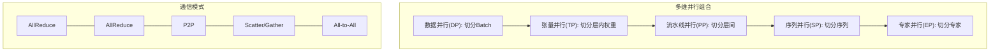
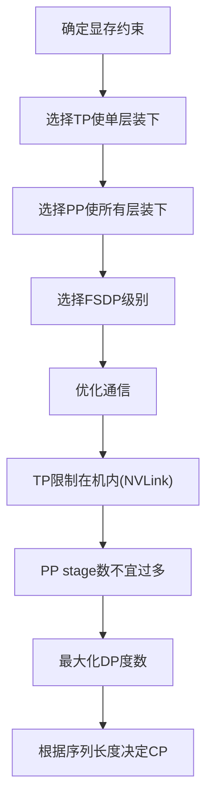

# 7.8 多维并行

实际的大模型训练往往需要组合多种并行策略，形成**多维并行**（Multi-dimensional Parallelism）。从经典的 3D 并行（DP + TP + PP）到现代的 5D 并行（+ SP + EP），本节讨论如何设计和调优多维并行配置。

假设你要组织一家超大型工厂生产汽车。单一的策略不够用：你需要装配线（流水线并行）、每个工位多人协作（张量并行）、多条装配线同时运行（数据并行），还可能需要专业外包团队（专家并行）。多维并行就是把这些策略组合起来，让整个工厂高效运转。

## 7.8.1 并行维度回顾

| 维度 | 符号 | 切分对象 | 通信模式 |
|------|------|----------|----------|
| 数据并行 | $N$ 或 $D$ | Batch | AllReduce |
| 张量并行 | $T$ | 层内权重 | AllReduce |
| 流水线并行 | $P$ | 层间 | P2P |
| 序列并行 | $S$ | 序列（element-wise） | Scatter/Gather |
| 上下文并行 | $C$ | 序列（注意力） | Ring/All2All |
| 专家并行 | $E$ | MoE 专家 | All2All |

总 GPU 数：$N \times T \times P \times C$（某些维度可能共享）



## 7.8.2 3D 并行

### 经典组合

**3D 并行** = DP + TP + PP，是大模型训练的标准配置。用工厂的比喻来说：TP 是每个工位内多人分工，PP 是多个工位组成装配线，DP 是多条装配线同时运行。

```
示例：128 GPU 训练 175B 模型
  TP = 8 (单机 8 卡)
  PP = 4 (4 个 stage)
  DP = 4 (4 份数据副本)
  总计: 8 × 4 × 4 = 128 GPU
```

### 通信组划分

不同并行维度使用不同的通信组：

```python
# 假设 128 GPU，按 [DP, PP, TP] 组织为 [4, 4, 8]
world_size = 128
tp_size, pp_size, dp_size = 8, 4, 4

# TP 组：同一机器的 8 卡
tp_group = ranks[dp_idx, pp_idx, :]  # e.g., [0,1,2,3,4,5,6,7]

# PP 组：跨机器的流水线
pp_group = ranks[dp_idx, :, tp_idx]  # e.g., [0,8,16,24]

# DP 组：不同数据副本
dp_group = ranks[:, pp_idx, tp_idx]  # e.g., [0,32,64,96]
```

### 通信拓扑优化

**原则**：高带宽需求 → 低延迟连接。就像工厂里需要频繁传递零件的工位要紧挨着，而只需要偶尔交流的部门可以距离远一点：

- **TP**：通信频繁（每层 2 次），放在 NVLink 连接的机内
- **PP**：P2P 通信，可跨机（IB）
- **DP**：AllReduce 可重叠，跨机可接受

## 7.8.3 4D 并行

### 加入序列/上下文并行

长序列训练需要 SP 或 CP：

```
4D 并行 = DP + TP + PP + CP

示例：256 GPU，128K 序列
  TP = 8
  PP = 2
  CP = 4
  DP = 4
  总计: 8 × 2 × 4 × 4 = 256 GPU
```

### SP 与 TP 的关系

Megatron 的 SP 与 TP **共享通信组**：

- SP 和 TP 使用相同的 GPU 集合
- SP 不增加 GPU 数量，只改变激活的分布

因此 4D 并行中的 "S" 通常与 T 合并计数。

### CP 的独立性

CP 可以独立于 TP：

- CP 组内做 Ring Attention 或 All2All
- CP 组可以跨机（长序列需要很多 GPU）

## 7.8.4 5D 并行

### 加入专家并行

MoE 模型的完整并行：

```
5D 并行 = DP + TP + PP + CP + EP

示例：Mixtral 8×7B 训练
  TP = 4 (每专家内)
  EP = 8 (8 个专家)
  PP = 2
  DP = 4
  总计: 4 × 8 × 2 × 4 = 256 GPU
  (EP 和 TP 通常在同一组 GPU 上交替)
```

### EP 与其他维度的交互

EP 的 All2All 与其他并行的通信可能冲突：

- EP All2All 在专家并行组内
- TP AllReduce 在张量并行组内
- 需要协调通信顺序

### 混合并行组

实际中，EP 和 DP 可能**共享 GPU 维度**：

```
物理布局: 32 GPU
  TP = 8 (同机)
  EP × DP = 4 (跨机)
  
可以是:
  EP = 4, DP = 1 (纯专家并行)
  EP = 2, DP = 2 (混合)
  EP = 1, DP = 4 (纯数据并行)
```

## 7.8.5 配置设计原则

### 显存约束

首先确保模型能装下——就像建工厂前先确保场地够大：

1. 估算单卡显存需求
2. 选择 TP 使单层能装下
3. 选择 PP 使所有层能装下
4. 选择 FSDP 级别（ZeRO-1/2/3）

### 通信效率

然后优化通信：

1. TP 限制在机内（NVLink）
2. PP 的 stage 数不宜过多（气泡）
3. DP 越大越好（吞吐量）
4. CP 根据序列长度决定

### 计算效率

最后优化计算：

1. 避免太小的 micro-batch（GPU 利用率低）
2. 避免过多的梯度累积（通信延迟）
3. 专家负载均衡



## 7.8.6 典型配置示例

### LLaMA-70B (Dense)

```
硬件: 64 × A100-80GB
模型: 70B 参数

配置 A (Megatron 风格):
  TP = 8
  PP = 2
  DP = 4
  
配置 B (FSDP 风格):
  TP = 1
  PP = 1
  DP = 64 (FSDP FULL_SHARD)
```

### Mixtral 8×7B (MoE)

```
硬件: 32 × A100-80GB
模型: 8 专家，每个 7B

配置:
  TP = 4
  EP = 2
  DP = 4
  (PP = 1, 单层可装下)
```

### GPT-4 级别 (推测)

```
硬件: 数千 GPU
模型: ~1T 参数 (MoE)

推测配置:
  TP = 8
  PP = 8-16
  EP = 8-16
  DP = 大
  CP = 用于长上下文训练
```

## 7.8.7 框架支持

### Megatron-LM

Megatron 原生支持 3D + SP：

```bash
--tensor-model-parallel-size 8 \
--pipeline-model-parallel-size 4 \
--sequence-parallel \
--context-parallel-size 4
```

### DeepSpeed

DeepSpeed 支持 ZeRO + 3D + MoE：

```json
{
    "zero_optimization": {"stage": 3},
    "pipeline": {"stages": 4},
    "moe": {"ep_size": 8}
}
```

### Megatron-DeepSpeed

结合两者优势：

- Megatron 的 TP/PP/SP
- DeepSpeed 的 ZeRO/MoE

### PyTorch 原生

PyTorch 2.0+ 的 `DeviceMesh` 支持多维并行：

```python
from torch.distributed.device_mesh import init_device_mesh

# 定义 2D mesh: DP × TP
mesh = init_device_mesh("cuda", (4, 8), mesh_dim_names=("dp", "tp"))
```

## 7.8.8 调优实践

### Profiling

使用工具分析瓶颈：

```bash
# NVIDIA Nsight Systems
nsys profile python train.py

# PyTorch Profiler
with torch.profiler.profile(...) as prof:
    train_step()
prof.export_chrome_trace("trace.json")
```

### 常见问题诊断

| 现象 | 可能原因 | 解决方案 |
|------|----------|----------|
| GPU 利用率低 | Micro-batch 太小 | 增大 batch 或减少 PP |
| 通信占比高 | TP 跨机 | TP 限制在机内 |
| 显存溢出 | 激活值过大 | 启用激活重计算或 CP |
| PP 气泡大 | 微批次少 | 增加微批次或用交错调度 |
| MoE 负载不均 | 路由不均匀 | 调整负载均衡损失权重 |

### 迭代调优流程

1. **基线配置**：从简单开始（如 FSDP only）——先用最简单的方案把车造出来
2. **识别瓶颈**：profiling 找出最慢的部分——找到装配线的卡点
3. **针对性优化**：加入合适的并行维度——引入新设备或调整工序
4. **验证正确性**：检查 loss 曲线和收敛性——确保车还能正常跑
5. **重复迭代**：直到达到目标效率
