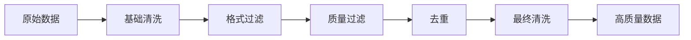

# Data-Juicer

Data-Juicer是阿里巴巴开源的大模型数据处理框架，专注于高质量训练数据的清洗、过滤和分析。

在大模型训练中有一句老话："数据质量决定模型质量"。但实际操作起来，"提升数据质量"这件事往往比调模型更复杂——你面对的可能是数十TB的原始文本，里面充斥着HTML标签、重复内容、低质量翻译、甚至恶意内容。手工处理显然不现实，Data-Juicer提供了一套系统化的流水线来解决这个问题。

## 概述

数据质量是大模型训练的关键因素。Data-Juicer提供了一套完整的数据处理流水线，包含丰富的算子用于数据清洗、去重、过滤和增强。它的设计哲学是"配置驱动"——你不需要写代码，只需要在YAML文件里定义想用哪些算子、什么参数，然后一条命令执行即可。

### 核心特性

- **算子丰富**：100+数据处理算子
- **配置驱动**：YAML配置定义处理流程
- **可视化分析**：数据分布可视化
- **分布式处理**：支持大规模数据集
- **多模态支持**：文本、图像、视频数据

## 安装

```bash
pip install data-juicer

# 或完整安装
pip install "data-juicer[all]"
```

## 数据处理流程



### 配置文件

```yaml
# config.yaml
project_name: 'my_data_processing'

dataset_path: './raw_data.jsonl'
export_path: './processed_data.jsonl'

# 处理算子
process:
  # 过滤器
  - language_id_score_filter:
      lang: 'zh'
      min_score: 0.8
  
  - text_length_filter:
      min_len: 50
      max_len: 10000
  
  - perplexity_filter:
      max_ppl: 1000
      lang: 'zh'
  
  # 清洗器
  - clean_html_mapper
  - clean_email_mapper
  - clean_url_mapper
  - fix_unicode_mapper
  
  # 去重器
  - document_minhash_deduplicator:
      tokenization: 'character'
      num_permutations: 128
      jaccard_threshold: 0.7
```

### 执行处理

```bash
# 命令行执行
python -m data_juicer.tools.process_data --config config.yaml

# Python API
from data_juicer import process_data
process_data('config.yaml')
```

## 核心算子

### 过滤器（Filter）

过滤器根据条件筛选数据。举个例子：你爬取了大量网页文本，但里面包含各种语言的混杂内容、太短或太长的片段、以及杞乱的乱码文本。过滤器能自动把这些不合格的内容剔除：

| 算子 | 功能 |
|-----|------|
| `language_id_score_filter` | 语言识别过滤 |
| `text_length_filter` | 文本长度过滤 |
| `perplexity_filter` | 困惑度过滤 |
| `word_num_filter` | 词数过滤 |
| `alphanumeric_filter` | 字母数字比例过滤 |
| `special_characters_filter` | 特殊字符比例过滤 |
| `flagged_words_filter` | 敏感词过滤 |
| `image_aspect_ratio_filter` | 图像宽高比过滤 |

### 映射器（Mapper）

映射器对数据进行转换：

```yaml
process:
  # 文本清洗
  - clean_html_mapper            # 清理HTML标签
  - clean_email_mapper           # 清理邮箱地址
  - clean_ip_mapper              # 清理IP地址
  - clean_links_mapper           # 清理链接
  - remove_repeat_sentences_mapper  # 移除重复句子
  - whitespace_normalization_mapper # 空白字符标准化
  
  # 格式转换
  - chinese_convert_mapper:      # 繁简转换
      mode: 's2t'  # 简体转繁体
  
  # 文本增强
  - sentence_split_mapper        # 句子分割
```

### 去重器（Deduplicator）

```yaml
process:
  # 精确去重
  - document_simhash_deduplicator:
      tokenization: 'character'
      hamming_distance: 4
  
  # 模糊去重
  - document_minhash_deduplicator:
      tokenization: 'character'
      num_permutations: 256
      jaccard_threshold: 0.8
  
  # 行级去重
  - ray_document_deduplicator:
      backend: 'ray'
```

## 数据分析

### 统计分析

```yaml
# 分析配置
project_name: 'data_analysis'
dataset_path: './data.jsonl'

# 分析算子
process:
  - text_length_filter:
      stats_export_path: './stats/text_length.json'
  
  - language_id_score_filter:
      stats_export_path: './stats/language.json'
```

### 可视化

```python
from data_juicer.analysis import Analyser

analyser = Analyser(dataset='./data.jsonl')

# 生成分析报告
analyser.run(
    output_dir='./analysis_report',
    stats=['text_length', 'word_count', 'language']
)
```

## 多模态数据处理

### 图文数据

```yaml
process:
  # 图像过滤
  - image_size_filter:
      min_width: 256
      min_height: 256
  
  - image_aspect_ratio_filter:
      min_ratio: 0.5
      max_ratio: 2.0
  
  # 图文相关性
  - image_text_similarity_filter:
      min_score: 0.2
      model: 'openai/clip-vit-base-patch32'
```

### 视频数据

```yaml
process:
  - video_duration_filter:
      min_duration: 3
      max_duration: 60
  
  - video_resolution_filter:
      min_width: 480
      min_height: 360
```

## 分布式处理

### Ray后端

```yaml
# 启用Ray分布式
executor_type: 'ray'

ray:
  address: 'auto'
  num_cpus: 32
```

### Spark后端

```yaml
executor_type: 'spark'

spark:
  master: 'yarn'
  executor_memory: '8g'
  executor_cores: 4
```

## 自定义算子

```python
from data_juicer.ops.base_op import OPERATORS, Mapper

@OPERATORS.register_module('my_custom_mapper')
class MyCustomMapper(Mapper):
    def __init__(self, param1, param2=None, *args, **kwargs):
        super().__init__(*args, **kwargs)
        self.param1 = param1
        self.param2 = param2
    
    def process(self, sample):
        # 处理逻辑
        text = sample['text']
        sample['text'] = self.custom_process(text)
        return sample
    
    def custom_process(self, text):
        # 自定义处理
        return text
```

使用自定义算子：

```yaml
process:
  - my_custom_mapper:
      param1: 'value1'
      param2: 'value2'
```

## 最佳实践

### 处理流程设计

```yaml
# 推荐的处理顺序
process:
  # 1. 基础清洗
  - fix_unicode_mapper
  - clean_html_mapper
  - whitespace_normalization_mapper
  
  # 2. 格式过滤
  - text_length_filter
  - alphanumeric_filter
  
  # 3. 质量过滤
  - language_id_score_filter
  - perplexity_filter
  
  # 4. 去重
  - document_minhash_deduplicator
  
  # 5. 最终清洗
  - remove_repeat_sentences_mapper
```

### 监控与日志

```yaml
# 启用详细日志
log_level: 'INFO'

# 保存处理统计
export_stats: true
stats_export_path: './processing_stats.json'
```

Data-Juicer为大模型数据准备提供了系统化的解决方案。通过灵活的算子组合和配置驱动的流程设计，可以高效地处理大规模训练数据，提升数据质量，从而改善模型的训练效果。在实践中，建议先对小样本跑一遍分析报告，了解数据的分布特征（语言比例、长度分布、重复率等），然后再有针对性地设计处理流水线——盲目套用模板配置往往事倍功半。
